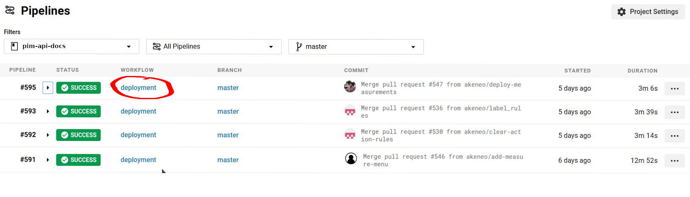
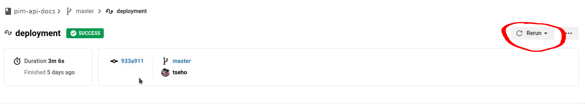

# Akeneo Web API documentation
This repository holds the sources for the documentation of the web API that was released in 1.7.

The API documentation can be found here: [api.akeneo.com](http://api.akeneo.com).

## Installation for dev/preview purposes

### Requirements

Install [Docker Engine](https://docs.docker.com/engine/installation/).

### Build with docker

```bash
make build
```

This is only building the documentation. The documentation is not available with this command, as it does not launch the HTTP server.

### Build and launch HTTP server with docker

```bash
make watch
```

The API documentation site is then available on `localhost:8000`.
Files located in the content and src directories are watched for changes, so when developing you do not need to launch any other task.

## Deployment

### Automatic

Once you merge a PR into the `master` branch, it is automatically deployed on the production server. You have nothing to do.

### Manual

In case you want to re deploy the Serenity documentation, [look at the latest merge in master](https://app.circleci.com/pipelines/github/akeneo/pim-api-docs?branch=master) and click on _Deployment_.



Then click on _Rerun_.



## Swagger

As our YAML Swagger spec uses references and links, it is considered as non-valid.
During the build, we generate a valid JSON specification that is put under the `content/swagger` folder. Don't forget to version it if you made any change into the YAML Swagger spec.
test
