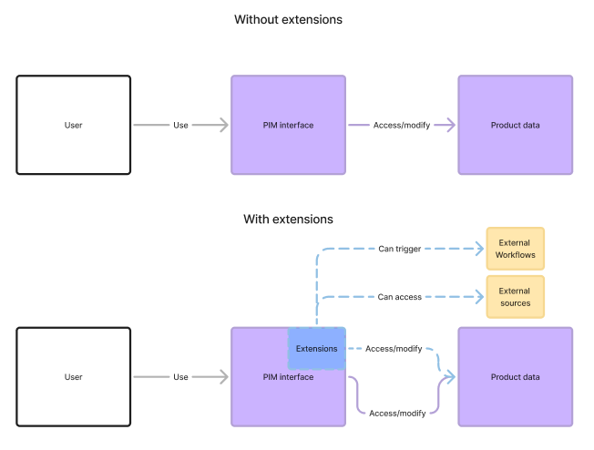

# Custom Component Extensions

## What Are Custom Components?

A **custom component** extension is a JavaScript application built with the **Akeneo Extension SDK** that runs securely within the PIM. Unlike other extension types that load external URLs, custom components are self-contained JavaScript code that executes directly in the PIM's secure sandbox environment.

This is the most powerful extension type, allowing you to build rich, interactive user interfaces with full access to PIM APIs, all without requiring external hosting infrastructure.

## Why Use Custom Components?

Custom components are ideal when you need to:

- **Enhance Product Enrichment**: Build specialized interfaces for product data entry and validation
- **Visualize Data**: Create charts, graphs, and dashboards using PIM data
- **Implement Business Logic**: Add custom validation, calculations, or workflows
- **Integrate External Systems**: Connect PIM data with ERPs, DAMs, or other external services
- **Build Interactive Tools**: Create multi-step wizards or guided processes
- **Display Real-time Data**: Show live information from external APIs alongside PIM data
- **Customize User Experience**: Design interfaces tailored to your organization's specific needs

## Key Benefits

### Secure by Design
Your code runs in a secure sandbox environment that protects the PIM while giving you powerful capabilities.

### Authenticated Access
All API calls are automatically authenticated using the current user's session - no token management needed.

###  No Infrastructure Required
Deploy directly to the PIM. No web servers, domain names, or SSL certificates to manage.

### Modern Development
Build with TypeScript, React, or your favorite JavaScript tools. Use npm packages and modern bundlers.

### Full PIM Access
Access products, assets, reference entities, catalog structure, and all PIM resources through simple APIs.

## How It Works

1. **Build**: Develop your extension using the SDK with access to TypeScript definitions and example projects
2. **Bundle**: Compile your code into a single JavaScript file
3. **Deploy**: Upload to the PIM via UI or API
4. **Run**: Your code executes in the sandbox with authenticated access to PIM APIs

::: panel-link [Getting Started](/advanced-extensions/getting-started.html)
