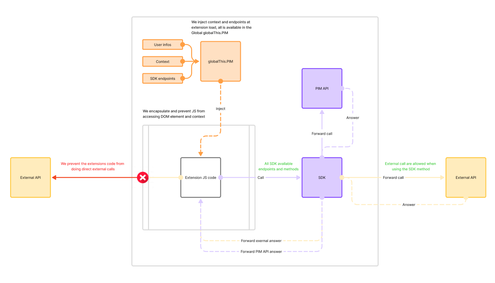

# SDK in Depth

## Integration Architecture

Applications you will build are designed to run within the Akeneo PIM application itself, executing in a secure sandbox environment. This architecture provides several benefits:

1. **Direct Access**: Your code runs within the PIM context, allowing direct access to the current context.
2. **Security**: The SDK code operates in a secure sandbox environment using the [SES (Secure ECMAScript)](https://github.com/endojs/endo) library, which restricts access to potentially harmful JavaScript capabilities.
3. **Controlled API Access**: All API calls are automatically authenticated using the current user's session.

## Important Constraints

When developing with the SDK, keep these constraints in mind:

- **Restricted Environment**: Your code runs in a secure sandbox that limits JavaScript capabilities.
- **External Access**: Direct network requests (fetch, XMLHttpRequest) to external services are not allowed. All API interactions must go through the SDK methods. There is a specific method available to allow access to external resources.
- **DOM Access**: Limited access to the DOM is provided, with restrictions on what elements can be modified.
- **Global State**: The sandbox isolates your code from affecting the global state of the PIM application.
- **Resources**: Your script should be efficient as it runs within the PIM application context.

[](../img/extensions/ui-extensions/indepth_custom_extension.png)

## Permissions and Access Control

The SDK operates under the permissions of the currently logged-in user. This means:

- **Inherited Permissions**: All API calls made through the SDK inherit the Web API permissions of the user who is currently logged into the PIM.
- **Role-Based Access**: What your extension can do depends entirely on the role and permissions assigned to the user running it.
- **Permission Variations**: The same extension may have different capabilities depending on who is using it.
- **Error Handling**: Your code should gracefully handle permission-denied scenarios, as different users may have different access levels.

For example, if a user doesn't have permission to edit products, any SDK calls attempting to update products will fail, even if your code is technically correct. Always design your extensions with these permission constraints in mind.

You can refer to the [Akeneo Web API permissions documentation](https://api.akeneo.com/documentation/permissions.html) for more details on the permission system.

## TypeScript Support

The SDK comes with comprehensive TypeScript declarations (`global.d.ts`), providing rich intellisense and autocompletion in compatible editors. This makes development faster and helps prevent errors by ensuring you're using the API correctly.

Benefits of the TypeScript declarations:
- **Autocomplete**: Get suggestions for available methods and properties
- **Type Checking**: Catch type errors before runtime
- **Documentation**: View parameter descriptions and requirements directly in your editor
- **Improved Developer Experience**: Navigate the SDK easily with proper typing

## Available Features

The SDK provides access to the following API resources:

### Product Management
- **Product UUID API** (`PIM.api.product_uuid_v1`): Create, update, and retrieve products by UUID
- **Product Model API** (`PIM.api.product_model_v1`): Work with product models
- **Product Media File API** (`PIM.api.product_media_file_v1`): Upload and manage product images and files

### Attribute Management
- **Attribute API** (`PIM.api.attribute_v1`): Manage product attributes
- **Attribute Group API** (`PIM.api.attribute_group_v1`): Organize attributes into groups
- **Attribute Option API** (`PIM.api.attribute_option_v1`): Work with attribute options

### Catalog Structure
- **Family API** (`PIM.api.family_v1`): Manage product families
- **Family Variant API** (`PIM.api.family_variant_v1`): Work with family variants
- **Category API** (`PIM.api.category_v1`): Manage the category tree
- **Association Type API** (`PIM.api.association_type_v1`): Define product associations

### Asset Management
- **Asset API** (`PIM.api.asset_v1`): Create and manage assets
- **Asset Family API** (`PIM.api.asset_family_v1`): Work with asset families
- **Asset Attribute API** (`PIM.api.asset_attribute_v1`): Manage asset attributes
- **Asset Attribute Option API** (`PIM.api.asset_attribute_option_v1`): Work with asset attribute options
- **Asset Media File API** (`PIM.api.asset_media_file_v1`): Upload and manage asset files

### Reference Entities
- **Reference Entity API** (`PIM.api.reference_entity_v1`): Manage reference entities
- **Reference Entity Attribute API** (`PIM.api.reference_entity_attribute_v1`): Work with reference entity attributes
- **Reference Entity Attribute Option API** (`PIM.api.reference_entity_attribute_option_v1`): Manage reference entity attributes option
- **Reference Entity Record API** (`PIM.api.reference_entity_record_v1`): Manage reference entity records

### System & Configuration
- **System API** (`PIM.api.system`): Get system information
- **Currency API** (`PIM.api.currency_v1`): Work with currencies
- **Channel API** (`PIM.api.channel_v1`): Manage channels
- **Locale API** (`PIM.api.locale_v1`): Work with locales
- **Measurement Family API** (`PIM.api.measurement_family_v1`): Manage measurement families

### Workflows
- **Workflow API** (`PIM.api.workflows_v1`): Manage workflows and their configurations
- **Workflow Tasks API** (`PIM.api.workflow_tasks_v1`): Work with workflow tasks
- **Workflow Executions API** (`PIM.api.workflow_executions_v1`): Monitor and manage workflow executions

## Common Patterns

Most API methods follow these common patterns:

### List Resources
```js
// List with optional filtering and pagination
const listParams = {
  // Required parameters specific to the resource
  // Optional filters, search, pagination
};
const items = await PIM.api.resource_v1.list(listParams);
```

### Get a Single Resource
```js
// Fetch a specific resource by its identifier
const getParams = {
  // Required parameters to identify the resource
};
const item = await PIM.api.resource_v1.get(getParams);
```

### Create or Update Resources
```js
// Create or update a resource
const upsertParams = {
  // Resource identifier
  // Data to create or update
};
const response = await PIM.api.resource_v1.upsert(upsertParams);
```

```js
// Patch a resource
const patchParams = {
  // Resource identifier
  // Data to patch
};
const response = await PIM.api.resource_v1.patch(patchParams);
```

```js
// Create a resource
const createParams = {
  // Resource identifier
  // Data to create
};
const response = await PIM.api.resource_v1.create(createParams);
```

## User Context

The SDK provides access to the current user context through:

```js
// Get user information
const currentUser = PIM.user;
console.log(`Current user: ${currentUser.first_name} ${currentUser.last_name}`);

// Get contextual information (if available)
const context = PIM.context;
if ('product' in context) {
  console.log(`Current product UUID: ${context.product.uuid}`);
}
```

## Navigation within the PIM

The SDK provides a navigation method that allows you to open new tabs, but only within the Akeneo PIM application. This is useful for directing users to different sections of the PIM from your extension:

```js
// Navigate to a product edit page
PIM.navigate.internal('#/enrich/product/6b7546f8-929c-4ba3-b7ed-d55b61753313');

// Navigate to a category page
PIM.navigate.internal('#/enrich/product-category-tree/');

// Navigate to an asset page
PIM.navigate.internal('#/asset/video/asset/absorb_video/enrich');
```

Important limitations to keep in mind:
- This navigation method can **only** open tabs within the PIM application
- It cannot be used to navigate to external websites or applications
- The paths must be valid PIM routes that the user has permission to access
- Navigation will open in a new tab, preserving the current extension context

Use this feature to create helpful shortcuts or workflows that connect your extension's functionality with standard PIM screens.

## External API Calls

The SDK provides a secure gateway for making calls to external APIs and services. Since direct network requests (fetch, XMLHttpRequest) are not allowed within the sandbox environment, the SDK offers a dedicated method for external communication:

```js
// Make a GET request to an external API
const response = await PIM.api.external.call({
  method: 'GET',
  url: 'https://api.example.com/data',
  headers: {
    'Content-Type': 'application/json'
  }
});

// Make a POST request with a body
const createResponse = await PIM.api.external.call({
  method: 'POST',
  url: 'https://api.example.com/items',
  headers: {
    'Content-Type': 'application/json'
  },
  body: JSON.stringify({
    name: 'New Item',
    description: 'Item description'
  })
});
```

### Authenticated Calls

For authenticated API calls, you can use stored credentials by referencing them with the `credentials_code` parameter:

```js
// Make a request using stored credentials
const secureResponse = await PIM.api.external.call({
  method: 'GET',
  url: 'https://api.secure-service.com/data',
  credentials_code: 'my_api_credentials' // Reference credentials stored in PIM
});
```

::: info
**Never hardcode credentials** in your extension code. Always use the `credentials_code` parameter to reference credentials that are securely stored in the PIM. For detailed information on configuring and using credentials, see the [Credentials guide](/advanced-extensions/sdk-credentials.html).
:::

### Important Considerations

- This is the **only method** allowed for accessing external resources from your extension
- All external domains must be allowlisted in your extension configuration
- For security reasons, requests are proxied through the PIM server
- The method supports standard HTTP methods (GET, POST, PUT, DELETE, etc.)
- Responses are returned as promises that can be handled with async/await

The external gateway provides a secure way to integrate your extension with external systems while maintaining the security of the PIM environment.

## Using Custom variables

Custom Variables allow you to define configuration data that will be securely passed to your SDK Custom Component extensions at runtime. They are stored as encrypted JSON objects in the PIM database and made available to your extension's JavaScript code through a global variable.

This feature is designed to make your extensions adaptable across multiple PIM instances. By externalizing configuration through Custom Variables, you can deploy the same extension code to different environments (development, staging, production) or different customer PIM instances, and simply
adjust the configuration values without modifying your JavaScript code.

  ```js
  // Access the entire custom variables object
  const config = globalThis.PIM_CUSTOM_VARIABLES;

    // Access specific values
  const apiUrl = globalThis.PIM_CUSTOM_VARIABLES.apiUrl;
  const timeout = globalThis.PIM_CUSTOM_VARIABLES.timeout;
  const features = globalThis.PIM_CUSTOM_VARIABLES.features;
  ```

## Error Handling

The SDK methods return promises that you can handle with try/catch:

```js
try {
  const result = await PIM.api.resource_v1.method(params);
  // Process successful result
} catch (error) {
  // Handle errors
  console.error('API Error:', error.message);
  // You may want to check for specific error types/codes
}
```

::: panel-link [Learn more about the development workflow](/advanced-extensions/development-workflow.html)
:::
