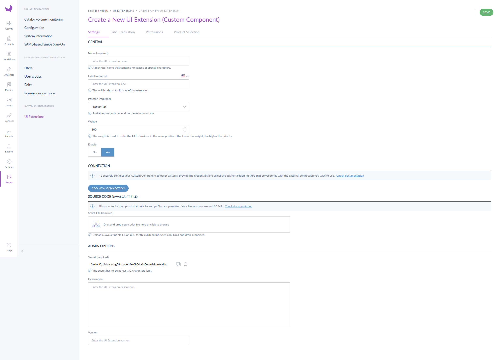

# UI Deployment

## Overview

You can deploy your Extensions directly through the Akeneo PIM user interface. This method doesn't require an API token - you simply need to be logged into your PIM instance.

::: info
If you prefer an automated deployments method, check out the [API deployment guide](/advanced-extensions/api-deployment.html).
:::

## How to Upload an Extension via UI

- **Log into your Akeneo PIM** with appropriate permissions

- **Navigate to the Extensions section**:
   - Go to System → Extensions → UI Extensions

- **Create or Update an Extension**:
   - Click on "Create" to add a new extension, or select an existing extension to update it

- **Fill in the Extension Details**:
   - **Name**: Enter a unique identifier for your extension (e.g., `my-custom-panel`)
   - **Type**: Select `SDK Script`
   - **Position**: Choose where your extension should appear in the PIM (e.g., `pim.product.panel`, `pim.activity.navigation.tab`)
   - **Labels**: Add display labels for different locales

- **Upload Your Script File**:
   - Click the file upload button
   - Select your compiled JavaScript file (e.g., `dist/my-app.js`)
   - The file will be uploaded to the PIM

- **Configure Credentials (Optional)**:
   - If your extension needs to communicate with external services, you can add credentials directly in the UI:
     - **Bearer Token**: For simple token-based authentication
     - **Basic Auth**: For username/password authentication
     - **Custom Header**: For custom HTTP headers

- **Save and Activate**:
   - Click "Save" to store your extension configuration
   - The extension will be immediately available in the configured position

## Related content
- [API deployment process](/advanced-extensions/positions.html)
- [Learn more about the development workflow](advanced-extensions/development-workflow.html)

::: panel-link [Learn more about credentials](/advanced-extensions/sdk-credentials.html)
:::
