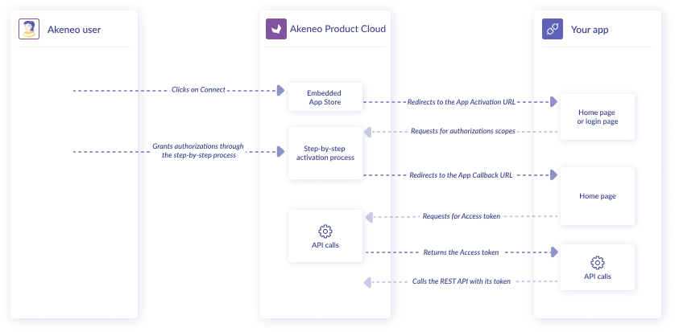

# App activation overview

Before an App can interact with PIM REST API, it must first be acknowledged by the PIM and retrieve an API token.

This process of activation of the App on the PIM relies on **Auth0** protocol that through exchanges between PIM and the App, registers the App on the PIM side and provides the App with a token.

::: info
It is assumed that the App is already registred on the PIM Marketplace as it provides *client_id* and *clien_secret* that will be necessary for the App activation
:::

## App activation in action

