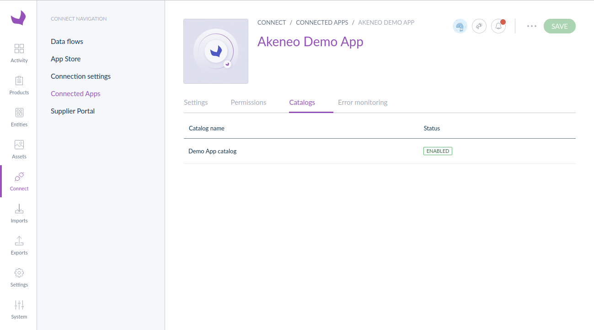

# Catalogs (beta)

## Overview

This guide introduces the catalog feature. With catalogs, you will save time during development because Akeneo PXM Studio
will manage your **product selection** and give you direct access to the relevant data.
With catalogs, you don't need to develop interfaces about filtering products, locales or attributes.

### What's a catalog?

A catalog is a selection of products defined by one or several criteria. (families, categories, ...)

Catalogs are only created by apps and are configured by Akeneo users themselves from Akeneo PXM Studio. This feature is
only visible if the app manage catalogs.




### Limits

::: warning
You can only create **up to 15 catalogs** per app.
:::

### Next steps

- Learn [how to create and use catalogs](/apps/catalogs.html#getting-started-with-catalogs)
<!-- - Discover how users configure catalogs in the Akeneo PXM Studio TODO Add link -->

## Getting started with catalogs

To create and use a catalog, an app must send some requests to the PIM REST API.

### What you'll learn

After you've completed this tutorial, you'll be able to create and use catalogs to retrieve product data.

### Requirements

- You have a Partner account and a developer sandbox.
- You have an app able to use the authorization process.

### Step 1: Ask for catalog scopes

In the documentation [Ask for authorizations](/apps/authentication-and-authorization.html#step-2-ask-for-authorizations), 
you discovered how to ask for scopes.

If you want to manage catalogs, you need to ask for at least 4 scopes:
- `read_products`
- `read_catalogs`
- `write_catalogs`
- `delete_catalogs`

Once these scopes are accepted by Akeneo users during the installation of your app, you will be able to manage and use
catalogs.

### Step 2: Create catalogs

Checkout the [Create a new catalog](/api-reference.html#post_app_catalog) endpoint documentation to find out how
to create one.

::: info
You should create a catalog with the more descriptive name possible. It will help your users to know how to configure it.
:::

Catalogs created **are always disabled by default** in the Akeneo PXM Studio. Only Akeneo users are able to enable a 
catalog. You must wait for any of your users to enable it before using it.

To help your users, you can give them a link to directly access the catalog configuration interface:

``` http

https://my-pim.cloud.akeneo.com/connect/apps/v1/catalogs/{catalog id}
```

At any moment, you can verify if the catalog is enabled by calling the [get catalog endpoint](/api-reference.html#get_app_catalog).

### Step 3: Get products using catalogs

::: warning
The endpoint for retrieving the list of product uuids will be available soon.
:::

Once you have an enabled catalog, you will be able to paginate the corresponding product uuids using this
[endpoint](/api-reference.html#Appcatalogproduct).

### Next steps
- Learn [how to synchronize Akeneo data](/getting-started/synchronize-pim-products-6x/welcome.html)
- Explore the [REST API reference](/api-reference-index.html) 
