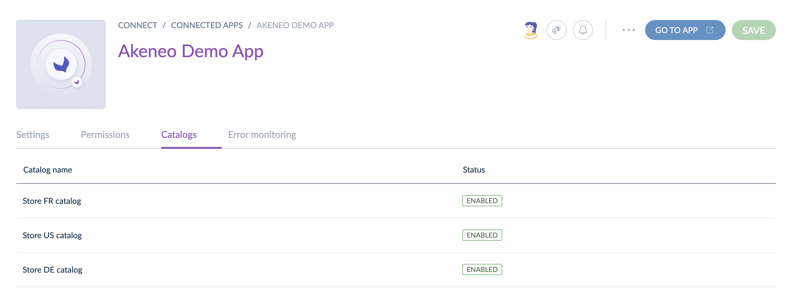

# Catalogs (beta)

## Overview

This guide introduces the catalog feature and explains why using catalogs to retrieve Akeneo data.  
You will save time during development with catalogs because Akeneo PXM Studio manages your **product selection** and gives you direct access to the relevant data.

### What's a catalog?

A catalog is a selection of products defined by one or several criteria (families, categories, etc.)

Catalogs are only created by apps and configured by Akeneo users from Akeneo PXM Studio. This feature is only visible if the app manages catalogs.



### Why use catalogs to retrieve product data? 

Using Catalogs helps you better manage the product information you get from the Akeneo PXM Studio. 

Most of the time, developers must design, develop and maintain a filter interface to allow users to configure their product selection: which products must be taken into account and which don't. 
Using catalogs for apps prevents you from adding this filtering interface to your app. When you retrieve product information related to a catalog, you only retrieve the data your app needs to process. 

Moreover, with catalogs, you don't have to master the entire PIM structure anymore to deliver a relevant filtering interface, as the Akeneo PXM Studio already provides it to your users. 


### Limits

To ensure Akeneo PXM Studio remains stable, we added some limits to catalogs:
- Each app can create up to **15 catalogs**.
- A product selection can have up to **25 selection criteria**.


### Next steps

- Learn [how to create and use catalogs](/apps/catalogs.html#getting-started-with-catalogs)
- Discover [how users configure catalogs](https://help.akeneo.com/pim/serenity/articles/how-to-connect-my-pim-with-apps.html#how-to-configure-catalogs-for-apps) in the Akeneo PXM Studio


## Getting started with catalogs

To create and use a catalog, your app has to send some requests to the Akeneo REST API. This guide describes how to use the catalog features with your app. 

### What you'll learn

After completing this tutorial, you'll be able to create and use catalogs to retrieve product data.

### Requirements

- You have a Partner account and a developer sandbox.
- Your app already manages the authorization process.

### Step 1: Ask for catalog scopes

To manage catalogs, you need to ask for at least 4 scopes:
- `read_products`
- `read_catalogs`
- `write_catalogs`
- `delete_catalogs`

In the documentation [Ask for authorizations](/apps/authentication-and-authorization.html#step-2-ask-for-authorizations), 
you can discover how to ask for scopes.

Once Akeneo users accept these scopes during the app connection, you will be able to manage and use catalogs.

### Step 2: Create catalogs

Once your app is connected and gets the proper authorization, your app can start using catalogs. 

To do so, your app has to create a catalog using the [Create a new catalog](/api-reference.html#post_app_catalog) endpoint. 
When your app creates a catalog, the API returns its UUID. You will use this catalog UUID to get information about the catalog and retrieve related products.

::: tips
To help your users know how to configure a catalog, give it the most descriptive name possible.
:::

By default, new catalogs are **disabled**. 
It means that until a user hasn't enabled it, you won't be able to retrieve products for this catalog. 

Please note that only users can enable a catalog. 


To help your users, you can redirect them directly to the catalog configuration interface on their Akeneo PXM Studio using the following URL structure:

``` http

https://my-pim.cloud.akeneo.com/connect/apps/v1/catalogs/{catalog_uuid}
```

At any moment, you can verify if a catalog is enabled by calling the [get catalog endpoint](/api-reference.html#get_app_catalog).

### Step 3: Get products using catalogs

::: warning
The endpoint for retrieving the list of product UUIDs will be available soon!
:::

Once you have an enabled catalog, you can paginate the corresponding product UUIDs using this [endpoint](/api-reference.html#Appcatalogproduct).

### Next steps
- Learn [how to synchronize Akeneo data](/getting-started/synchronize-pim-products-6x/welcome.html)
- Explore the [REST API reference](/api-reference-index.html) 
