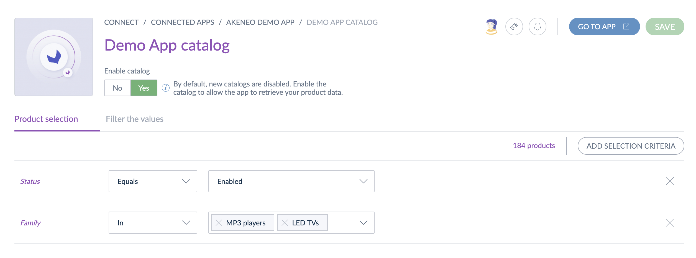
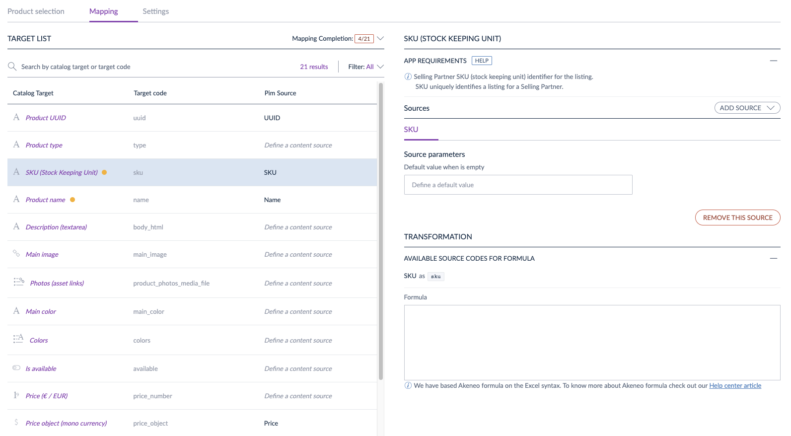

# Catalogs for Apps

## Overview

This guide introduces the catalog feature and explains why using catalogs to retrieve Akeneo data.  
You will save time during development with catalogs because Akeneo PXM Studio manages your **product selection** and gives you direct access to the relevant data. You can also leverage our **data mapping** feature to get product data in your chosen format.  

### What's a catalog?

A catalog is a selection of products defined by one or several criteria (families, categories, etc.)

Catalogs are only created by apps and configured by Akeneo users from Akeneo PXM Studio. This feature is only visible if the app manages catalogs.


### Why use catalogs to retrieve product data? 

Using Catalogs helps you better manage the product information you get from the Akeneo PXM Studio. 

Most of the time, developers must design, develop and maintain a filter interface to allow users to configure their product selection: which products must be considered and which don't. 
Using catalogs for apps **prevents you from adding this filtering interface to your app**. When you retrieve product information related to a catalog, you **only retrieve the data your app needs to process**. 

Moreover, with catalogs, you **don't have to master the entire PIM structure anymore** to deliver a relevant filtering interface, as the Akeneo PXM Studio already provides it to your users. 


### Limits

To ensure Akeneo PXM Studio remains stable, we added some limits to catalogs:
- Each app can create up to **200 catalogs**.
- A product selection can have up to **25 selection criteria**.
- A product mapping schema can have up to **200 targets**.

::: info 
To learn more about the functional scope, please visit our Help Center and read the [How to configure catalogs for Apps?](https://help.akeneo.com/serenity-connect-your-pim/how-to-configure-catalogs-for-apps)
:::

### Troubleshooting

#### Automatic deactivation of catalogs

When a product selection becomes invalid, e.g., a selected category no longer exists, the PIM automatically disables the catalog. 

In that case, your app receives an HTTP 200 response containing the following payload.

```json
{
  "error": "No products to synchronize. The catalog \"65f5a521-e65c-4d7b-8be8-1f267fa2729c\" has been disabled on the PIM side. Note that you can get catalogs status with the GET /api/rest/v1/catalogs endpoint."
}
```


### Next steps

- Learn [how to create and use catalogs](/apps/catalogs.html#getting-started-with-catalogs)
- Discover [how users configure catalogs](https://help.akeneo.com/pim/serenity/articles/how-to-connect-my-pim-with-apps.html#how-to-configure-catalogs-for-apps) in the Akeneo PXM Studio


## Getting started with catalogs

To create and use a catalog, your app has to send some requests to the Akeneo REST API. This guide describes how to use the catalog features with your app. 

### What you'll learn

After completing this tutorial, you'll be able to create and use catalogs to retrieve product data.

### Requirements

- You have access to an Akeneo PIM ([get your App developer starter kit](/apps/overview.html#app-developer-starter-kit))
- Your app already manages the authorization process

### Step 1: Ask for catalog scopes

To manage catalogs, you need to ask for at least 4 scopes:
- `read_products`
- `read_catalogs`
- `write_catalogs`
- `delete_catalogs`

In the documentation [Ask for authorizations](/apps/authentication-and-authorization.html#step-2-ask-for-authorizations), 
you can discover how to ask for scopes.

Once Akeneo users accept these scopes during the app connection, you can manage and use catalogs.

### Step 2: Create catalogs

Once your app is connected and gets the proper authorization, your app can start using catalogs. 

To do so, your app has to create a catalog using the [Create a new catalog](/api-reference.html#post_app_catalog) endpoint. 
When your app creates a catalog, the API returns its UUID. You will use this catalog UUID to get information about the catalog and retrieve related products.

::: tips
To help your users know how to configure a catalog, give it the most descriptive name possible.
:::

**By default, new catalogs are disabled and only users can enable a catalog.**
It means that once a user has enabled it, you won't be able to retrieve products for this catalog. 


To help your users, you can redirect them directly to the catalog configuration interface on their Akeneo PXM Studio using the following URL structure:

``` http

https://my-pim.cloud.akeneo.com/connect/apps/v1/catalogs/{catalog_uuid}
```

At any moment, you can verify if a catalog is enabled by calling the [get catalog endpoint](/api-reference.html#get_app_catalog).

### Step 3: Get products using catalogs

Once you have an enabled catalog, paginate the related products using this [endpoint](/api-reference.html#get_app_catalog_products).

### Next steps
- Learn [how to use the product mapping feature](/getting-started/synchronize-pim-products-6x/welcome.html)
- Learn [how to synchronize Akeneo data](/getting-started/synchronize-pim-products-6x/welcome.html)
- Explore the [REST API reference](/api-reference-index.html) 


## Use the catalog product mapping

To further help you in your app development, you can use product mapping to push your data structure to Akeneo PIM and get pre-formatted product data. 

### What you'll learn

After completing this tutorial, you'll be able to push your JSON mapping schema to the PIM and get product data in the format you expect. 

### Requirements

- You have access to an Akeneo PIM ([get your App developer starter kit](/apps/overview.html#app-developer-starter-kit))
- Your app already manages the authorization process 
- You followed the [Getting started with catalogs](#getting-started-with-catalogs) steps

### Step 1: Define your JSON schema

The first step to using the mapping feature is determining the JSON schema you need to push to the Akeneo PIM to get mapped product data. 

::: info 
**JSON Schema is a declarative language that allows annotating and validating JSON documents.** It describes an existing data format, provides clear human- and machine-readable documentation, and allows to validate data which is useful for ensuring the quality of client-submitted data.
:::

To help you define your schema, we advise you to use this online validator pre-configured with our latest meta-schema: [jsonschemavalidator.net](https://www.jsonschemavalidator.net/s/sj7VwD3l). The validator highlights errors if there are some or displays a success message if your schema matches all our meta-schema constraints. 

You can also download the latest meta-schema at this url: [product mapping meta-schema - v1.0.0 (December, 2023)](/mapping/product/0.1.0/schema) and a product mapping schema example: [example v1.0.0](/mapping/product/1.0.0/example)  

::: warning
Please note that **we don't return empty values**.  
When the mapped attribute is empty on the Akeneo PIM side, you won't receive the target property for this product in the API response.
:::

### Step 2: Push your product mapping schema

Once your product mapping schema is ready, use the endpoint to [create or update the product mapping schema related to a catalog](/api-reference.html#put_app_catalogs_mapping_schema_product) to push your schema to the PIM and access the related configuration screen inside the PIM. 

### Step 3:  Get mapped product data 

Finally, get product data using the endpoint to [get the list of mapped products related to a catalog](/api-reference.html#get_app_catalog_mapped_products).

### Step 4: Test your implementation

To do so, please:
1. Log into your [developer sandbox](/apps/overview.html#app-developer-starter-kit)
2. Click `Connect`, `Connected apps`, `Catalogs`, then the name of your catalog
3. Go to the `Product mapping` tab 
4. Fill in the mapping and enable the catalog using the `Enable catalog` button in the catalog header

We use your product mapping schema to display a screen where your users will configure their catalog.
Here is an example of an interface displayed using a JSON schema:

 

### Next steps
- Explore the [REST API reference](/api-reference-index.html) 
