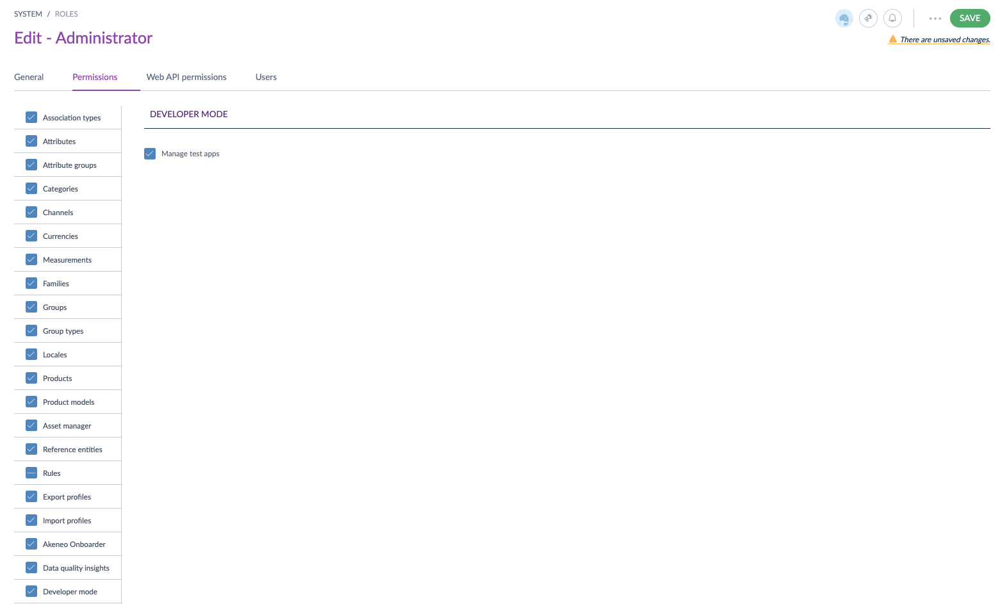
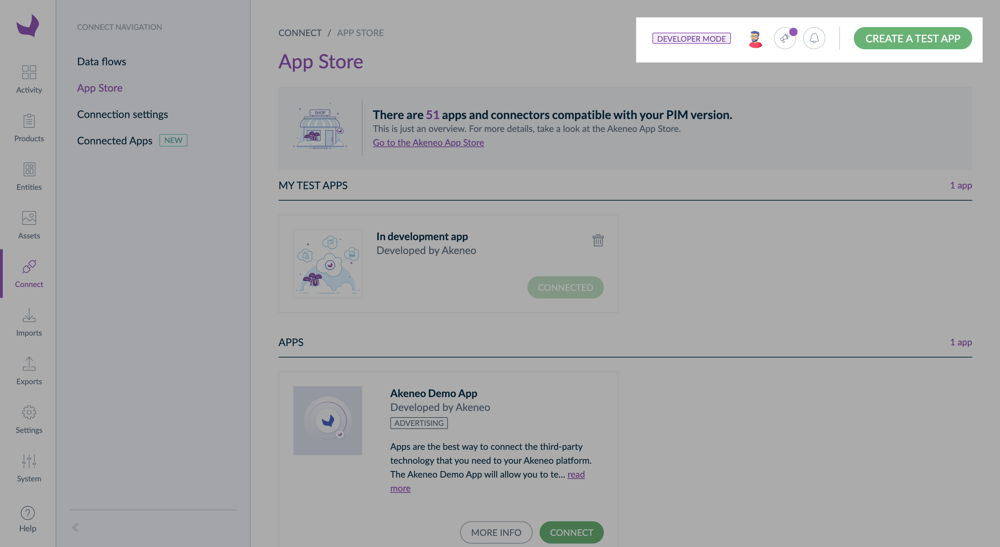
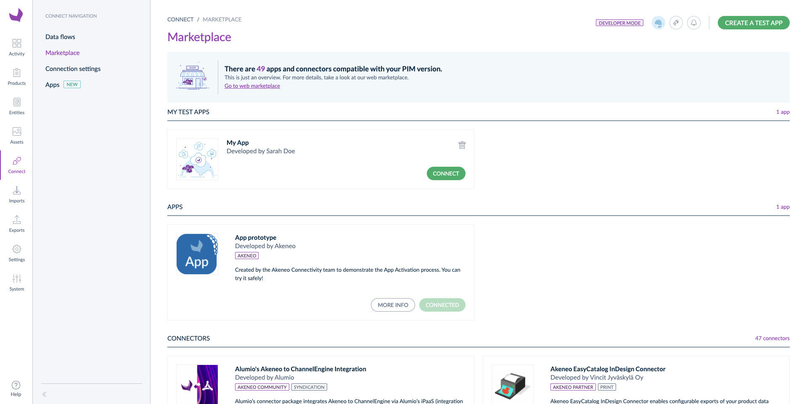
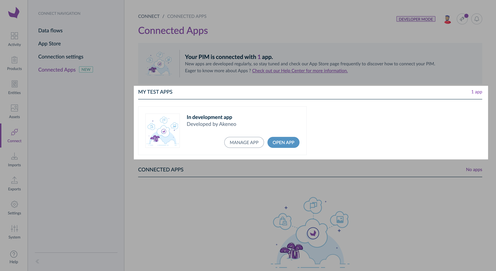

# How to test my App?

::: warning
**For now, this feature is ONLY AVAILABLE on partner sandboxes Akeneo provides**
:::

This page explains how to enable the `developer mode` on your partner sandbox and how to create a test App to check that everything is working well. 

## Step 1 - Enable the developer mode and the test App creation

To enable the developer mode and the `Create a test App` button, you need to:
1. Go to `Settings`, then `Roles`
2. Choose the role you use for your user
3. In the `Permissions` tab, scroll down and search for the `Developer mode` submenu
4. Select `Manage test apps`
5. Don't forget to save your modifications

## Step 2 - Create a test App 

To create a test App: 
1. Go to `Connect`, then `Marketplace`
2. On the top right corner, click on `Create a test App` 
3. Fill in all the required information
4. Then click on `Create`
5. Copy/paste credentials in your app configuration file
6. And click on `Done`
7. Your test App appears on the Marketplace page

## Step 3 - Connect your test App 

Connect a test App is like connecting a published App. 

1. Click on `Connect`
2. Your App opens in a new tab of your browser
3. Launch the connection process from your App
4. Follow all the activation process steps, then `Confirm`
5. Your test App is now connected with Akeneo PIM! 🔗

::: info
To know more about the step-by-step activation process, please read our article: [How to connect an App?](https://help.akeneo.com/pim/serenity/articles/how-to-connect-my-pim-with-apps.html#how-to-connect-an-app)
:::

## Step 4 - Access the connected App settings on Akeneo PIM

Now, your App is connected you can enjoy all the available App features from the Akeneo PIM UI and test that your App is working well. 

To access the settings of your connected App on the Akeneo PIM side, please go to `Apps`, then click on `Manage App`. 
You can also open your App from Akeneo PIM UI, to do so, click on `Open app`. 

::: info
To know more about connected app management, please read our article: [Manage your Apps](https://help.akeneo.com/pim/serenity/articles/manage-your-apps.html)
:::