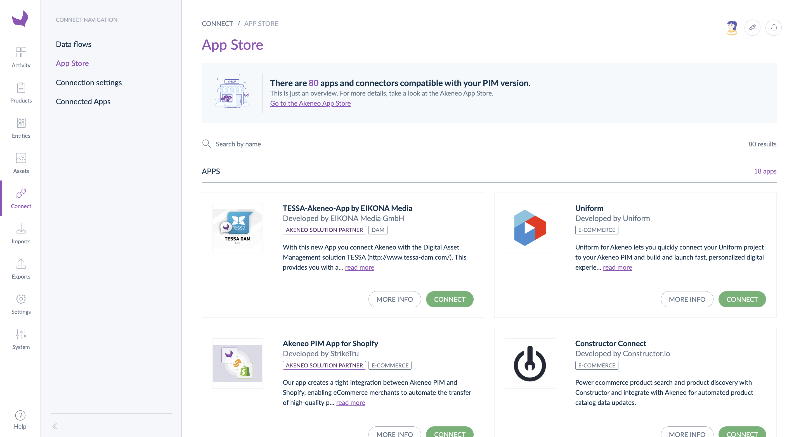

# Overview

Before you start planning and developing your app, it's essential to understand what Akeneo apps do and how they fit into Akeneo PIM.

## What's an Akeneo app?

An Akeneo App connects Akeneo PIM with third-party solutions. They can be easily connected directly from within PIM, with a **streamlined process of activation and configuration**.

Most Akeneo apps are built by third-party developers, not by Akeneo.

You can build an app to pull Akeneo data into your App to adapt and distribute it to external services, like e-commerce platforms or marketplaces. You can also push data to enrich the Akeneo PIM with translations, ERP data, assets, data pool content, or other sources.

To tailor experiences to their specific needs, Akeneo users connect Akeneo apps to integrate with external services and improve how they collect, enrich and distribute their data.

::: tips 
Want to know more about apps?  
Discover the [Akeneo App Store and apps fundamentals course](https://akademy.akeneo.com/akeneo-app-store-apps-fundamentals) through our [Akeneo Academy](https://akademy.akeneo.com/).
:::

## How apps fit into Akeneo PXM Studio?

Apps integrate with Akeneo in the following ways:

- using **OAuth2.0 protocol** to connect with Akeneo
- benefits from the [catalogs for apps](/apps/catalogs.html) features: 
    - easily **get a pre-filtered product selection** configured by your users from their PIM interface,
    - push your app requirements and **get mapped product data** calling catalogs endpoints without developing any mapping interface
    - provide a **consistent experience** to users
- connecting with our **REST API** to read and write Akeneo data 

::: info
For more information on apps usage, please read our help center articles
[How to connect Akeneo PIM with third parties](https://help.akeneo.com/pim/serenity/articles/how-to-connect-my-pim-with-apps.html)
and [Manage your apps](https://help.akeneo.com/pim/serenity/articles/manage-your-apps.html).
::::

## Why apps over connectors?

Both connectors and apps are SaaS compatible and use API.  
However, there are some significant differences.

- **Automatic configuration instead of manual configuration**: connectors use Akeneo PIM connections to get credentials, apps use the OAuth 2.0. When a user connects Akeneo PIM with an app, they click on Connect then follow the step-by-step activation process to accept requested authorizations and set up permissions. The app receives everything it needs to interact with Akeneo PIM at the end of this process.  No more manual configuration issues and more transparency!
- **High visibility**: we give your app high visibility when you publish an app on the [Akeneo App Store](https://apps.akeneo.com/). Your app is displayed ***above all connectors***. We also give high visibility to apps to our Akeneo PIM users. To do so, we created a ***dedicated section*** to highlight them in the Akeneo PXM Studio embedded App Store.
- **Greater level of support**: we provide support to app developers to help them design, build, and test their app before publishing it on [Akeneo App Store](https://apps.akeneo.com/).
- **Increase co-marketing opportunities**: Akeneo promotes apps and will communicate about new apps published on the Akeneo App Store, especially about certified apps. 
- **Benefit from all the future features & improvements**: Akeneo teams are also investing in apps by developing new features for you to ease and accelerate app development and publication in the coming years. 

::: info 
Want to know more about the app certification? [Contact us](https://www.akeneo.com/contact/). 
:::

## App developer starter kit

Before starting to develop your app, we advise you to: 
- Learn [how users connect their PIM with apps](https://help.akeneo.com/pim/serenity/articles/how-to-connect-my-pim-with-apps.html) and [how they manage their connected apps](https://help.akeneo.com/pim/serenity/articles/manage-your-apps.html)
- Read our [guides](/apps/app-concepts-and-use-cases.html) to better understand Akeneo and be aware of best pratices
- Check our REST API [Reference](/api-reference-index.html) & [basics](/documentation/introduction.html)
- Use our [developer tools](/apps/app-developer-tools.html)

Then, you can [contact us](https://www.akeneo.com/contact/) to get your **App developer starter kit**: 
- A developer sandbox with our [Serenity Enterprise version](https://help.akeneo.com/pim/serenity/versions-in-detail.html)
- An access to our [support portal](https://apps-support.akeneo.com/) to easily ask questions, send suggestions or report a bug

## Publish your app

Your app is good to go? 

- Read our [how to publish your app](/app-portal/publish-your-app.html) guide
- Consult our recommendations about [how to write your app information](/app-portal/manage-app-information.html#app-identity-and-description)

## Develop an app for a custom need

With **Custom apps**, we're introducing a SaaS-compliant way to have a one size fits one scenario.  
When you don't find an on-the-shelf App answering your exact need on the Akeneo App Store, Custom apps allow you to develop your own app and benefit from all app features without publishing it. 

Discover our to create a custom app following our [How to get your app token](/tutorials/how-to-get-your-app-token.html) guided tutorial.

## Next steps

- Learn more about how to [create an app](/tutorials/how-to-get-your-app-token.html#how-to-get-app-token)
- Read our documentation about [authorization and authentication](/apps/authentication-and-authorization.html)
- Learn how to use [catalogs](/apps/catalogs.html) to retrieve product data
