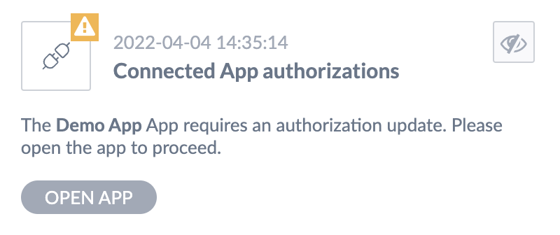

# Update access scopes

::: warning
**This feature is only available on SaaS platforms.**
:::

It's possible to update the access scopes of an already connected app.
The access scope update process requires app users to consent to new scopes addition. 

If your app needs to change the initial scope list, it must initiate an authorization request with the entire list of access scopes your app needs. The authorization request follows the usual OAuth 2.0 protocol through which the app will be able to retrieve a new Access Token that reflects new requested scopes.

::: warning
**Not all users of Akeneo PIM can manage scopes changes.**  
Some users might only have the rights to use your app but not manage it on the Akeneo PIM side. For this reason, it is up to your app to be able to function as per usual until it retrieves a new Access Token.  
  
More information on our Help Center: [Who can manage and open Apps?](https://help.akeneo.com/pim/serenity/articles/manage-your-apps.html#who-can-manage-and-open-apps)
:::

## Notify a PIM your app requires an authorization update

Through Akeneo REST API, connected apps can notify Akeneo PIM users who can manage your app that the authorization scopes your app requires have changed. 

To do so, use the following `POST` method, with parameters below:

```
https://my-pim.cloud.akeneo.com/connect/apps/v1/scopes/update?scope=[REQUESTED_SCOPES]
```
Requirements:
- `scopes`: query parameter to specify app new scope list as a space-separated string
- `Authorization: Bearer [AccessToken]`: header to authenticate your app
- `Content-Type: application/json`: header for the response format

Response: `"Ok"`

Here is an example where the app asks for the following authorizations:
- View attribute options
- View attributes, attribute groups, families and family variants
- View locales and currencies
- View, edit and delete products and product models

```
https://my-pim.cloud.akeneo.com/connect/apps/v1/scopes/update?scopes=read_products%20write_products%20delete_products%20read_catalog_structure%20read_channel_localization%20read_attribute_options%20openid%20profile
```

The notification will warn them and entice them to open your app so that you can initiate an authorization request with the entire list of required scopes.



::: warning
Please, be aware that **this endpoint does not update any access scopes**.  
It is only meant to provide a way for an app to warn Akeneo PIM. 
:::

::: panel-link Next step [How to test your App?](/apps/how-to-test-my-app.html)
:::
