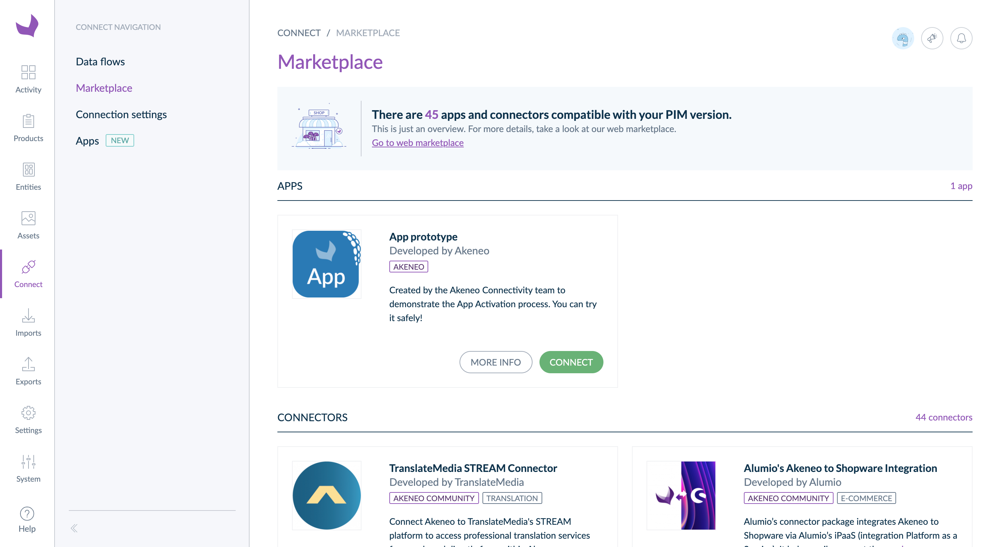

# Why should you choose developing an App over a connector?

::: warning
This feature is available on all SaaS environments and only since v6 for other types of environments.
:::

Both connectors and Apps use the OAuth standard. However, there are some significant differences.

## Automatic configuration instead of manual configuration

### Connectors use Akeneo PIM connections to get credentials

The user who connects Akeneo PIM with a connector must create a connection and manually configure authorizations and permissions. Then, they copy/paste generated API credentials from the PIM UI to the connector. 

### Apps use the Connect feature

When a user connects Akeneo PIM with an App, they click on Connect then follow the step-by-step activation process to accept requested authorizations and set up permissions. The App receives everything it needs to interact with Akeneo PIM at the end of this process.

No more manual configuration issues and more transparency!

## High visibility

We give your App high visibility when you publish an App on the [Akeneo App Store](https://marketplace.akeneo.com/). Your App is displayed **above all connectors**. 

We also give high visibility to Apps to our Akeneo PIM users. To do so, we created a **dedicated section** to highlight them in the PIM App Store.

## This is just the beginning!

Akeneo promotes Apps and will communicate about new Apps published on the Akeneo App Store.

Akeneo teams are also investing in Apps by developing new features for you to ease and accelerate App development and publication in the coming years. 

And we are going to need your input so get ready to hear about us! 🎙️

::: panel-link Next step [Use OAuth 2.0 to connect an App](/apps/using-oauth2.html)
:::