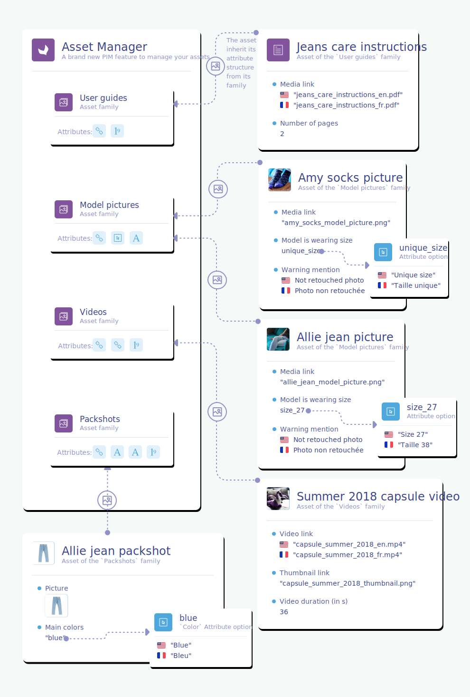
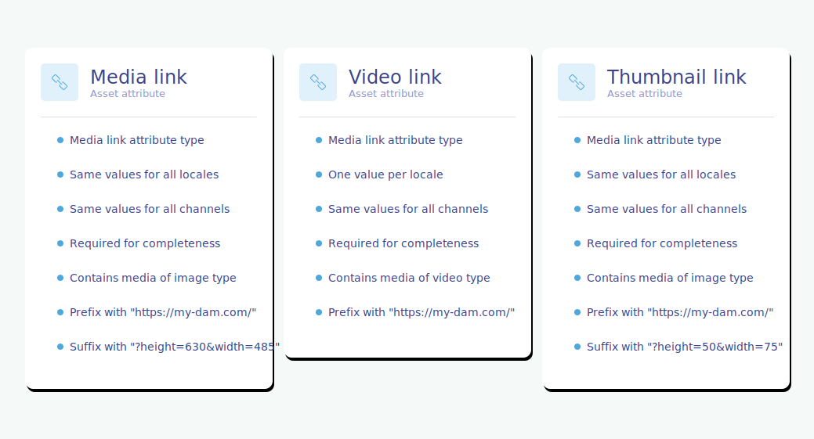

# Introduction
The Asset Manager is a brand new and more efficient way to manage the assets linked to your products/product models inside the PIM. :rocket:

::: warning
This feature is only available in the Enterprise Edition.
:::

The assets of the Asset Manager will be way more powerful than before. They will benefit from 3 major new features:
- the possibility to define a flexible structure, thanks to the [asset families](#the-asset-family),
- the possibility to automatize the link with your products, thanks to the [product link rules](#focus-on-the-product-link-rule),
- the possibility to refer to both external and internal binaries, thanks to the [media link](#the-media-link-attribute), the [image](#the-image-attribute) and the [file](#coming-soon-the-file-attribute) attribute types. 

Below, you'll find an illustration of this wonderful new feature.



This documentation explains the API built around this new Asset Manager. It also presents all the concepts of the Asset Manager so that you, as a developer using our API, can easily understand all our available [endpoints](#reference).

::: info
This new API is available starting in the 3.2 version of the PIM.
:::

Let's dig into the new concepts of this Asset Manager!

# Concepts & resources

In this section, we will introduce all the API resources our team created to interact with the Asset Manager.

## The asset family
An asset family gathers a number of assets that share a common attribute structure. In other words, an asset family can be considered as a template for its assets.

An asset family is made of [asset attributes](#the-asset-attribute). Unlike the [product families](/documentation/resources.html#family), asset attributes are not shared between asset families.

Below are some examples of asset families, along with their asset attributes.


For each asset family, you can define the way the PIM will automatically link the assets of this family to your products. We called that the `product link rule`. [Below](#focus-on-the-product-link-rule), you'll find the precise format of this rule.

Here is the JSON format representing an example of asset family.

```json
{
  "code": "user_instructions",
  "labels": {
    "en_US": "User instructions",
    "fr_FR": "Notice d'utilisation"
  },
  "product_link_rules": [
    {
      "product_selections": [
        {
          "field": "sku",
          "operator": "EQUALS",
          "value": "{{product_ref}}"
        }
      ],
      "assign_assets_to": [
        {
          "attribute": "user_instructions",
          "locale": "{{locale}}",
          "mode": "replace"
        }
      ]
    }
  ]
}
```

::: panel-link Want more details about the asset family resource? [Check its endpoints here!](#Assetfamily)
:::

## The asset attribute

In an asset family, an asset attribute is a characteristic of an asset for this family. It helps to describe and qualify an asset.
An asset attribute can have a value per channel and/or per locale.

::: warning
Note that the "Asset attribute" resource is not the same as the "Attribute" resource, even though they have a lot in common. The first one is used to describe assets, the second one is used to describe products.
:::

There are several types of asset attributes, that will allow you to handle different types of data:
- the [`text` attribute](#the-text-attribute),
- the [`single and multiple options` attributes](#the-single-and-multiple-options-attributes),
- the [`number` attribute](#the-number-attribute),
- the [`image` attribute](#the-image-attribute),
- the [`media link` attribute](#the-media-link-attribute).

::: info
Coming soon! 3 new attribute types are going to be introduced:
- the [`file` attribute](#coming-soon-the-file-attribute),
- the [`reference entity single and multiple links` attributes](#coming-soon-the-reference-entity-single-and-multiple-links-attributes).
:::

::: warning
You can have a maximum of 100 attributes to describe the structure for one given asset family.    
As a consequence, when you ask for the list of attributes for one given asset family, you'll see the response is not paginated. It won't cause any performance issue, since you can't have more than 100 attributes per asset family.
:::

### The `text` attribute
The text attribute is useful to hold textual information such as a description, a warning mention or whatever other information you can think of and which is basically made of a bunch of characters.

Here is an example of a `text` attribute.


And here is the JSON format of the `text` attribute type.
```json
{
  "code": "warning_mention",
  "labels": {
    "en_US": "Warning mention",
    "fr_FR": "Avertissement"
  },
  "type": "text",
  "value_per_locale": true,
  "value_per_channel": false,
  "is_required_for_completeness": false,
  "max_characters": 50,
  "is_textarea": false,
  "is_rich_text_editor": null,
  "validation_rule": null,
  "validation_regexp": null
}
```

### The `single and multiple options` attributes
The single and multiple options attributes are useful to hold data that can be selected among a list of choices. The single option attribute allows the selection of one single value, whereas the multiple options can hold one or several values.

Here are some examples of a `single option` and `multiple options` attributes.


And here is the JSON format of the `single option` attribute type.
```json
{
  "code": "model_is_wearing_size",
  "labels": {
    "en_US": "Model is wearing size",
    "fr_FR": "Le mannequin porte la taille"
  },
  "type": "single_option",
  "value_per_locale": false,
  "value_per_channel": false,
  "is_required_for_completeness": true
}
```
And here is the JSON format of the `multiple options` attribute type.
```json
{
  "code": "main_colors",
  "labels": {
    "en_US": "Main colors",
    "fr_FR": "Couleurs principales"
  },
  "type": "multiple_options",
  "value_per_locale": false,
  "value_per_channel": false,
  "is_required_for_completeness": true
}
```

### The `number` attribute
The number attribute is useful to hold numeral information, such as a number of pages or a video duration.

Here is an example of a `number` attribute.


And here is the JSON format of the `number` attribute type.
```json
{
  "code": "number_of_pages",
  "labels": {
    "en_US": "Number of pages",
    "fr_FR": "Nombre de pages"
  },
  "type": "number",
  "value_per_locale": false,
  "value_per_channel": false,
  "is_required_for_completeness": true
}
```

### The `image` attribute
The image attribute is useful to hold the binaries of a picture.

Here is an example of an `image` attribute.


And here is the JSON format of the `image` attribute type.
```json
{
  "code": "picture",
  "labels": {
    "en_US": "Picture",
    "fr_FR": "Photo"
  },
  "type": "image",
  "value_per_locale": false,
  "value_per_channel": false,
  "is_required_for_completeness": true,
  "allowed_extensions": ["jpg"],
  "max_file_size": "10"
}
```

### The `media link` attribute
The media link attribute type comes in pretty handy whenever you want your asset to refer to an external file, not hosted inside the PIM. For example, it can be very useful whenever you already have all your assets stored in a CDN or a DAM. The illustration below gives you an idea of how this attribute type can be used in such a case.


Here are examples of several media link asset attributes.


Below is the JSON format of the `media_link` attribute type.
```json
{
  "code": "media_link",
  "labels": {
    "en_US": "Media link",
    "fr_FR": "Lien vers le média"
  },
  "type": "media_link",
  "value_per_locale": false,
  "value_per_channel": false,
  "is_required_for_completeness": false,
  "prefix": "dam.com/my_assets/",
  "suffix": null,
  "media_type": "image"
}
```

::: info
The media type defines the type of the asset whose URL is stored in the media link attribute.  
It allows the preview display of the media link.
The available media types that you can put in the `media_type` field are:
- _"image"_,
- _"other"_.
:::


### COMING SOON - The `file` attribute

Format for the `file` attribute type
```json
{
  "code": "user_instructions_pdf",
  "labels": {
    "en_US": "User instructions pdf",
    "fr_FR": "PDF du manuel utilisateurs"
  },
  "type": "file",
  "value_per_locale": false,
  "value_per_channel": false,
  "is_required_for_completeness": true,
  "allowed_extensions": ["pdf"],
  "max_file_size": "10"
}
```

### COMING SOON - The `reference entity single and multiple links` attributes

Format for the `reference entity single link` and the `reference entity multiple links` attribute types
```json
{
  "code": "photographer",
  "labels": {
    "en_US": "Photographer",
    "fr_FR": "Photographe"
  },
  "type": "reference_entity_single_link",
  "value_per_locale": false,
  "value_per_channel": false,
  "is_required_for_completeness": false,
  "reference_entity_code": "artists"
}
```

```json
{
  "code": "main_colors",
  "labels": {
    "en_US": "Main colors",
    "fr_FR": "Couleurs dominantes"
  },
  "type": "reference_entity_multiple_links",
  "value_per_locale": false,
  "value_per_channel": false,
  "is_required_for_completeness": true,
  "reference_entity_code": "colors"
}
```


::: panel-link Want more details about the asset attribute resource? [Check its endpoints here!](#Assetattribute)
:::

## The asset

An asset is a flexible object that makes it possible to enrich products with images, videos, documents…

An asset must be part of an asset family. That way, it will have its own attributes and lifecycle.

Below are some examples of assets.


Below is the JSON format representing an example of an asset of the Asset Manager.

```json
{
  "code": "sku_54628_picture1",
  "family": "frontview",
  "values": {
    "media_preview": [
      {
        "locale": null,
        "channel": null,
        "data": "sku_54628_picture1.jpg"
      }
    ],
    "alt_tag":[
      {
        "locale": "en_US",
        "channel": null,
        "data": "Amor jacket, blue"
      },
      {
        "locale": "fr_FR",
        "channel": null,
        "data": "Veste Amor, bleu"
      }
    ],
    "model_is_wearing_size": [
      {
        "locale": null,
        "channel": null,
        "data": "s"
      }
    ],
    "photographer": [
      {
        "locale": null,
        "channel": null,
        "data": "ben_levy"
      }
    ],
    "main_colors": [
      {
        "locale": null,
        "channel": null,
        "data": ["red","purple"]
      }
    ],
    "end_of_use_date": [
      {
        "locale": null,
        "channel": "ecommerce",
        "data": "02/03/2021"
      }
    ]
  }
}
```

Assets can be linked to products and product models, in order to enrich them. To know more about this link, you can read this [section](#link-with-products-and-product-models).

An asset can hold one or several files. This comes in pretty handy if, for instance, you want to have one user instruction pdf file per language, aka per locale.

#### Example
```json
{
  "code": "user_instructions_TV_2948430",
  "family": "user_guides",
  "values": {
    "pdf_preview": [
      {
        "locale": "en_US",
        "channel": null,
        "data": "user_instructions_TV_2948430_en.pdf"
      },
      {
        "locale": "fr_FR",
        "channel": null,
        "data": "user_instructions_TV_2948430_fr.pdf"
      }
    ]
}
```

::: panel-link Want more details about the asset resource? [Check its endpoints here!](#Asset)
:::

## The asset attribute option

Some types of asset attributes can offer a list of choices. These available choices are asset attribute options.

::: warning
Note that the "Assets attribute option" resource is not the same as the "Attribute option" resource, even though they have a lot in common. The first one is an option of an attribute used to describe assets, the second one is an option of an attribute used to describe products.
:::

Only `single option` or `multiple options` attributes can have options.

Below is an example of an attribute option, used inside an asset.


Below is the JSON format representing this asset attribute option and some other.

```json
{
  "code": "size_27",
  "labels": {
    "en_US": "Size 27",
    "fr_FR": "Taille 36"
  }
}
```
```json
{
  "code": "small",
  "labels": {
    "en_US": "S",
    "fr_FR": "S"
  }
}
```
```json
{
  "code": "medium",
  "labels": {
    "en_US": "M",
    "fr_FR": "M"
  }
}
```
```json
{
  "code": "large",
  "labels": {
    "en_US": "L",
    "fr_FR": "L"
  }
}
```

::: warning
You can have a maximum of 100 options per attribute.
As a consequence, when you ask for the list of attribute options for one given attribute, you'll see that the response is not paginated. It won't cause any performance issue, since you can't have more than 100 options per attribute.
:::

::: panel-link Want more details about the asset attributes option resource? [Check its endpoints here!](#Assetattributeoption)
:::


## The asset media file
Asset media files correspond to the binaries of the images that you can link to your assets. 

Below we illustrate an example of an asset media file linked to an asset.


::: panel-link Want more details about the asset media file resource? [Check its endpoints here!](#Assetmediafile)
:::

# Focus on the asset values

Asset values hold all the information of an asset. More specifically, they are the values of the attributes you will find in a given asset.

In the API, the asset values are in the `values` property of the asset.

## The global format

Asset values follow the same format as [product values](/documentation/resources.html#product-values) or [reference entity record values](/documentation/resources.html#reference-entity-record-values):
```json
{
  "values": {
    ATTRIBUTE_CODE: [
      {
        "locale": LOCALE_CODE,
        "channel": CHANNEL_CODE,
        "data": DATA_INFORMATION
      }
    ]
  }
}
```
In this formula:
 - `ATTRIBUTE_CODE` is the code of an asset attribute,
 - `LOCALE_CODE` is the code of a locale when the attribute is localizable. When it's not, it should be `null`,
 - `CHANNEL_CODE` is the code of a channel when the attribute is scopable. When it's not, it should be `null`,
 - `DATA_INFORMATION` is the value stored for this attribute, this locale (if the attribute is localizable) and this channel (if the attribute is scopable). Its type and format depend on the attribute type as you can see in the table in the section below.

## The `data` format

The following table summarizes the format of the `data` value depending on the attribute type.

| Attribute type / Format| Example |
| ----------------- | -------------- |
| **Text** <br> _string_ | `"Scott, 2-seat sofa, grey"` |
| **Image** <br> _string_ | `"5/1/d/8/51d81dc778ba1501a8f998f3ab5797569f3b9e25_img.png"` |
| **[COMING SOON] File** <br> _string_ | `"5/1/d/8/51d81dc778ba1501a8f998f3ab5797569f3b9e25_user_instructions.pdf"` |
| **Single option** <br> _string_ | `"s"` |
| **Multiple options** <br> _Array[string]_ | `["leather", "cotton"]` |
| **[COMING SOON] Reference entity simple select** <br> _string_ | `"ben_levy"` |
| **[COMING SOON] Reference entity multi select** <br> _Array[string]_ | `["red", "purple"]` |
| **Number** <br> _string_ | `"1"` |
| **Media link** <br> _string_ | `"sku_54628_picture1.jpg"` |

## Localizable and scopable asset values
Asset values can be localizable and/or scopable. Here are some examples to illustrate those different possibilities.

::: info
Asset values should be **localizable** whenever you want to enrich different values among your activated locales.  
Asset values should be **scopable** whenever you want to enrich different values among your channels.
:::

### Asset values of a localizable attribute

The `alt_tag` attribute is localizable but not scopable, so it can hold several data values, up to one per locale.
```json
{
  "alt_tag": [
    {
      "locale": "en_US",
      "channel": null,
      "data": "Amor jacket, blue"
    },
    {
      "locale": "fr_FR",
      "channel": null,
      "data": "Veste Amor, bleu"
    }
  ]
}
```
:::info
Note that the `channel` property is set to `null` in this case.
:::

### Asset values of a scopable attribute

The `end_of_use_date` attribute is scopable but not localizable, so it can hold several data values, up to one per channel.
```json
{
  "end_of_use_date": [
    {
      "locale": null,
      "channel": "ecommerce",
      "data": "02/03/2021"
    },
    {
      "locale": null,
      "channel": "print",
      "data": "03/02/2021"
    }
  ]
}
```
:::info
Note that the `locale` property is set to `null` in this case.
:::

### Asset values of a localizable and scopable attribute

The `warning_message` attribute is both scopable and localizable, so it can hold several data values, up to one for each couple of channels and locales.
```json
{
  "warning_message": [
    {
      "locale": "en_US",
      "channel": "mobile",
      "data": "Retouched photo."
    },
    {
      "locale": "en_US",
      "channel": "ecommerce",
      "data": "Retouched photograph, not contractual."
    },
    {
      "locale": "fr_FR",
      "channel": "mobile",
      "data": "Photo retouchée."
    },
    {
      "locale": "fr_FR",
      "channel": "ecommerce",
      "data": "Photographie retouchée, non contractuelle."
    }
  ]
}
```

### Asset value of a non localizable, non scopable attribute

The `photographer` attribute is neither scopable nor localizable, so it can hold only one data value.
```json
{
  "photographer": [
    {
      "locale": null,
      "channel": null,
      "data": "ben_levy"
    }
  ]
}
```
:::info
Note that the `locale` and `channel` properties are both set to `null` in this case.
:::

## Update asset values

Below we present three use cases to update these asset values.

### Add an asset value
You want to add the `warning_message` of the `allie_jean_picture` asset for the `en_US` locale and `mobile` channel.

**Original resource**
```json
{
  "code": "allie_jean_picture",
  "values": {
    "alt_tag": [
      {
        "locale": "en_US",
        "channel": null,
        "data": "Allie jean, blue"
      }
    ]
  }
}
```

**PATCH request body**
```json
{
  "values": {
    "warning_message": [
      {
        "locale": "en_US",
        "channel": "mobile",
        "data": "Retouched photo."
      }
    ]
  }
}
```

**Resulting resource**
```json
{
  "code": "allie_jean_picture",
  "values": {
    "alt_tag": [
      {
        "locale": "en_US",
        "channel": null,
        "data": "Allie jean, blue"
      }
    ],
    "warning_message": [
      {
        "locale": "en_US",
        "channel": "mobile",
        "data": "Retouched photo."
      }
    ]
  }
}
```

### Modify an asset value

#### First example
You want to modify the `warning_message` of the `allie_jean_picture` asset for the `en_US` locale and the `mobile` channel.

**Original resource**
```json
{
  "code": "allie_jean_picture",
  "values": {
    "alt_tag": [
      {
        "locale": "en_US",
        "channel": null,
        "data": "Allie jean, blue"
      }
    ],
    "warning_message": [
      {
        "locale": "en_US",
        "channel": "mobile",
        "data": "Retouched photo."
      }
    ]
  }
}
```

**PATCH request body**
```json
{
  "values": {
    "warning_message": [
      {
        "locale": "en_US",
        "channel": "mobile",
        "data": "Not retouched photo."
      }
    ]
  }
}
```

**Resulting resource**
```json
{
  "code": "allie_jean_picture",
  "values": {
    "alt_tag": [
      {
        "locale": "en_US",
        "channel": null,
        "data": "Allie jean, blue"
      }
    ],
    "warning_message": [
      {
        "locale": "en_US",
        "channel": "mobile",
        "data": "Not retouched photo."
      }
    ]
  }
}
```

#### Second example
You want to modify the `alt_tag` of the `allie_jean_picture` asset for the `fr_FR` locale but the `alt_tag` on the `en_US` locale is already set.

**Original resource**
```json
{
  "code": "allie_jean_picture",
  "values": {
    "alt_tag": [
      {
        "locale": "en_US",
        "channel": null,
        "data": "Allie jean, blue"
      },
      {
        "locale": "fr_FR",
        "channel": null,
        "data": "Veste Amor, bleu"
      }
    ],
    "warning_message": [
      {
        "locale": "en_US",
        "channel": "mobile",
        "data": "Not retouched photo."
      }
    ]
  }
}
```

**PATCH request body**
```json
{
  "values": {
    "alt_tag": [
      {
        "locale": "fr_FR",
        "channel": null,
        "data": "Jean Allie, bleu"
      }
    ]
  }
}
```

**Resulting resource**
```json
{
  "code": "allie_jean_picture",
  "values": {
    "alt_tag": [
      {
        "locale": "en_US",
        "channel": null,
        "data": "Amor jacket, blue"
      },
      {
        "locale": "fr_FR",
        "channel": null,
        "data": "Jean Allie, bleu"
      }
    ],
    "warning_message": [
      {
        "locale": "en_US",
        "channel": "mobile",
        "data": "Not retouched photo."
      }
    ]
  }
}
```

### Erase an asset value
You want to erase the `alt_tag` of the `allie_jean_picture` asset for the `en_US` locale.

**Original resource**
```json
{
  "code": "allie_jean_picture",
  "values": {
    "alt_tag": [
      {
        "locale": "en_US",
        "channel": null,
        "data": "Amor jacket, blue"
      },
      {
        "locale": "fr_FR",
        "channel": null,
        "data": "Jean Allie, bleu"
      }
    ],
    "warning_message": [
      {
        "locale": "en_US",
        "channel": "mobile",
        "data": "Not retouched photo."
      }
    ]
  }
}
```

**PATCH request body**
```json
{
  "values": {
    "alt_tag": [
      {
        "locale": "en_US",
        "channel": null,
        "data": null
      }
    ]
  }
}
```

**Resulting resource**
```json
{
  "code": "allie_jean_picture",
  "values": {
    "alt_tag": [
      {
        "locale": "en_US",
        "channel": null,
        "data": null
      },
      {
        "locale": "fr_FR",
        "channel": null,
        "data": "Jean Allie, bleu"
      }
    ],
    "warning_message": [
      {
        "locale": "en_US",
        "channel": "mobile",
        "data": "Not retouched photo."
      }
    ]
  }
}
```


# Link with products and product models
Can we agree on the fact that assets that are linked to zero products are kind of useless?  
So here we go! We already explained what an asset was in the new Asset Manager and how you can structure it. Now, it's time to see how the link is done with both products, and product models.

## A new attribute type
To link assets to your products, you are going to use a new attribute type called `pim_catalog_asset_collection`. There are two simple steps to use this new attribute in your products:
1. Create an attribute of this type,
2. Put this attribute within the families of the products you want to link your assets to.

For now, you can only perform these two actions via the API, as the UI hasn't been developed yet. But don't worry, we describe those simple actions in the paragraphs below.

### Step 1 - Create a `pim_catalog_asset_collection` attribute

To create a `pim_catalog_asset_collection` attribute, use the traditional [POST endpoint on the Attribute resource](/api-reference.html#post_attributes) with the following body, for example.
```json
{
  "code": "my_new_asset_collection",
  "type": "pim_catalog_asset_collection",
  "localizable": false,
  "scopable": false,
  "labels": {
    "en_US": "My new assets",
    "fr_FR": "Mes nouvelles ressources numériques"
  },
  "reference_data_name":"packshots"
}
```
In this example, we create an asset collection named `My new assets`, that will allow assets from the `packshots` family.
As you can see, the new asset collection attribute can be localizable, scopable, both or neither.

### Step 2 - Add the new attribute to your families

To add this newly created attribute to the structure of an existing family, send a request using the [PATCH endpoint of the Family resource](/api-reference.html#patch_families__code_) with the following body.
```json
{
  "attributes": ["an_attribute_already_in_the_family","another_attribute_already_in_the_family","a_third_attribute_already_in_the_family","my_new_asset_collection"]
}
```

You're done! Congrats. :)

## Format of the product values
As you can see in the example below, the format of the values of this new asset collection is **an array of asset codes**.  
This format also works with to product models.

#### Example
This is an example of a product with a localizable asset collection attribute called `model_pictures`. It holds different selections of assets, one selection for each activated locale. In this example, we imagine that we want to have totally different assets depending on the locale.
```json
{
  "identifier": "1111111195",
  "family": "clothing",
  "parent": "jack_brown",
  "categories": [
    "tshirts"
  ],
  "enabled": true,
  "values": {
    "model_pictures": [
      {
        "locale": "en_US",
        "scope": null,
        "data": ["picture_enUS_front","picture_enUS_back"]
      },
      {
        "locale": "fr_FR",
        "scope": null,
        "data": ["picture_frFR_front","picture_frFR_back"]
      }
    ]
  }
}
```

::: info
As you may have noticed in the example above, the new asset collection attribute is still able to hold one or several assets.
:::

## How to link your assets

Assets can be assigned to **products** either:
- manually, using the [product](/api-reference.html#patch_products) POST and PATCH endpoints by adding the asset codes in the asset collection data,
- or automatically thanks to the [product link rule](#focus-on-the-product-link-rule), detailed in the paragraph below.

Assets can only be manually assigned to **product models**, using the [product model](/api-reference.html#patch_product_models) POST and PATCH endpoints, by adding the asset codes in the asset collection data.


# Focus on the product link rule

The product link rule enables you to automatically link assets to products, based on assets name or attributes. This rule is defined at the [asset family](#the-asset-family) level.  

This rule is launched by the PIM after the asset creation.

::: warning
The product link rule is only available to link assets to products. Yet, linking assets to product models has to be done manually, for now.
:::

::: info
You can have up to **two** different product link rules for one given asset family.
:::

The JSON format of the product link rules is an array of product link rules. A product link rule is divided into two parts:
- the `product_selections` part,
- the `assign_assets_to` part.

```json
{
  "product_link_rules": [
    {
      "product_selections": [...],
      "assign_assets_to": [...]
    }
  ]
}
```

#### Examples
**With one product link rule**
```json
{
  "product_link_rules": [
    {
      "product_selections": [
        {
          "field": "sku",
          "operator": "EQUALS",
          "value": "{{product_ref}}",
          "locale": null,
          "channel": null
        }
      ],
      "assign_assets_to": [
        {
          "mode": "replace",
          "attribute": "user_instructions",
          "locale": "{{locale}}",
          "channel": null
        }
      ]
    }
  ]
}
```

**With two product link rules**
```json
{
  "product_link_rules": [
    {
      "product_selections": [
        {
          "field": "categories",
          "operator": "IN",
          "value": ["men_clothes"]
        }
      ],
      "assign_assets_to": [
        {
          "mode": "add",
          "attribute": "ambient_image",
          "locale": null,
          "channel": null
        }
      ]
    },
    {
      "product_selections": [
        {
          "field": "categories",
          "operator": "IN",
          "value": ["women_clothes"]
        }
      ],
      "assign_assets_to": [
        {
          "mode": "add",
          "attribute": "ambient_image",
          "locale": null,
          "channel": null
        }
      ]
    }
  ]
}
```

::: warning
A piece of advice: when defining two different rules on an asset family, make sure you define different product selections in each rule, as shown in the example above. Why? Because you could experience performance issues. If you want to assign your assets to two different product attributes on a given selection of products, use one single rule, with two assigments in the `assign_assets_to` field. See the [Product value assigment](#product-value-assignment) section for an example.
:::

Looks barbaric? Don't freak out! The following sections are here to help you understand this rule and how you can make the most of it. You'll see, it's super powerful! :)

## Product selection

The first part of the rule is a property called `product_selections`. This property will allow you to define a selection of products for which you want to automatically link the assets of the asset family.

In one single product link rule, you can define one or several product selections.

The `product_selections` property follows this format:
```json
{
  "product_selections": [
    {
      "field": FIELD_NAME,
      "operator": OPERATOR_NAME,
      "value": VALUE,
      "locale": SELECTION_LOCALE_CODE,
      "channel": SELECTION_CHANNEL_CODE
    },...
  ]
}
```

In this formula:
 - `FIELD_NAME` is the name of the field used to select your products. It can be a product attribute or a property of the product like categories for example.
 - `OPERATOR_NAME` is the name of the operator that will allow you to make your selection of products. Several operators are available depending on the `FIELD_NAME` you provided before.
 - `VALUE` is a value whose type corresponds to the `FIELD_NAME` you provided before.
 - `SELECTION_LOCALE_CODE` is an existing locale code when `FIELD_NAME` is the code of a localizable product attribute.
 - `SELECTION_CHANNEL_CODE` is an existing channel code when `FIELD_NAME` is the code of a scopable product attribute.

::: warning
The `field`, `operator` and `value` properties are mandatory.
:::

::: warning
The `locale` and `channel` properties should not appear in your product selection, whenever you are using the following `FIELD_NAME`: `categories`, `family` and `enable`.  
But they are mandatory when the `FIELD_NAME` is a product attribute code. 
If the `FIELD_NAME` is the code of an attribute that is not localizable, the `locale` property should be set to `null`.  
If the `FIELD_NAME` is the code of an attribute that is not scopable, the `channel` property should be set to `null`.  
:::

#### Example
Here is a concrete example to make it clearer.
If you want to select the products which are both enabled and classified in the `men` category, you can use the following syntax.
```json
{
  "product_selections": [
    {
      "field": "enabled",
      "operator": "=",
      "value": "true"
    },
    {
      "field": "categories",
      "operator": "IN",
      "value": ["men"]
    }
  ]
}
```

::: info
As you can see above, you can use multiple conditions to make your selection. Those conditions are cumulated. In the example, we select the products that are **both** enabled and in the `men` category.
:::

Here is the list of the fields you can use to select your products:
- among the product properties:
  + the [product family](#selection-via-product-family),
  + the [product categories](#selection-via-product-categories),
  + the [product status](#select-via-the-product-status),
- among the product attributes:
  + the [identifier attribute](#select-via-identifier-attribute),
  + the [text attributes](#select-via-text-attribute),
  + the [simple/multi select attributes](#select-via-simplemulti-select-attribute).


### Selection via product family
To associate your assets to a given set of products, you can use their family. In this case, use the keyword `family` as the `FIELD_NAME`.

The table below summarizes the operators available when you select products via family as well as the allowed value type you can have as a `VALUE`.

| Operator | Allowed value type | Selection description |
| ----------------- | -------------- | ------------------ |
| `IN` | _Array of existing family codes_ | Selects products that are respectively in the given families |
| `NOT IN` | _Array of existing family codes_ | Selects products that are respectively not in the given families |

#### Example
The following selection will select the products belonging to the `accesories` family.

```json
{
  "product_selections": [
    {
      "field": "family",
      "operator": "IN",
      "value": ["accessories"]
    }
  ]
}
```

### Selection via product categories
To associate your assets to a given set of products, you can use their categories. In this case, use the keyword `categories` as the `FIELD_NAME`.

The table below summarizes the operators available when you select via categories as well as the allowed value type you can have as a `VALUE`.

| Operator | Allowed value type | Selection description |
| ----------------- | -------------- | ------------------ |
| `IN` | _Array of existing category codes_ | Selects the products that are in the given categories |
| `NOT IN` | _Array of existing category codes_ | Selects the products that are not in the given categories |
| `IN OR UNCLASSIFIED` | _Array of existing category codes_ | Selects the products that are in the given categories or that are not classified in any categories |
| `IN CHILDREN` | _Array of existing category codes_ | Selects the products that are in the children of the given categories |
| `NOT IN CHILDREN` | _Array of existing category codes_ | Selects the products that are not in the children of the given categories |
| `UNCLASSIFIED` | _No value_ | Selects the products that are not classified into any category |

#### Example
The following selection will select the products belonging to the `bohemian_style` category.

```json
{
  "product_selections": [
    {
      "field": "categories",
      "operator": "IN",
      "value": ["bohemian_style"]
    }
  ]
}
```

### Select via the product status
To associate your assets to a given set of products, you can use their status. In this case, use the keyword `enabled` as the `FIELD_NAME`.

The table below summarizes the operator available when you select per status as well as the allowed value type you can have as a `VALUE`.

| Operator | Allowed value type | Selection description |
| ----------------- | -------------- | ------------------ |
| `=` | _string: "true" or "false"_ | Selects products that are enabled (`"true"`) or disabled (`"false"`) |

#### Example
The following selection will select the products that are enabled.

```json
{
  "product_selections": [
    {
      "field": "enabled",
      "operator": "=",
      "value": "true"
    }
  ]
}
```

### Select via identifier attribute

To associate your assets to a given set of products, you can use their identifier. In this case, use the code of the identifier attribute you have in your product family as the `FIELD_NAME`.

The table below summarizes the operators available when you select via identifier attribute as well as the allowed value type you can have as a `VALUE`.

| Operator | Allowed value type | Selection description |
| ----------------- | -------------- | ------------------ |
| `CONTAINS`  | _String_ | Selects products whose identifier contains a specific value |
| `DOES NOT CONTAIN` | _String_ | Selects products whose identifier does not contain a specific value  |
| `=`  | _String_ | Selects products that have exactly the given identifier |
| `!=` | _String_ | Selects products whose identifier is not the given one |

#### Example
The following selection will select the product with the `sku_54628` SKU, knowing that `sku` is the code of the identifier attribute.

```json
{
  "product_selections": [
    {
      "field": "sku",
      "operator": "=",
      "value": "sku_54628",
      "locale": null,
      "channel": null
    }
  ]
}
```

### Select via text attribute

To associate your assets to a given set of products, you can use one of their text attributes. In this case, use the code of one of the text attributes from your product family as the `FIELD_NAME`.

The table below summarizes the operators available when you select via text attribute as well as the allowed value type you can have as a `VALUE`.

| Operator | Allowed value type | Selection description |
| ----------------- | -------------- | ------------------ |
| `STARTS WITH` | _String_ | Selects products with a text attribute that begins with the given value |
| `CONTAINS`  | _String_ | Selects products with a text attribute that contains the given value |
| `DOES NOT CONTAIN` | _String_ | Select products with a text attribute that does not contain the given value |
| `=`  | _String_ | Selects products with a text attribute value that is an exact match to the given value |
| `!=` | _String_ | Select products with a text attribute value that differs from the given value |


#### Example
The following selection will select the products that have the words `bohème chic`, in their `description` attribute, on `fr_FR` locale and on the `ecommerce` channel.

```json
{
  "product_selections": [
    {
      "field": "description",
      "operator": "CONTAINS",
      "value": "bohème chic",
      "locale": "fr_FR",
      "channel": "ecommerce"
    }
  ]
}
```

### Select via simple/multi select attribute

To associate your assets to a given set of products, you can use one of their simple select attributes or multi select attributes. In this case, use the code of one of the simple/multi select attributes from your product family as the `FIELD_NAME`.

The table below summarizes the operators available when you select via simple/multi select attribute as well as the allowed value type you can have as a `VALUE`.

| Operator | Allowed value type | Selection description |
| ----------------- | -------------- | ------------------ |
| `IN` | _Array of existing simple/multi select option codes_ | Select products having a specific option in the respective simple select attribute |
| `NOT IN`  | _Array of existing simple/multi select option codes_ | Select products not having a specific option in the respective simple select attribute |

#### Example
The following selection will select the products that have the `range_style` simple select set to `bohemian_chic`, `bohemian_chic` being an option of the simple select `range_style` attribute.

```json
{
  "product_selections": [
    {
      "field": "range_style",
      "operator": "IN",
      "value": ["bohemian_chic"],
      "locale": null,
      "channel": null
    }
  ]
}
```

## Product value assignment
Once you have chosen and selected the products you want to apply the rule on, it is time to think about where, in the products, you want to assign those assets.

This is done in the second part of the product link rule, in the `assign_assets_to` property.
Thanks to this property, you will define to which product value you want to assign your assets. In other words, which attribute, locale and scope of the products you want to link your assets to. You can also decide whether you want to add new assets or replace the existing ones inside this product attribute.

The `assign_assets_to` property follows this format:
```json
{
  "assign_assets_to": [
      {
        "mode": MODE_NAME,
        "attribute": ATTRIBUTE_CODE,
        "locale": LOCALE_CODE,
        "channel": CHANNEL_CODE
      },...
    ]
}
```

In this formula:
- `MODE_NAME` allows you to choose if you want to add or replace the current values of the asset collection you want your assets to be assigned to.
- `ATTRIBUTE_CODE` is the code of the product attribute in which you want to link your asset. This attribute should be an asset collection attribute.
- `LOCALE_CODE` is an existing locale code when `ATTRIBUTE_CODE` is the code of a localizable attribute.
- `CHANNEL_CODE` is an existing channel code when `ATTRIBUTE_CODE` is the code of a scopable attribute.

::: warning
All the fields of this formula are mandatory.
:::

::: warning
If the `ATTRIBUTE_CODE` is the code of an attribute that is not localizable, the `locale` property should be set to `null`.  
If the `ATTRIBUTE_CODE` is the code of an attribute that is not scopable, the `channel` property should be set to `null`.  
:::

For the `mode`, you can decide between two values:
- `add`: this mode allows you to add the new assets inside the asset collection attribute. They will appear after all the assets already existing in the attribute.
- `replace`: this mode allows you to replace all the previously existing assets by the new ones, within the asset collection attribute.

#### Example
Imagine, in the family of the products you [selected](#product-selection) before, you have the `user_instructions` asset collection attribute. This attribute is localizable. If you want to add the assets to this attribute, on the `en_US` locale, without replacing the existing ones, you can use the following syntax.

```json
{
  "assign_assets_to": [
    {
      "mode": "add",
      "attribute": "user_instructions",
      "locale": "en_US",
      "channel": null
    }
  ]
}
```

::: info
You can provide multiple actions in one single rule. Let's take an example. Say you want to assign the asset to two different attributes of your product, the `main_image` one and the `images` one.

```json
{
  "main_image": [
    {
      "mode": "replace",
      "attribute": "main_image",
      "locale": null,
      "channel": null
    },
    {
      "mode": "add",
      "attribute": "images",
      "locale": null,
      "channel": null
    }
  ]
}
```
:::

## Asset values extrapolation
"Asset values extrapolation"? What the hell is that? It's the clever naming I just came up with to explain one last thing about the product link rule.

You now know how to [select your products](#product-selection), and then [assign your assets in the right product attribute](#product-value-assignment). That's a good start.

But in some cases, you might need the rule to be a bit more powerful so it answers your expectations.  
As an example is better than 10,000 words, let's imagine this situation.

### An example
You put all your user guides in the same asset family, called `user_instructions`.  
On the one hand, you have an asset of this family, let's say the user guide for a particular TV, the `XMLD500` TV. This user guide asset has the following code: `XMLD500_fr_FR_user_guide`. It is the French version of the user guide for this TV.  
On the other hand, you have your TV which SKU is `XMLD500`. The product sheet of this TV has an asset attribute collection called `user_guides`. It is localizable.  
Now, what you want is to automatically link the `XMLD500_fr_FR_user_guide` to the `XMLD500` product, in the right attribute on the right locale, ie the French locale.

How do you do that? I'll tell you. You're gonna need "asset value extrapolation".

"Asset value extrapolation" is a mechanism by which you can target specific asset values in various fields of the product link rule so that they can be interpreted depending on the asset it is currently linking.

Not sure you understood, so let's write the product link rule for my previous example.

```json
{
  "product_link_rules": [
    {
      "product_selections": [
        {
          "field": "sku",
          "operator": "EQUALS",
          "value": "{{product_ref}}",
          "locale": null,
          "channel": null
        }
      ],
      "assign_assets_to": [
        {
          "mode": "replace",
          "attribute": "user_guides",
          "locale": "{{locale}}",
          "channel": null
        }
      ]
    }
  ]
}
```

As a prerequisite for this rule to work, we would need two new attributes in the structure of our `user_instructions` asset family. One named `product_ref`, and the other `locale`.  
In our example, for our `XMLD500_fr_FR_user_guide` asset, we would store the string `XMLD500` into the `product ref` attribute and `fr_FR` in the `locale` attribute

In fine, below is the JSON of our dear `XMLD500_fr_FR_user_guide` asset, once we added those new attributes.

```json
{
  "code": "XMLD500_fr_FR_user_guide",
  "family": "user_instructions",
  "values": {
    "media_preview": [
      {
        "locale": null,
        "channel": null,
        "data": "XMLD500_fr_FR_user_guide.pdf"
      }
    ],
    "product_ref":[
      {
        "locale": null,
        "channel": null,
        "data": "XMLD500"
      }
    ],
    "locale": [
      {
        "locale": null,
        "channel": null,
        "data": "fr_FR"
      }
    ]
  }
}
```

::: info
Those two new attributes can be easily filled by using the API and a simple regular expression on the code of the asset, as both information, the product reference and the locale are already in the code.
:::

So, now that our asset is ready, whenever the rule is launched, the PIM will automatically extrapolate the rule, by replacing the curlies reference, `{{product_ref}}` and `{{locale}}`, by their real values in the asset it's currently trying to link to products.

The PIM, whenever it wants to link the `XMLD500_fr_FR_user_guide` asset to the right product, will interpret the rule as if it was written like this:
```json
{
  "product_link_rules": [
    {
      "product_selections": [
        {
          "field": "sku",
          "operator": "EQUALS",
          "value": "XMLD500",
          "locale": null,
          "channel": null
        }
      ],
      "assign_assets_to": [
        {
          "mode": "replace",
          "attribute": "user_instructions",
          "locale": "fr_FR",
          "channel": null
        }
      ]
    }
  ]
}
```

In other words, it's going to select the product which SKU is `XMLD500` and assign the asset to the `user_instructions` product attribute on the `fr_FR` locale. Exactly what we wanted. ;)

### Extrapolated properties

As you saw in the previous example, to notify the PIM a property of the rule  should be extrapolated, you will need to use the following syntax: `"{{code_of_an_asset_attribute}}"`.

This way, the PIM will know that it needs to replace this string by the value stored inside the `code_of_an_asset_attribute` attribute of the given asset it currently wants to link.

You can use this super power - the extrapolation - in the following properties of the rule:
- in the product selection part:
  + `field`,
  + `value`,
  + `locale`,
  + `channel`,
- in the assignment part:
  + `attribute`,
  + `locale`,
  + `channel`.

:::info
The extrapolation mechanism can be used in combination with strings. For more details, see the [example](/documentation/asset-manager.html#example-1) below.
:::

::: warning
When using the extrapolation mechanism, you should only refer to non scopable and non localizable asset attributes.
:::


### Some other examples

#### Example 1
Let's consider the `amor_red_model_picture` and `amor_blue_model_picture` assets for this example. Those two assets are in the same asset family.
```json
{
  "code": "amor_red_model_picture",
  "family": "model_pictures",
  "values": {
    "media_preview": [
      {
        "locale": null,
        "channel": null,
        "data": "amor_red_model_picture.jpg"
      }
    ],
    "product_ref":[
      {
        "locale": null,
        "channel": null,
        "data": "amor"
      }
    ],
    "model_is_wearing_size": [
      {
        "locale": null,
        "channel": null,
        "data": "s"
      }
    ],
    "main_color": [
      {
        "locale": null,
        "channel": null,
        "data": "red"
      }
    ]
  }
}
```
```json
{
  "code": "amor_blue_model_picture",
  "family": "model_pictures",
  "values": {
    "media_preview": [
      {
        "locale": null,
        "channel": null,
        "data": "amor_blue_model_picture.jpg"
      }
    ],
    "product_ref":[
      {
        "locale": null,
        "channel": null,
        "data": "amor"
      }
    ],
    "model_is_wearing_size": [
      {
        "locale": null,
        "channel": null,
        "data": "S"
      }
    ],
    "main_color": [
      {
        "locale": null,
        "channel": null,
        "data": "blue"
      }
    ]
  }
}
```
We want these assets to be automatically linked to their respective products: `sku_amor_blue` and `sku_amor_red`.

To do this, you'll use the following product link rule.

```json
{
  "product_link_rules": [
    {
      "product_selections": [
        {
          "field": "sku",
          "operator": "EQUALS",
          "value": "sku_{{product_ref}}_{{main_color}}",
          "locale": null,
          "channel": null
        }
      ],
      "assign_assets_to": [
        {
          "mode": "replace",
          "attribute": "pictures",
          "locale": null,
          "channel": null
        }
      ]
    }
  ]
}
```

You can use the extrapolation mechanism in combination with strings, as you can see in the example below, in the `value` field of the `product_selections` property.  
For the `amor_blue_model_picture`, the `value` field will be extrapolated to `sku_armor_blue`. For the `amor_red_model_picture`, the `value` field will be extrapolated to `sku_armor_red`.

#### Example 2
Let's consider the `men_women_ambient_picture` and `children_ambient_picture` assets for this example. Those two assets are in the same asset family.
```json
{
  "code": "men_women_ambient_picture",
  "family": "ambient_images",
  "values": {
    "media_preview": [
      {
        "locale": null,
        "channel": null,
        "data": "men_women_ambient_picture.jpg"
      }
    ],
    "product_categories":[
      {
        "locale": null,
        "channel": null,
        "data": ["men", "women"]
      }
    ]
  }
}
```
```json
{
  "code": "children_ambient_picture",
  "family": "ambient_images",
  "values": {
    "media_preview": [
      {
        "locale": null,
        "channel": null,
        "data": "children_ambient_picture.jpg"
      }
    ],
    "product_categories":[
      {
        "locale": null,
        "channel": null,
        "data": ["children"]
      }
    ]
  }
}
```
We want these assets to be automatically linked to the products of the respective categories they refers to: the `men` and `women` categories for the `men_women_ambient_picture` and the `children` category for the `children_ambient_picture`.

To do this, you'll use the following product link rule.
```json
{
  "product_link_rules": [
    {
      "product_selections": [
        {
          "field": "categories",
          "operator": "IN",
          "value": "{{product_categories}}"
        }
      ],
      "assign_assets_to": [
        {
          "mode": "add",
          "attribute": "ambient_image",
          "locale": null,
          "channel": null
        }
      ]
    }
  ]
}
```
As you can see above, you can use the extrapolation mechanism to refer to an array.  
For the `men_women_model_picture`, the `value` field will be extrapolated to `["men","women"]`. For the `children_ambient_picture`, the `value` field will be extrapolated to `["children"]`.

# Asset filters

When requesting a [list of assets via the API](/api-reference.html#get_assets), you can apply filters to get only the ones you want and also the kind of information you want in them.

## Filter assets by update date

You can filter the assets by their update date.

Below is the operator allowed to filter on this property, as well as the corresponding type of value expected in the `search` query parameter.

:::info
Note that dates should follow the [ISO 8601 standard](https://en.wikipedia.org/wiki/ISO_8601).
:::

| Operator | Allowed value type | Filter description |
| ----------------- | -------------- | ------------------ |
| `>` | datetime <br> _Format: ISO 8601_ | Only returns assets that were <br> updated after the given day and hour |

#### Example
To get the assets that were updated since the 4th of July 2016 at 10am (UTC), you can use the following URL.

```
/api/rest/v1/asset-families/model_pictures/assets?search={"updated":[{"operator":">","value":"2018-07-04T10:00:00Z"}]}
```

## Filter asset values by locale
If you want to receive assets with only the asset values of specific locales, as well as the attribute values of the non localizable attributes, you can specify it thanks to the `locales` query parameter.

#### Example 1
Imagine that without this filter you get these asset values:
```json
{
  "warning_mention": [
    {
      "locale": "en_US",
      "channel": "mobile",
      "data": "Photo retouched."
    },
    {
      "locale": "en_US",
      "channel": "ecommerce",
      "data": "Photo retouched. This does not necessarily reflect the reality."
    },
    {
      "locale": "fr_FR",
      "channel": "mobile",
      "data": "Photo retouchée."
    },
    {
      "locale": "fr_FR",
      "channel": "ecommerce",
      "data": "Photo retouchée, ne représentant pas forcément la réalité."
    }
  ],
  "model_is_wearing_size":[
    {
      "locale": null,
      "channel":null,
      "data":"small"
    }
  ]
}
```

To get only the asset values regarding the `en_US` locale (+ the attribute values of the non localizable attributes), you can use the following URL.
```
/api/rest/v1/asset-families/model_pictures/assets?locales=en_US
```

As a result you will receive the following answer:
```json
{
  "warning_mention": [
    {
      "locale": "en_US",
      "channel": "mobile",
      "data": "Photo retouched."
    },
    {
      "locale": "en_US",
      "channel": "ecommerce",
      "data": "Photo retouched. This does not necessarily reflect the reality."
    }
  ],
  "model_is_wearing_size":[
    {
      "locale": null,
      "channel":null,
      "data":"small"
    }
  ]
}
```

#### Example 2
You can also filter asset values on several locales at the same time.
```
/api/rest/v1/asset-families/model_pictures/assets?locales=en_US,fr_FR
```


## Filter asset values by channel
There is also a `channel` query parameter that will allow you to get only the asset values for a specific channel, as well as the asset values of the non scopable attributes.

:::warning
Note that you cannot use this filter on several channels.
:::

#### Example
Imagine that without this filter you get these asset values:
```json
{
  "warning_mention": [
    {
      "locale": "en_US",
      "channel": "mobile",
      "data": "Photo retouched."
    },
    {
      "locale": "en_US",
      "channel": "ecommerce",
      "data": "Photo retouched. This does not necessarily reflect the reality."
    },
    {
      "locale": "fr_FR",
      "channel": "mobile",
      "data": "Photo retouchée."
    },
    {
      "locale": "fr_FR",
      "channel": "ecommerce",
      "data": "Photo retouchée, ne représentant pas forcément la réalité."
    }
  ],
  "model_is_wearing_size":[
    {
      "locale": null,
      "channel":null,
      "data":"small"
    }
  ]
}
```

To get only the attribute values regarding the `ecommerce` channel (+ the attribute values of the non scopable attributes), you can use the following URL.
```
/api/rest/v1/asset-families/model_pictures/assets?channel=ecommerce
```

As a result you will receive the following answer:
```json
{
  "warning_mention": [
    {
      "locale": "en_US",
      "channel": "ecommerce",
      "data": "Photo retouched. This does not necessarily reflect the reality."
    },
    {
      "locale": "fr_FR",
      "channel": "ecommerce",
      "data": "Photo retouchée, ne représentant pas forcément la réalité."
    }
  ],
  "model_is_wearing_size":[
    {
      "locale": null,
      "channel":null,
      "data":"small"
    }
  ]
}
```


# Reference

This is the list of the Asset Manager endpoints.  
