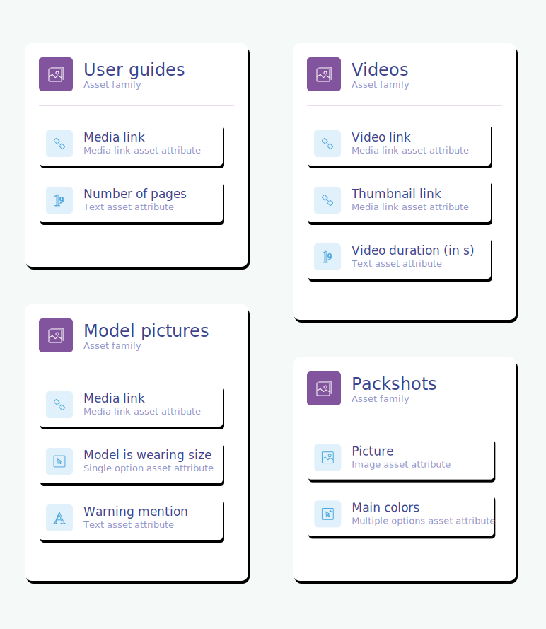
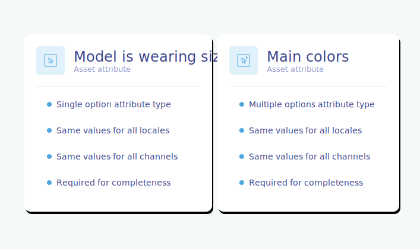

# Concepts & resources

In this section, we will introduce all the API resources our team created to interact with the Asset Manager.

## The asset family
An asset family gathers a number of assets that share a common attribute structure. In other words, an asset family can be considered as a template for its assets.

An asset family is made of [asset attributes](#the-asset-attribute). Unlike the [product families](/documentation/resources.html#family), asset attributes are not shared between asset families.

Below are some examples of asset families, along with their asset attributes.



For each asset family, you can define the way the PIM will automatically link the assets of this family to your products. We called that the `product link rule`. [Below](#focus-on-the-product-link-rule), you'll find the precise format of this rule.

Here is the JSON format representing an example of asset family.

```json
{
  "code": "user_instructions",
  "labels": {
    "en_US": "User instructions",
    "fr_FR": "Notice d'utilisation"
  },
  "product_link_rules": [
    {
      "product_selections": [
        {
          "field": "sku",
          "operator": "EQUALS",
          "value": "{{product_ref}}"
        }
      ],
      "assign_assets_to": [
        {
          "attribute": "user_instructions",
          "locale": "{{locale}}",
          "mode": "replace"
        }
      ]
    }
  ]
}
```

::: panel-link Want more details about the asset family resource? [Check its endpoints here!](#Assetfamily)
:::

## The asset attribute

In an asset family, an asset attribute is a characteristic of an asset for this family. It helps to describe and qualify an asset.
An asset attribute can have a value per channel and/or per locale.

::: warning
Note that the "Asset attribute" resource is not the same as the "Attribute" resource, even though they have a lot in common. The first one is used to describe assets, the second one is used to describe products.
:::

There are several types of asset attributes, that will allow you to handle different types of data:
- the [`text` attribute](#the-text-attribute),
- the [`single and multiple options` attributes](#the-single-and-multiple-options-attributes),
- the [`number` attribute](#the-number-attribute),
- the [`image` attribute](#the-image-attribute),
- the [`media link` attribute](#the-media-link-attribute).

::: info
Coming soon! 3 new attribute types are going to be introduced:
- the [`file` attribute](#coming-soon-the-file-attribute),
- the [`reference entity single and multiple links` attributes](#coming-soon-the-reference-entity-single-and-multiple-links-attributes).
:::

::: warning
You can have a maximum of 100 attributes to describe the structure for one given asset family.    
As a consequence, when you ask for the list of attributes for one given asset family, you'll see the response is not paginated. It won't cause any performance issue, since you can't have more than 100 attributes per asset family.
:::

### The `text` attribute
The text attribute is useful to hold textual information such as a description, a warning mention or whatever other information you can think of and which is basically made of a bunch of characters.

Here is an example of a `text` attribute.


And here is the JSON format of the `text` attribute type.
```json
{
  "code": "warning_mention",
  "labels": {
    "en_US": "Warning mention",
    "fr_FR": "Avertissement"
  },
  "type": "text",
  "value_per_locale": true,
  "value_per_channel": false,
  "is_required_for_completeness": false,
  "max_characters": 50,
  "is_textarea": false,
  "is_rich_text_editor": null,
  "validation_rule": null,
  "validation_regexp": null
}
```

### The `single and multiple options` attributes
The single and multiple options attributes are useful to hold data that can be selected among a list of choices. The single option attribute allows the selection of one single value, whereas the multiple options can hold one or several values.

Here are some examples of a `single option` and `multiple options` attributes.


And here is the JSON format of the `single option` attribute type.
```json
{
  "code": "model_is_wearing_size",
  "labels": {
    "en_US": "Model is wearing size",
    "fr_FR": "Le mannequin porte la taille"
  },
  "type": "single_option",
  "value_per_locale": false,
  "value_per_channel": false,
  "is_required_for_completeness": true
}
```
And here is the JSON format of the `multiple options` attribute type.
```json
{
  "code": "main_colors",
  "labels": {
    "en_US": "Main colors",
    "fr_FR": "Couleurs principales"
  },
  "type": "multiple_options",
  "value_per_locale": false,
  "value_per_channel": false,
  "is_required_for_completeness": true
}
```

### The `number` attribute
The number attribute is useful to hold numeral information, such as a number of pages or a video duration.

Here is an example of a `number` attribute.


And here is the JSON format of the `number` attribute type.
```json
{
  "code": "number_of_pages",
  "labels": {
    "en_US": "Number of pages",
    "fr_FR": "Nombre de pages"
  },
  "type": "number",
  "value_per_locale": false,
  "value_per_channel": false,
  "is_required_for_completeness": true
}
```

### The `image` attribute
The image attribute is useful to hold the binaries of a picture.

Here is an example of an `image` attribute.


And here is the JSON format of the `image` attribute type.
```json
{
  "code": "picture",
  "labels": {
    "en_US": "Picture",
    "fr_FR": "Photo"
  },
  "type": "image",
  "value_per_locale": false,
  "value_per_channel": false,
  "is_required_for_completeness": true,
  "allowed_extensions": ["jpg"],
  "max_file_size": "10"
}
```

### The `media link` attribute
The media link attribute type comes in pretty handy whenever you want your asset to refer to an external file, not hosted inside the PIM. For example, it can be very useful whenever you already have all your assets stored in a CDN or a DAM. The illustration below gives you an idea of how this attribute type can be used in such a case.


Here are examples of several media link asset attributes.


Below is the JSON format of the `media_link` attribute type.
```json
{
  "code": "media_link",
  "labels": {
    "en_US": "Media link",
    "fr_FR": "Lien vers le média"
  },
  "type": "media_link",
  "value_per_locale": false,
  "value_per_channel": false,
  "is_required_for_completeness": false,
  "prefix": "dam.com/my_assets/",
  "suffix": null,
  "media_type": "image"
}
```

::: info
The media type defines the type of the asset whose URL is stored in the media link attribute.  
It allows the preview display of the media link.
The available media types that you can put in the `media_type` field are:
- _"image"_,
- _"other"_.
:::


### COMING SOON - The `file` attribute

Format for the `file` attribute type
```json
{
  "code": "user_instructions_pdf",
  "labels": {
    "en_US": "User instructions pdf",
    "fr_FR": "PDF du manuel utilisateurs"
  },
  "type": "file",
  "value_per_locale": false,
  "value_per_channel": false,
  "is_required_for_completeness": true,
  "allowed_extensions": ["pdf"],
  "max_file_size": "10"
}
```

### COMING SOON - The `reference entity single and multiple links` attributes

Format for the `reference entity single link` and the `reference entity multiple links` attribute types
```json
{
  "code": "photographer",
  "labels": {
    "en_US": "Photographer",
    "fr_FR": "Photographe"
  },
  "type": "reference_entity_single_link",
  "value_per_locale": false,
  "value_per_channel": false,
  "is_required_for_completeness": false,
  "reference_entity_code": "artists"
}
```

```json
{
  "code": "main_colors",
  "labels": {
    "en_US": "Main colors",
    "fr_FR": "Couleurs dominantes"
  },
  "type": "reference_entity_multiple_links",
  "value_per_locale": false,
  "value_per_channel": false,
  "is_required_for_completeness": true,
  "reference_entity_code": "colors"
}
```


::: panel-link Want more details about the asset attribute resource? [Check its endpoints here!](#Assetattribute)
:::

## The asset

An asset is a flexible object that makes it possible to enrich products with images, videos, documents…

An asset must be part of an asset family. That way, it will have its own attributes and lifecycle.

Below are some examples of assets.


Below is the JSON format representing an example of an asset of the Asset Manager.

```json
{
  "code": "sku_54628_picture1",
  "family": "frontview",
  "values": {
    "media_preview": [
      {
        "locale": null,
        "channel": null,
        "data": "sku_54628_picture1.jpg"
      }
    ],
    "alt_tag":[
      {
        "locale": "en_US",
        "channel": null,
        "data": "Amor jacket, blue"
      },
      {
        "locale": "fr_FR",
        "channel": null,
        "data": "Veste Amor, bleu"
      }
    ],
    "model_is_wearing_size": [
      {
        "locale": null,
        "channel": null,
        "data": "s"
      }
    ],
    "photographer": [
      {
        "locale": null,
        "channel": null,
        "data": "ben_levy"
      }
    ],
    "main_colors": [
      {
        "locale": null,
        "channel": null,
        "data": ["red","purple"]
      }
    ],
    "end_of_use_date": [
      {
        "locale": null,
        "channel": "ecommerce",
        "data": "02/03/2021"
      }
    ]
  }
}
```

Assets can be linked to products and product models, in order to enrich them. To know more about this link, you can read this [section](#link-with-products-and-product-models).

An asset can hold one or several files. This comes in pretty handy if, for instance, you want to have one user instruction pdf file per language, aka per locale.

#### Example
```json
{
  "code": "user_instructions_TV_2948430",
  "family": "user_guides",
  "values": {
    "pdf_preview": [
      {
        "locale": "en_US",
        "channel": null,
        "data": "user_instructions_TV_2948430_en.pdf"
      },
      {
        "locale": "fr_FR",
        "channel": null,
        "data": "user_instructions_TV_2948430_fr.pdf"
      }
    ]
}
```

::: panel-link Want more details about the asset resource? [Check its endpoints here!](#Asset)
:::

## The asset attribute option

Some types of asset attributes can offer a list of choices. These available choices are asset attribute options.

::: warning
Note that the "Assets attribute option" resource is not the same as the "Attribute option" resource, even though they have a lot in common. The first one is an option of an attribute used to describe assets, the second one is an option of an attribute used to describe products.
:::

Only `single option` or `multiple options` attributes can have options.

Below is an example of an attribute option, used inside an asset.


Below is the JSON format representing this asset attribute option and some other.

```json
{
  "code": "size_27",
  "labels": {
    "en_US": "Size 27",
    "fr_FR": "Taille 36"
  }
}
```
```json
{
  "code": "small",
  "labels": {
    "en_US": "S",
    "fr_FR": "S"
  }
}
```
```json
{
  "code": "medium",
  "labels": {
    "en_US": "M",
    "fr_FR": "M"
  }
}
```
```json
{
  "code": "large",
  "labels": {
    "en_US": "L",
    "fr_FR": "L"
  }
}
```

::: warning
You can have a maximum of 100 options per attribute.
As a consequence, when you ask for the list of attribute options for one given attribute, you'll see that the response is not paginated. It won't cause any performance issue, since you can't have more than 100 options per attribute.
:::

::: panel-link Want more details about the asset attributes option resource? [Check its endpoints here!](#Assetattributeoption)
:::


## The asset media file
Asset media files correspond to the binaries of the images that you can link to your assets. 

Below we illustrate an example of an asset media file linked to an asset.


::: panel-link Want more details about the asset media file resource? [Check its endpoints here!](#Assetmediafile)
:::
