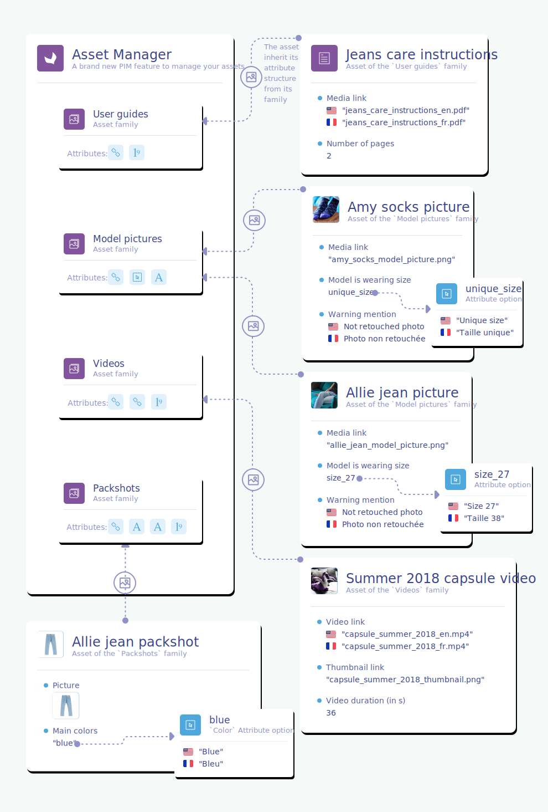

# Introduction
The Asset Manager is a brand new and more efficient way to manage the assets linked to your products/product models inside the PIM. :rocket:

::: warning
This feature is only available in the Enterprise Edition.
:::

The assets of the Asset Manager will be way more powerful than before. They will benefit from 3 major new features:
- the possibility to define a flexible structure, thanks to the [asset families](#the-asset-family),
- the possibility to automatize the link with your products, thanks to the [product link rules](#focus-on-the-product-link-rule),
- the possibility to refer to both external and internal binaries, thanks to the [media link](#the-media-link-attribute), the [image](#the-image-attribute) and the [file](#coming-soon-the-file-attribute) attribute types. 

Below, you'll find an illustration of this wonderful new feature.

This documentation explains the API built around this new Asset Manager. It also presents all the concepts of the Asset Manager so that you, as a developer using our API, can easily understand all our available [endpoints](#reference).

::: info
This new API is available starting in the 3.2 version of the PIM.
:::

Let's dig into the new concepts of this Asset Manager!
