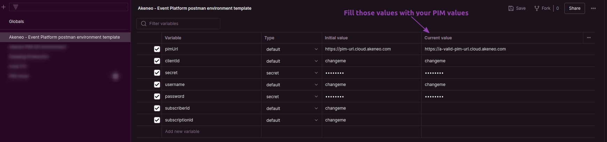
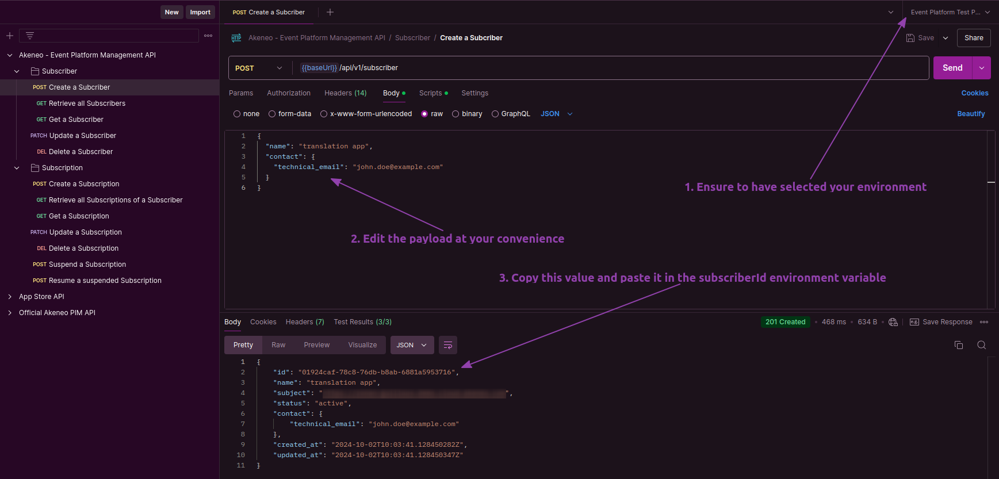
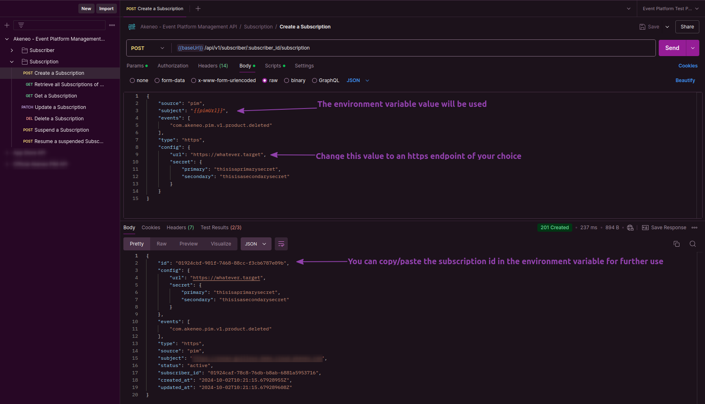

# Getting started

This guide provides a step-by-step walkthrough to help you set up event subscriptions using the Event Platform. By the end of this guide, you will have created a connection, authenticated your App, subscribed to events, and triggered an event from your PIM.

## Prerequisites

Before proceeding, ensure that you have an active <a href="https://api.akeneo.com/apps/overview.html#whats-an-akeneo-app" target="_blank">App</a> (it can be a <a href="https://api.akeneo.com/apps/create-custom-app.html" target="_blank">Custom App</a> or an active <a href="https://api.akeneo.com/getting-started/connect-the-pim-4x/step-1.html#you-said-connection" target="_blank">connection</a>) to an Akeneo PIM.

To learn how to create a connection, see the <a href="https://api-dev.akeneo.com/documentation/authentication.html#client-idsecret-generation" target="_blank">Authentication Guide</a>. If you're setting up a custom App, follow the steps in <a href="https://api-dev.akeneo.com/tutorials/how-to-get-your-app-token.html" target="_blank">this tutorial</a> to obtain an App token.

---

## Using Postman

The easiest way to manipulate the Event Platform API for a quickstart will be through our Postman Collection.

### 1. Import the Postman Collection

1. Download our <a href="https://storage.googleapis.com/akecld-prd-sdk-aep-prd-api-assets/generated_postman_collection.json" target="_blank">Postman Collection</a>
2. Download our <a href="https://storage.googleapis.com/akecld-prd-sdk-aep-prd-api-assets/postman_environment_template.json" target="_blank">Postman environment variable template</a>
3. Import those files into Postman (follow <a href="https://learning.postman.com/docs/getting-started/importing-and-exporting/importing-data/" target="_blank">this guide</a> if you're not familiar with it)

### 2. Fill the environment variables

The collection comes with a pre-script to deal with the authentication specificities when using a PIM Connection.

Fill the environment variables with your PIM connection values, and it will automatically generate an `access_token` if the credentials you provide are valid.
You can leave `subscriberId` and `subscriptionId` blank for now.



### 3. Create a Subscriber

1. Select the Postman environment you've just created
2. Send a `Create a Subscriber` POST request
3. Copy/Paste the newly created Subscriber id in your `subscriberId` environment variable



### 4. Create a Subscription

1. Change the https endpoint value to the url of your choice to receive events
2. You can update the `events` array to receive more event types
3. Send a `Create a Subscription` POST request



### 5. Trigger an Event from the PIM

With your subscription in place, you're ready to trigger the event you subscribed to (in this example, `com.akeneo.pim.v1.product.deleted`). The simplest way to do this is by deleting a product directly within the Akeneo PIM UI. This approach allows you to trigger the event and manually observe the changes in real time.

After deleting the product, verify that the event was successfully triggered by checking the payload received at your destination URL.

### 6. Consider benchmarking your Subscription

TODO: Describe briefly and redirect to the benchmarck test doc: [Benchmark your Subscription](/event-platform/benchmark.html)

---

## Using Curl

### 1. Retrieve your credentials from your targeted PIM

::: info
🛠 For every call to the API, you will need `X-PIM-TOKEN` & `X-PIM-CLIENT-ID`.

In this example, we will create a new `connection` in the PIM and use it to generate an `API token`.
:::

**1. Create a connection in Akeneo PIM:**
   - Navigate to **Connect** > **Connection settings** > **Create**.
   - Fill out the form to create the connection.
   - Note the generated `Client ID`, `Secret`, `Username`, and `Password`.

**2. Set Your Environment Variables:**
   - Define the Client ID, Secret, Username, Password, and Akeneo host URL as environment variables:

   ```bash [snippet:Shell]
        export CLIENT_ID="your-client-id"
    export CLIENT_SECRET="your-client-secret"
    export API_USERNAME="your-API-username"
    export API_PASSWORD="your-API-password"
    export TARGET_PIM_URL="https://your-pim.cloud.akeneo.com"
   ```
   Replace the placeholders with your actual credentials and host URL.

**3. Encode Your Credentials:**
   - Encode the Client ID and Secret in base64 format, separated by a colon `:`:
   ```bash [snippet:Shell]
        export BASE64_ENCODED_CLIENTID_AND_SECRET=$(echo -n "$CLIENT_ID:$CLIENT_SECRET" | base64 -w 0)
   // For Mac OS user remove the -w 0 option
   ```

**4.  Your API Token:**
   - Make the API call to retrieve your `API token` using the environment variables:
   ```bash [snippet:Shell]
        curl --request POST "$TARGET_PIM_URL/api/oauth/v1/token" \
    --header "Content-Type: application/json" \
    --header "Authorization: Basic $BASE64_ENCODED_CLIENTID_AND_SECRET" \
    --data-raw '{
    "grant_type": "password",
    "username": "'"$API_USERNAME"'",
    "password": "'"$API_PASSWORD"'"
    }'
   ```
   After retrieving the API token, store the `access_token` from the response in an environment variable:
   ```bash [snippet:Shell]
        export PIM_API_TOKEN="..."
    // Replace with the actual token from the response
   ```

   ::: info
   ℹ️ Note that the token has a lifespan of one hour.
   :::
   
   ::: info
   🛠 You can also use a custom App if you like. As long as you have a `client_id` alongside an `API token`, you are good to go for the next step
   :::

### 2. Create a Subscriber

From the next steps we will use the event platform REST API: 'https://event.prd.sdk.akeneo.cloud/api/v1'

You can create a subscriber once you have a valid PIM API token. A subscriber is an entity to which all of your subscriptions will be attached.

The `technical_email` is used to send emails about the subscription status (`deleted`, `suspended`, `revoked`)

```bash [snippet:Shell]
    curl --request POST 'https://event.prd.sdk.akeneo.cloud/api/v1/subscribers' \
--header "X-PIM-URL: $TARGET_PIM_URL" \
--header "X-PIM-TOKEN: $PIM_API_TOKEN" \
--header "X-PIM-CLIENT-ID: $CLIENT_ID" \
--header 'Content-Type: application/json' \
--data-raw '{
    "name": "example subscriber name",
    "contact": {
        "technical_email": "subscriber.test.email@example.com"
    }
}'
```

Response Example :
```json [snippet:Response]
    {
    "id": "01905a84-a3b7-766e-a49f-5519c35fa7a0",
    "name": "example subscriber name",
    "subject": "https://your-pim.cloud.akeneo.com",
    "status": "active",
    "contact": {
        "technical_email": "subscriber.test.email@example.com"
    },
    "created_at": "2024-06-27T16:26:00.503422Z",
    "updated_at": "2024-06-27T16:26:00.503422Z"
}
```
After creating the subscriber, store the ID from the response in an environment variable:
```bash [snippet:Shell]
    export SUBSCRIBER_ID="01905a84-a3b7-766e-a49f-5519c35fa7a0"  # Replace with the actual ID from the response
```

### 3. Create a Subscription

With a subscriber in place, the next step is to create a subscription to specify which events you want to receive.
In this example, we will use an HTTPS destination (HTTPS is mandatory for secure communication).
To create a subscription, you will need a destination URL.

```bash [snippet:Shell]
    export DESTINATION_URL="https://my-destination-url.com"  # Replace with your destination URL
```

::: warning
If you have already configured the Events API, do not use the same URL for your destination URL; otherwise, you will not receive events from the event platform.
:::

::: info
💡 You don’t have to worry about the secret part of the configuration for now, they are used to sign the payload (more information below in the API presentation section)
:::

```bash [snippet:Shell]
    curl --request POST "https://event.prd.sdk.akeneo.cloud/api/v1/subscribers/$SUBSCRIBER_ID/subscriptions" \
--header "X-PIM-URL: $TARGET_PIM_URL" \
--header "X-PIM-TOKEN: $PIM_API_TOKEN" \
--header "X-PIM-CLIENT-ID: $CLIENT_ID" \
--header 'Content-Type: application/json' \
--data-raw '{
    "source": "pim",
    "subject": "'"$TARGET_PIM_URL"'",
    "events": [
        "com.akeneo.pim.v1.product.updated"
    ],
    "type": "https",
    "config": {
        "url": "'"$DESTINATION_URL"'",
        "secret": {
            "primary": "averysecretprimarysecret",
            "secondary": "you can leave empty here, only use to ease your secret rotation use cases"
        }
    }
}'
```

### 4. Trigger an Event from the PIM

With your subscription in place, you're ready to trigger the event you subscribed to (in this example, `com.akeneo.pim.v1.product.updated`). The simplest way to do this is by updating a product directly within the Akeneo PIM UI. This approach allows you to trigger the event and manually observe the changes in real time.

Alternatively, you can also update a product using the [Akeneo PIM REST API](/api-reference.html#post_products_uuid) if you prefer an automated approach.

After updating the product, verify that the event was successfully triggered by checking the payload received at your destination URL.

### 5. Consider benchmarking your Subscription

TODO: Describe briefly and redirect to the benchmarck test doc: [Benchmark your Subscription](/event-platform/benchmark.html)

::: panel-link Explore Key Concepts to deepen your understanding of the [Event Platform](/event-platform/concepts.html)
:::

