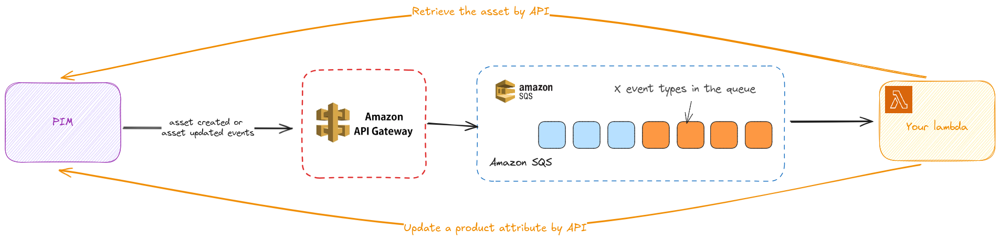
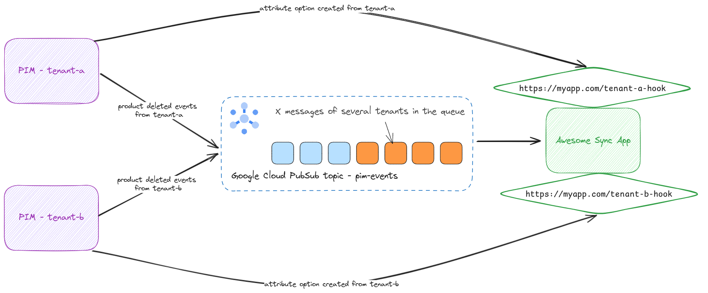

# Integration examples

### Developing a custom integration for a specific Akeneo PIM

Let’s take an example:

- You develop a custom integration that generates automatic (based on AI) textual descriptions when an asset is created or updated in the PIM.
- You want to avoid polling the Akeneo PIM Rest API to know when an asset has changed and prefer to “react” to changes, which seems a good pattern.
- Your business logic is handled by a NodeJs program, and you want it to run in an AWS Lambda

You’ll need to create a unique `subscriber` and a unique `subscription` where you can subscribe to several events simultaneously.

To respect our strict timeout policy, you should never run your business logic directly when an event is received in an HTTPS destination.

Privilege the solution of exposing an HTTP endpoint, which will put the event in a queue. To illustrate the example, you can put events in an AWS SQS queue and run your business logic asynchronously.

*(Click on the image to view it in full size)*

### Handle multi-tenant use cases with the Event Platform

You’re in a multi-tenant case where you’ll have to maintain an isolated configuration per tenant.

Let’s take an example:

- You develop an App called “Awesome Sync App”, which synchronizes product data to an e-commerce SaaS platform.
- This App runs thanks to a Google Cloud serverless solution like Cloud Run.
- This App will be published in the Akeneo App Store.
- As a public App, it aims to be integrated with any Akeneo PIM.
- Let’s say your App needs to automatically delete products in the e-commerce platform when a product is deleted in the PIM.

How can we manage it:

- For each tenant (Akeneo PIM) you deal with, you’ll have to create a `subscriber` and a `subscription` that targets a destination.
- In our example, let’s say you want to receive events on a Google Cloud PubSub topic.
    - For the sake of simplicity and maintainability, you can choose to receive all the events of the two tenants in a single topic and handle the business logic using the data received in the event payload to correctly target the right tenant.
    - The `subject` attribute of the cloud event specification is set with the `subscription` ID; it’s here to help you map the event with your internal configuration and run your business logic for the right tenant.

| Tenant | Subscriber id | Subscription id | Google topic name |
| --- | --- | --- | --- |
| https://tenant-a.cloud.akeneo.com | subscriber-tenant-a | subscription-pubsub-tenant-a | `pim-events` |
| https://tenant-b.cloud.akeneo.com | subscriber-tenant-b | subscription-pubsub-tenant-b | `pim-events` |

*(Click on the image to view it in full size)*

This way, when a new tenant is configured in your App, call the Event platform management API again to create a new subscriber and a new subscription with the correct credentials without needing to deploy other resources or infrastructure changes.

You’ll have to manage the lifecycle of the related Subscriber and Subscription when you want to receive more or fewer event types or delete tenant configuration, for example.

Please remember that if the Akeneo PIM administrator removes your app from its PIM, the related subscribers and subscriptions will be automatically revoked.

### Handle more complex isolation or dedicated resources per tenants

Having events of several tenants in one queue can be challenged, if you want more fairness or change your architecture topology, remember that you can update any subscription configuration to target a new Google topic or an HTTPS destination at will.

In the example below, we can imagine the following change: let’s say we want to keep a multi-tenant Google Cloud topic to deal with product deleted events, but we want a specific and dedicated https endpoint to receive attribute options created events as a webhook.

| Tenant | Subscriber id | Subscription id | Google topic name | Https destination |
| --- | --- | --- | --- | --- |
| https://tenant-a.cloud.akeneo.com | subscriber-tenant-a | subscription-pubsub-tenant-a | `pim-events` |  |
| https://tenant-a.cloud.akeneo.com | subscriber-tenant-a | subscription-webhook-tenant-a |  | `https://myapp.com/tenant-a-hook` |
| https://tenant-b.cloud.akeneo.com | subscriber-tenant-b | subscription-pubsub-tenant-b | `pim-events` |  |
| https://tenant-b.cloud.akeneo.com | subscriber-tenant-b | subscription-webhook-tenant-b |  | `https://myapp.com/tenant-b-hook` |

*(Click on the image to view it in full size)*

You could also choose to keep only one Google Cloud Topic and deal with different event types coming from different tenants. Everything is possible. You should start simple and adapt the topology according to your needs.

### Key takeaways

- Do not handle business logic directly when consuming events through an HTTPS destination to ensure that the Event Platform timeout is respected.
- Declare one subscription per tenant and subscribe to several events at once.
- Start simple and add complexity with multiple subscriptions targeting different destinations if required.

::: panel-link Understand the event platform compatibility with your PIM version[Next](/event-platform/compatibility.html)
:::