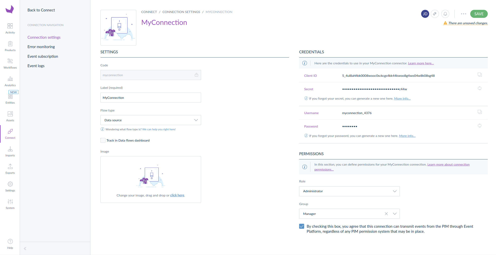

# Migrate to Event Platform
## Introduction
This documentation aims to help your transition from the deprecated Event API to the modern Event Platform. We recommend beginning with [the getting started guide](https://api.akeneo.com/event-platform/getting-started.html) to get acquainted with the core concepts. Instead of repeating existing information, this guide offers numerous links to relevant resources, enabling you to delve deeper into various topics.

As you will discover throughout this guide, the Event Platform was built with an API-first approach. Consequently, a substantial portion of its configuration is required to be performed through HTTPS calls.

## Permissions
In the previous Event API, you received events related to all simple products, product models, or variants within categories that the Connection user had permission to access.

With the Event Platform, there is now a single permission model. This permission is represented by a checkbox on the Connection settings page. When this permission is enabled, the Connection is granted access to receive all events.

This checkbox must be activated by a PIM user.

[](../img/aep/checkbox-on-connection-page.png)

## Event Platform configuration
As outlined [here](https://api.akeneo.com/event-platform/concepts.html#), to receive events, you must declare a subscriber and one or more subscriptions. You can utilize Postman with our [collection](https://storage.googleapis.com/akecld-prd-sdk-aep-prd-api-assets/generated_postman_collection.json) and [environment variables template](https://storage.googleapis.com/akecld-prd-sdk-aep-prd-api-assets/postman_environment_template.json), or you can opt for another tool like Curl.

### Create a subscriber
To create a subscriber, you need to make a **POST** request to `https://event.prd.sdk.akeneo.cloud/api/v1/subscribers`, including three headers and a **JSON body**.

The required headers are:

- `x-pim-client-id`: The Connection client ID.
- `x-pim-url`: The URL of the relevant PIM, starting with `https://`.
- `x-pim-token`: The access token (the same token you send with the `Authorization: Bearer …` header when using the PIM REST API).

The body should contain a single object with a `name` property and a `contact` sub-object, which includes a `technical_email` property. Here’s an example:

```json

{
    "name": "awesome connection subscriber",
    "contact": {
        "technical_email": "valid.email@example.com"
    }
}
```

The response will be a JSON object containing an `id`, needed for the creation of your subscription(s).

### Create a subscription
To replicate a system similar to what you had with the Event API (with a single destination), you will need to create one subscription.

As with the subscriber, you can use Postman or another tool like Curl. The URL to call is `https://event.prd.sdk.akeneo.cloud/api/v1/subscribers/{subscriber_id}/subscriptions`. The headers remain the same as before.

For more details, refer to the documentation for the endpoint [here](https://storage.googleapis.com/akecld-prd-sdk-aep-prd-api-assets/openapi_specification.html#tag/Subscription/operation/create_subscription). To summarize, here’s an example of the payload you need to send:

```json

{
    "source": "pim",
    "subject": "https://pim.url",
    "events": [
        "com.akeneo.pim.v1.product.created",
        "com.akeneo.pim.v1.product.updated.delta",
        "com.akeneo.pim.v1.product.deleted",
        "com.akeneo.pim.v1.product-model.created",
        "com.akeneo.pim.v1.product-model.updated.delta",
        "com.akeneo.pim.v1.product-model.deleted"
    ],
    "type": "https",
    "config": {
        "url": "https://destination.url",
        "secret": {
            "primary": "averysecretprimarysecret",
            "secondary": "can be empty, only used to ease secret rotation"
        }
    }
}
```

This example includes all the events necessary to maintain a similar system to what you had before. Feel free to modify the list according to your needs. A complete list of available events can be found [here](https://api.akeneo.com/event-platform/available-events.html#available-events).

Now, all relevant events should be sent. To test the setup, simply create, modify, or delete a product and check your destination to see if you receive the corresponding event.


## Development adjustments
### Product UUID and removal of identifier
In the previous Event API, you had the option to send product information using either UUID or identifier. With the Event Platform, only the UUID is transmitted. If you were using product identifiers, you will need to transition to using UUIDs.

This change will not affect product model events.

### Differential payload (delta) instead of full payload
In the old Event API, each event related to an update provided a complete snapshot of the object (simple product, model, or variant), including a wealth of data. With the Event Platform and the `*.updated.delta` events, you will now receive only the data that has changed. The format for these new events is detailed in the documentation [here](https://api.akeneo.com/event-platform/available-events.html).

If you need to access all product or product model information upon receiving events, please use the PIM REST API.

### Filtering events triggered by yourself
With the Event Platform, you will receive events triggered by creation, modification, or deletion actions, even if your Connection initiated those actions. Therefore, it is essential to implement a mechanism to filter out these self-triggered events to avoid an infinite loop.

### Importance of a robust system
It is crucial to ensure that your system is robust, as the Event Platform can send significantly more events per second compared to the previous system. If your system is unable to keep up with this increased volume, it may lead to the suspension of your subscription. To avoid potential disruptions, it is essential to implement effective handling mechanisms.

For more information on managing event delivery, please refer to the documentation on [delivery timeout](https://api.akeneo.com/event-platform/key-platform-behaviors.html#delivery-timeout), [retry policy](https://api.akeneo.com/event-platform/key-platform-behaviors.html#retry-policy-for-transient-failures), and [suspension policy](https://api.akeneo.com/event-platform/key-platform-behaviors.html#suspension-policy).

## How to debug
In the previous version, there was an "Event Logs" menu within the PIM user interface. With the Event Platform, you now have access to an endpoint that allows you to view logs relevant to your activities. For more information, please visit our [dedicated page](https://api.akeneo.com/event-platform/logs.html#logs-api-overview).
