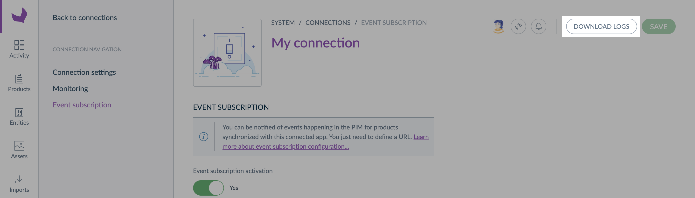

# Subscribe and Receive events

## Subscribing to events

To subscribe events, you need to start by configuring an Akeneo PIM. 
You will find all the steps to follow in the help center page [Subscribe and manage **events**](https://help.akeneo.com/pim/serenity/articles/manage-event-subscription.html):
- how to activate the event subscription,
- how and where to setup and verify your server URL,
- how to manage the Akeneo PIM permissions to filter events,
- how to access logs related to an event subscription.

### Events API Request URLs

Request URL receives an HTTP POST containing data in response to activity.

In the Events API, your Events API Request URL is the target location. Akeneo PIM will deliver all the events, regardless of the event type, to this location.

Since your connected application will have only one Request URL, maybe you'll need to do an additional dispatch or routing server-side after receiving event data.

Your Request URL will receive JSON-based payloads containing wrapped event types.


## Receiving Events

Your Event API Request URL will receive events matching your subscriptions. The message which delivers these events can contain up to `10` events.

::: warning
Be careful as some events can be sent in the wrong order, more than once, or get lost altogether.

This is why the `event_id` and `event_datetime` are essential.
- The `event_id` uniquely identify each event.
  This allows you to log the events you have already processed and not handle more than once.
- The `event_datetime` allows you to ignore an outdated event.

:::


### Events dispatched as JSON

When an event occurs, Akeneo PIM send an HTTP POST request to your Request URL. 
This request is JSON-based (`Content-Type: application/json`) and contains wrapped events. 

```json
{
    "events": [
        {
            "action": "product.created",
            "author": "julia",
            "author_type": "ui",
            "event_id": "6ad821d8-2468-4632-89d2-92e442c72313",
            "event_datetime": "2020-01-01T00:00:00+00:00",
            "pim_source": "staging.akeneo.com",
            "data": {
                "resource": {...}
            }
        }
    ]
}
```

### Request header

| Name | Description |
| ---- | ------- |
| `X-Akeneo-Request-Signature` | The signature of the payload to verify the authenticity of the request
| `X-Akeneo-Request-Timestamp` | The time at which the request was sent (unix timestamp in seconds)

### Request body

| Name | Description | Example | Format |
| ---- | ----------- | ------- | ------ |
| `action` | Helps you identify the API event type you received, which action has been done in the PIM. | `product.created` | |
| `event_id` | Unique identifier of the event. It allows you to ensure you received the same API event only one time. | `6ad821d8-2468-4632-89d2-92e442c72313` | UUID V4|
| `event_datetime` | Contains the date and time of the event. | `2020-01-01T00:00:00+00:00` | Format ISO 8601 |
| `author` | Tells you who performed the action. | `Julia` or `magento_0000` | |
| `author_type` | Type of user who performed the action. Like Julia, it can be a UI user or a REST API call coming from another application. | `ui` or `api` | |
| `pim_source` | Identify which Akeneo PIM sent the event. | `demo.akeneo.com` | From `AKENEO_PIM_URL` environment variable |
| `data` | Contains the resource data. Learn more about the data wrapper, including its JSON schema, on our [Events API Reference](/events-reference/events-reference-serenity/products.html). | | |


## Debugging events



### Log types
As you can read on our help center page [Subscribe and manage **events**](https://help.akeneo.com/pim/serenity/articles/manage-event-subscription.html#debug), the log file gives you access to 4 log levels and 5 log types: 
- `ERROR The endpoint returned an error.` In that case, the connected app received the event request, but something went wrong, and it answered with an error. 
- `ERROR The endpoint failed to answer under 500 ms.` This error means that the connected application did not answer quickly enough. 
- `WARNING The maximum number of requests per hour has been reached.` If you have this warning log, you might be interested in the limit and scalability section below. ;) 
- `NOTICE The event was not sent because it was raised by the same connection.` In that case, your connected application raised an event in the PIM through the REST API, so we chose not to send this event to avoid an endless loop between the PIM and your app.
- `NOTICE The event was not sent because the product does not exist or the connection does not have the required permissions.` When the PIM doesn't send an event because of a lack of permission, it can be normal. For instance, if you previously set up the connection permission to not receive events on products that are irrelevant for this particular app. If you think you should have received this event, please look at our [permission configuration section](https://help.akeneo.com/pim/serenity/articles/manage-event-subscription.html#manage-your-permissions). 
- `INFO The API event request was sent.` Information logs are here to inform you that an event request has been sent to your connected app. It can be useful when you are testing if everything works well! 

::: warning
Please, note that we store **errors and warnings for the past 72 hours**, and only the **latest 100 notices and info logs**.
:::


### Example of a log file

Here is an example of what you can download: 
```
2021/03/12 09:46:11 ERROR The endpoint failed to answer under 500 ms. {"event_subscription_url":"http:\/\/mockbin.org\/bin\/e5736cfd-e790-4029-b9f4-87c7035641c5http:\/\/mockbin.org\/bin\/54ecaed5-a663-4c2f-a369-8c640c7b60db","events":[{"action":"product.updated","event_id":"b2d1c2c3-4370-49c0-950e-feb6bd91b71e","event_datetime":"2021-03-12T09:46:08+00:00","author":"admin","author_type":"ui","product_identifier":"1111111171"},{"action":"product.updated","event_id":"7f4f193f-7942-40b7-b768-b3081f56574f","event_datetime":"2021-03-12T09:46:08+00:00","author":"admin","author_type":"ui","product_identifier":"13620748"},{"action":"product.updated","event_id":"d2186b26-e40f-4a55-a972-3b2feea4b5c8","event_datetime":"2021-03-12T09:46:08+00:00","author":"admin","author_type":"ui","product_identifier":"15554974"},{"action":"product.updated","event_id":"8e00e2bd-43c7-411c-a49f-20acc59c713c","event_datetime":"2021-03-12T09:46:08+00:00","author":"admin","author_type":"ui","product_identifier":"12249740"},{"action":"product.updated","event_id":"247afac3-0295-4487-9bd4-c0917ff645f7","event_datetime":"2021-03-12T09:46:08+00:00","author":"admin","author_type":"ui","product_identifier":"14802402"},{"action":"product.updated","event_id":"081e8b46-cbac-4d34-8575-29c46645a0c6","event_datetime":"2021-03-12T09:46:08+00:00","author":"admin","author_type":"ui","product_identifier":"11704300"},{"action":"product.updated","event_id":"7f2de727-1a6d-42a9-b692-87175122a629","event_datetime":"2021-03-12T09:46:08+00:00","author":"admin","author_type":"ui","product_identifier":"11051162"},{"action":"product.updated","event_id":"20967bc9-ffd0-4fd7-98c5-f1d6e76c925e","event_datetime":"2021-03-12T09:46:08+00:00","author":"admin","author_type":"ui","product_identifier":"1712634"},{"action":"product.updated","event_id":"5f657729-1c33-4f5f-a1e6-ed06aaec4e72","event_datetime":"2021-03-12T09:46:08+00:00","author":"admin","author_type":"ui","product_identifier":"16672632"},{"action":"product.updated","event_id":"3a9a68f7-fa4b-4fa6-8639-e30e486c94aa","event_datetime":"2021-03-12T09:46:08+00:00","author":"admin","author_type":"ui","product_identifier":"13303917"}]}
2021/03/12 09:52:16 ERROR The endpoint returned an error. {"event_subscription_url":"http:\/\/mockbin.org\/bin\/54ecaed5-a663-4c2f-a369-8c640c7b60db","status_code":500,"headers":{"User-Agent":["GuzzleHttp\/6.5.5 curl\/7.64.0 PHP\/7.4.16"],"Host":["mockbin.org"],"Content-Type":["application\/json"],"X-Akeneo-Request-Signature":["c12cc6b14b92a7847c85f52a3f6919c479378ecb67de2f6729e2f00e32b22792"],"X-Akeneo-Request-Timestamp":["1615542736"]},"events":[{"action":"product_model.updated","event_id":"08cb3423-52ca-48dc-9f1e-bad0129e817a","event_datetime":"2021-03-12T09:52:13+00:00","author":"admin","author_type":"ui","product_model_code":"aurora"}]}
2021/03/12 09:54:16 NOTICE The event was not sent because it was raised by the same connection. {"event":{"action":"product.created","event_id":"713f6acb-08bd-45b9-9c44-036b0fbfcac0","event_datetime":"2021-03-12T09:54:16+00:00","author":"magento_0000","author_type":"api","product_identifier":"new_simple_product_2"}}
2021/03/12 09:54:58 NOTICE The event was not sent because the product does not exists or the connection does not have the required permissions. {"event":{"action":"product.updated","event_id":"68e5652c-0816-4a16-8d66-fd4fbc47bbe6","event_datetime":"2021-03-12T09:54:58+00:00","author":"admin","author_type":"ui","product_identifier":"new_simple_product_2"}}
2021/03/12 09:46:38 INFO The API event request was sent. {"event_subscription_url":"http:\/\/mockbin.org\/bin\/e5736cfd-e790-4029-b9f4-87c7035641c5http:\/\/mockbin.org\/bin\/54ecaed5-a663-4c2f-a369-8c640c7b60db","status_code":200,"headers":{"Date":["Fri, 12 Mar 2021 09:46:38 GMT"],"Content-Type":["application\/json; charset=utf-8"],"Transfer-Encoding":["chunked"],"Connection":["keep-alive"],"Set-Cookie":["__cfduid=da6292561570de2b37bcecdf48724e1151615542398; expires=Sun, 11-Apr-21 09:46:38 GMT; path=\/; domain=.mockbin.org; HttpOnly; SameSite=Lax"],"Vary":["X-HTTP-Method-Override, Accept, Accept-Encoding"],"Access-Control-Allow-Origin":["*"],"Access-Control-Allow-Methods":["POST"],"Access-Control-Allow-Headers":["host,connection,accept-encoding,x-forwarded-for,cf-ray,x-forwarded-proto,cf-visitor,user-agent,content-type,x-akeneo-request-signature,x-akeneo-request-timestamp,cf-connecting-ip,cdn-loop,cf-request-id,x-request-id,x-forwarded-port,via,connect-time,x-request-start,total-route-time,content-length"],"Access-Control-Allow-Credentials":["true"],"Via":["1.1 vegur"],"CF-Cache-Status":["DYNAMIC"],"cf-request-id":["08c76dc53d000027a005860000000001"],"Report-To":["{\"group\":\"cf-nel\",\"endpoints\":[{\"url\":\"https:\\\/\\\/a.nel.cloudflare.com\\\/report?s=Cakq8lW27UdvdnjfqCZHlDIWGh2FpXBdhaWAzOUVK8JlcAFDBVTz8gD4hHkNqEr7kLnaiqPTRu8um3vLmd%2BUZfWOo6cMY3bdiGfjvQ%3D%3D\"}],\"max_age\":604800}"],"NEL":["{\"report_to\":\"cf-nel\",\"max_age\":604800}"],"Server":["cloudflare"],"CF-RAY":["62ec18b52abe27a0-PRG"],"alt-svc":["h3-27=\":443\"; ma=86400, h3-28=\":443\"; ma=86400, h3-29=\":443\"; ma=86400"]},"events":[{"action":"product.updated","event_id":"ab1865b0-143d-4ad8-8b73-0c14844df032","event_datetime":"2021-03-12T09:46:23+00:00","author":"admin","author_type":"ui","product_identifier":"12312165"},{"action":"product.updated","event_id":"cda38acc-253a-4d98-a1b7-e174add5b083","event_datetime":"2021-03-12T09:46:23+00:00","author":"admin","author_type":"ui","product_identifier":"1199244"},{"action":"product.updated","event_id":"62896f91-17af-49d0-8707-99329a125f09","event_datetime":"2021-03-12T09:46:23+00:00","author":"admin","author_type":"ui","product_identifier":"17654811"},{"action":"product.updated","event_id":"bf31fda4-9c55-42ad-ae49-22fc3f432db1","event_datetime":"2021-03-12T09:46:23+00:00","author":"admin","author_type":"ui","product_identifier":"10978316"},{"action":"product.updated","event_id":"b9e4b245-cc9e-4393-a0b8-06b4412bf40d","event_datetime":"2021-03-12T09:46:23+00:00","author":"admin","author_type":"ui","product_identifier":"12822289"},{"action":"product.updated","event_id":"e2840a00-2bf6-466e-ab15-27d4235096c2","event_datetime":"2021-03-12T09:46:23+00:00","author":"admin","author_type":"ui","product_identifier":"15620134"},{"action":"product.updated","event_id":"78f0f73d-9c21-4ee4-8473-14e8e7a65e8a","event_datetime":"2021-03-12T09:46:23+00:00","author":"admin","author_type":"ui","product_identifier":"12226421"},{"action":"product.updated","event_id":"ffc93c4f-4cd0-4e7c-a1b6-aefa14e5b7b2","event_datetime":"2021-03-12T09:46:23+00:00","author":"admin","author_type":"ui","product_identifier":"14600631"},{"action":"product.updated","event_id":"d407100d-630c-4fb8-867d-965f70a6bb62","event_datetime":"2021-03-12T09:46:23+00:00","author":"admin","author_type":"ui","product_identifier":"18157852"},{"action":"product.updated","event_id":"8bf064de-2d57-4d0f-910a-fd78af8a4a5c","event_datetime":"2021-03-12T09:46:23+00:00","author":"admin","author_type":"ui","product_identifier":"14532409"}]}
```
