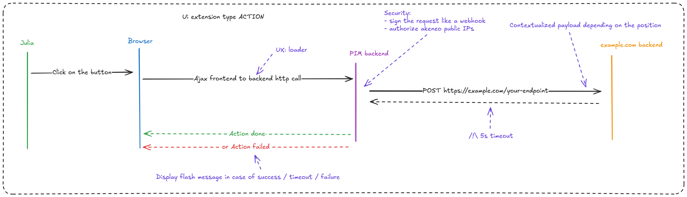

## Action
An **action** UI extension is designed to perform external tasks in the background. Please note the following key points regarding its functionality:

+ **Single execution**: An action cannot be executed multiple times simultaneously. This ensures that tasks are processed in a controlled manner.
+ **Menu deactivation**: During the execution of an action, the associated menu will be deactivated to prevent further interactions until the task is complete.
+ **Notification on completion**: A notification will appear once the external server responds to the request, keeping users informed of the task's status.
+ **Timeout**: The PIM HTTP client that communicates with the destination is configured with a timeout of 5 seconds.
+ **POST HTTP method**: The request being sent to the destination is a POST request.
+ **Signature**: It's possible to configure a `secret` to sign the body of the POST request sent to the destination (<a href='https://wikipedia.org/wiki/SHA-2'>SHA-512</a> protocol).

Here is a diagram illustrating the workflow:
[](../img/extensions/ui-extensions/action-extension-schema.png)

Data sent within the POST body, formatted in JSON, contain:
- A `data` object with different fields depending on the [position](#position).
- A `context` object containing:
  - the configured `locale`,
  - the configured `channel`,
  - the configured `category` (only available for product grid actions).
- A `user` object containing the `uuid`, `username` and `groups` of the connected user.
- A `timestamp` that can be used with a [secret](#secret) to help you to protect your server against [replay attacks](https://en.wikipedia.org/wiki/Replay_attack).

From the position `pim.product.header`, the `data` object contains:
- A `productUuid` string field

From the position `pim.product-model.header`, the `data` object contains:
- A `productModelCode` string field representing the root model code.

From the position `pim.sub-product-model.header`, the `data` object contains:
- A `productModelCode` string field representing the sub model code.

From the position `pim.product-grid.action-bar`, the `data` object contains:
- A `productUuids` field which is an array of string representing the UUIDs of selected products
- A `productModelCodes` field which is an array of string representing the codes of selected product models and sub models

From the position `pim.product.index`, the `data` object is `empty`.

Examples :

```json
{
  "data": {
    "productUuid": "ecfddba2-59bf-4d35-bd07-8ceeefde51fd"
  },
  "context": {
    "locale": "en_US",
    "channel": "ecommerce"
  },
  "user": {
    "uuid": "e05cc457-b8ac-43b1-baa7-c4c112091ad8",
    "username": "julia",
    "groups": [
      "Manager",
      "All"
    ]
  },
  "timestamp": 1739948408
}
```

```json
{
  "data": {
    "productUuids": [],
    "productModelCodes": ["armor", "apollon"]
  },
  "context": {
    "locale": "en_US",
    "channel": "ecommerce",
    "category": "master_men_blazers_deals"
  },
  "user": {
    "uuid": "e05cc457-b8ac-43b1-baa7-c4c112091ad8",
    "username": "julia",
    "groups": [
      "Manager",
      "All"
    ]
  },
  "timestamp": 1739948408
}
```

## Available Positions

Action extensions can be placed in:

| Position | Context | Data Sent |
|----------|---------|-----------|
| `pim.product.header` | Single product | `productUuid` |
| `pim.product-model.header` | Root product model | `productModelCode` |
| `pim.sub-product-model.header` | Sub product model | `productModelCode` |
| `pim.product-grid.action-bar` | Multiple products/models | `productUuids[]`, `productModelCodes[]` |
| `pim.product.index` | Product list page | No product data |

## Limitations

- **5-second timeout**: Your endpoint must respond quickly
- **No retry mechanism**: Failed requests are not automatically retried
- **No progress updates**: Users don't see real-time progress
- **500 item limit**: Grid actions limited to 500 products/models
- **Single execution**: One action at a time per extension

::: panel-link Data Component Extensions [Next](/extensions/data-component.html)
:::
