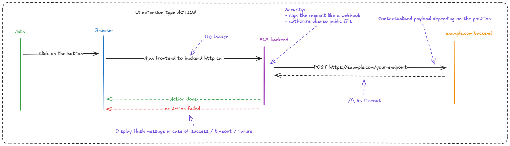

## Action
An **action** Extension is designed to make HTTP POST request.

Here is a diagram illustrating the workflow:
[](../img/extensions/ui-extensions/action-extension-schema.png)

Data sent within the POST body, formatted in JSON, contain:
- A `context` object containing:
  - the configured `locale`,
  - the configured `channel`,
- A `user` object containing the `uuid`, `username` and `groups` of the connected user.
- A `timestamp` that can be used with a [secret](#secret) to help you to protect your server against [replay attacks](https://en.wikipedia.org/wiki/Replay_attack).
- A `data` object with different fields depending on the position:

  | Position | Field | Type | Description |
  |----------|-------|------|-------------|
  | `pim.product.header` | `productUuid` | string | The UUID of the product |
  | `pim.product-model.header` | `productModelCode` | string | The root model code |
  | `pim.sub-product-model.header` | `productModelCode` | string | The sub model code |
  | `pim.product-grid.action-bar` | `productUuids` | string[] | UUIDs of selected products |
  | `pim.product-grid.action-bar` | `productModelCodes` | string[] | Codes of selected product models and sub models |
  | `pim.product.index` | - | - | Empty object |

Examples :

```json
{
  "data": {
    "productUuid": "ecfddba2-59bf-4d35-bd07-8ceeefde51fd"
  },
  "context": {
    "locale": "en_US",
    "channel": "ecommerce"
  },
  "user": {
    "uuid": "e05cc457-b8ac-43b1-baa7-c4c112091ad8",
    "username": "julia",
    "groups": [
      {"id": 7, "name": "Manager"},
      {"id": 11, "name": "All"}
    ]
  },
  "timestamp": 1739948408
}
```

## Signature

You can configure a `secret` on the action to authenticate incoming requests. When a secret is set, the PIM computes an **HMAC-SHA512** signature of the raw request body and sends it in a `signature` HTTP header, formatted as:

```
signature: sha512=<hex digest>
```

### How to verify the signature

To verify a request on your server:

1. **Capture the raw request body as bytes** — before any JSON parsing.
2. **Compute** `HMAC-SHA512(body, secret)` and encode the result as a lowercase hex string.
3. **Strip the `sha512=` prefix** from the received `signature` header value.
4. **Compare** the two hex strings using a **timing-safe equality** function to prevent [timing attacks](https://en.wikipedia.org/wiki/Timing_attack).

::: warning
Always verify the signature **before** parsing the JSON body. Processing an unverified payload is a security risk.
:::

```php [snippet:PHP]
function isSignatureValid(string $rawBody, string $signatureHeader, string $secret): bool
{
    if (!str_starts_with($signatureHeader, 'sha512=')) {
        return false;
    }
    $received = substr($signatureHeader, strlen('sha512='));
    $expected = hash_hmac('sha512', $rawBody, $secret);

    return hash_equals($expected, $received);
}

// Usage in a controller / middleware:
$rawBody       = (string) $request->getContent();
$signatureHeader = $request->headers->get('signature', '');

if (!isSignatureValid($rawBody, $signatureHeader, $_ENV['AKENEO_SECRET'])) {
    return new Response('Invalid signature', 401);
}
```
```javascript [snippet:Node.js]
const crypto = require('crypto');

function isSignatureValid(rawBody, signatureHeader, secret) {
    if (!signatureHeader?.startsWith('sha512=')) return false;
    const received = signatureHeader.slice('sha512='.length);
    const expected = crypto.createHmac('sha512', secret).update(rawBody).digest('hex');
    return crypto.timingSafeEqual(Buffer.from(expected), Buffer.from(received));
}

// Usage with Express — capture raw body before JSON parsing:
app.use(express.json({
    verify: (req, _res, buf) => { req.rawBody = buf.toString('utf8'); },
}));

app.post('/your-endpoint', (req, res) => {
    const signature = req.headers['signature'] ?? '';
    if (!isSignatureValid(req.rawBody, signature, process.env.AKENEO_SECRET)) {
        return res.status(401).json({ error: 'Invalid signature' });
    }
    // process req.body ...
});
```
```python [snippet:Python]
import hmac
import hashlib

def is_signature_valid(raw_body: bytes, signature_header: str, secret: str) -> bool:
    prefix = 'sha512='
    if not signature_header.startswith(prefix):
        return False
    received = signature_header[len(prefix):]
    expected = hmac.new(secret.encode('utf-8'), raw_body, hashlib.sha512).hexdigest()
    return hmac.compare_digest(expected, received)

# Usage with Flask:
from flask import Flask, request, abort

@app.route('/your-endpoint', methods=['POST'])
def handle():
    raw_body = request.get_data()
    signature = request.headers.get('signature', '')
    if not is_signature_valid(raw_body, signature, os.environ['AKENEO_SECRET']):
        abort(401)
    # process request.json ...
```

### Replay attack prevention

The payload always includes a `timestamp` (Unix seconds). After verifying the signature, check that the timestamp is recent — for example, within 5 minutes — to protect your server against [replay attacks](https://en.wikipedia.org/wiki/Replay_attack):

```php [snippet:PHP]
$body = json_decode($rawBody, true);
if (abs(time() - $body['timestamp']) > 300) {
    return new Response('Request expired', 401);
}
```
```javascript [snippet:Node.js]
const body = JSON.parse(rawBody);
if (Math.abs(Date.now() / 1000 - body.timestamp) > 300) {
    return res.status(401).json({ error: 'Request expired' });
}
```
```python [snippet:Python]
import json, time

body = json.loads(raw_body)
if abs(time.time() - body['timestamp']) > 300:
    abort(401)
```

### Secret rotation

To rotate the secret without downtime, configure your server to accept both the current and the new secret — verify the signature against each one. Once all in-flight requests signed with the old secret have been processed, remove it and update the PIM configuration with the new secret only.

## Available Positions

See the [Positions documentation](/extensions/positions.html) for visual examples.

## Limitations

- **Timeout**: The PIM HTTP client that communicates with the destination is configured with a timeout of 5 seconds.
- **No retry mechanism**: Failed requests are not automatically retried
- **No progress updates**: Users don't see real-time progress
- **500 item limit**: Grid actions limited to 500 products/models
- **Single execution**: An action cannot be executed multiple times simultaneously. This ensures that tasks are processed in a controlled manner.

::: panel-link Data Component Extensions [Next](/extensions/data-component.html)
:::
