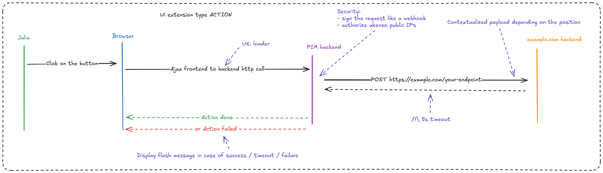

## Action
An **action** Extension is designed to make HTTP POST request.

Here is a diagram illustrating the workflow:
[](../img/extensions/ui-extensions/action-extension-schema.png)

Data sent within the POST body, formatted in JSON, contain:
- A `context` object containing:
  - the configured `locale`,
  - the configured `channel`,
  - the configured `categories` (only available for product grid actions).
- A `user` object containing the `uuid`, `username` and `groups` of the connected user.
- A `timestamp` that can be used with a [secret](#secret) to help you to protect your server against [replay attacks](https://en.wikipedia.org/wiki/Replay_attack).
- A `data` object with different fields depending on the position:

  | Position | Field | Type | Description |
  |----------|-------|------|-------------|
  | `pim.product.header` | `productUuid` | string | The UUID of the product |
  | `pim.product-model.header` | `productModelCode` | string | The root model code |
  | `pim.sub-product-model.header` | `productModelCode` | string | The sub model code |
  | `pim.product-grid.action-bar` | `productUuids` | string[] | UUIDs of selected products |
  | `pim.product-grid.action-bar` | `productModelCodes` | string[] | Codes of selected product models and sub models |
  | `pim.product.index` | - | - | Empty object |

Examples :

```json
{
  "data": {
    "productUuid": "ecfddba2-59bf-4d35-bd07-8ceeefde51fd"
  },
  "context": {
    "locale": "en_US",
    "channel": "ecommerce",
    "categories": ["master_men_blazers_deals"]
  },
  "user": {
    "uuid": "e05cc457-b8ac-43b1-baa7-c4c112091ad8",
    "username": "julia",
    "groups": [
      {"id": 7, "name": "Manager"},
      {"id": 11, "name": "All"}
    ]
  },
  "timestamp": 1739948408
}
```

## Signature

You can configure a `secret` on the action to authenticate requests. The PIM then signs the raw request body with **HMAC-SHA512** and sends the result as a hex string in a `signature` header, prefixed with `sha512=` (for example `sha512=9f86d081884c...`).

To verify it, compute the HMAC-SHA512 of the raw body (before JSON parsing) with your secret, and compare it to the header value with a timing-safe function.

::: tips
The payload includes a `timestamp` (Unix seconds). Rejecting requests older than a few minutes protects you against [replay attacks](https://en.wikipedia.org/wiki/Replay_attack).
:::

## Available Positions

See the [Positions documentation](/extensions/positions.html) for visual examples.

## Limitations

- **Timeout**: The PIM HTTP client that communicates with the destination is configured with a timeout of 5 seconds.
- **No retry mechanism**: Failed requests are not automatically retried
- **No progress updates**: Users don't see real-time progress
- **500 item limit**: Grid actions limited to 500 products/models
- **Single execution**: An action cannot be executed multiple times simultaneously. This ensures that tasks are processed in a controlled manner.

::: panel-link Data Component Extensions [Next](/extensions/data-component.html)
:::
