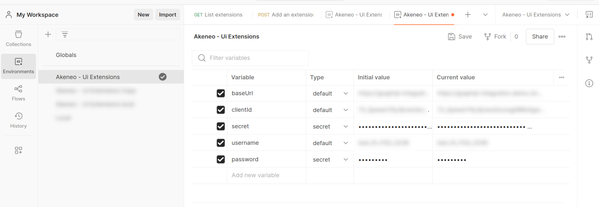
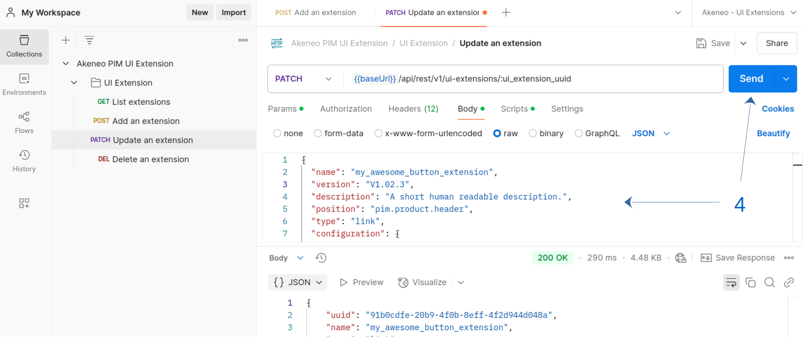

# API
We offer an API that allows you to manage UI Extensions with the same capabilities as the UI interface. This enables you to efficiently integrate and control your UI Extensions programmatically.

### Prerequisites
Before proceeding, ensure that you have an active <a href="https://api.akeneo.com/apps/overview.html#whats-an-akeneo-app" target="_blank">App</a> (it can be a <a href="https://api.akeneo.com/apps/create-custom-app.html" target="_blank">Custom App</a> or an active <a href="https://api.akeneo.com/getting-started/connect-the-pim-4x/step-1.html#you-said-connection" target="_blank">connection</a>) to an Akeneo PIM.

To learn how to create a Connection, see the <a href="https://api-dev.akeneo.com/documentation/authentication.html#client-idsecret-generation" target="_blank">Authentication Guide</a>. If you're setting up a Custom App, follow the steps in <a href="https://api-dev.akeneo.com/tutorials/how-to-get-your-app-token.html" target="_blank">this tutorial</a> to obtain an App token.

### Authentication and authorization

#### Authentication
Having a valid Akeneo PIM API token provided by either a Connection or an App to be authenticated to use the UI extension API endpoints.

#### Authorization
To manage your extension, ensure that your Connection or App has the necessary permissions.
1. For Connections: The user associated with the Connection must have the permission **UI extensions > Manage your extensions using the API** enabled.
2. For Apps: You need to request the scope **manage_extensions**.

::: info
A UI extension is owned by a user, meaning that a Connection can only manage UI extensions created by itself or by Connections associated with the same user. Similarly, an App can only manage its own UI extensions.
:::

Granting these permissions before setup helps prevent unnecessary errors.

### Using Postman
The quickest way to get started with UI extensions is by using our Postman collection.

#### 1. Import the Postman Collection
1. Download our <a href="https://api.akeneo.com/files/Akeneo%20PIM%20API.postman_collection.json" target="_blank">Postman collection</a>
2. Download our <a href="https://api.akeneo.com/files/akeneo-PIM-API-environment-4x.postman_environment.json" target="_blank">Postman environment variable template</a>
3. Import those files into Postman (follow <a href="https://learning.postman.com/docs/getting-started/importing-and-exporting/importing-data/" target="_blank">this guide</a> if you're not familiar with how Postman collections work)

#### 2. Fill the environment variables
The collection includes a pre-script for handling PIM Connection authentication.

Before making API requests, ensure your environment variables are filled with your Akeneo PIM Connection credentials: a valid `pim_access_token` will be generated automatically on your first request. If you don't receive a token, or you don't see it within the environment variable list, double-check your credentials.

[](../img/extensions/ui-extensions/postman-fill-env.png)


#### 3. Create a UI extension
1. Select the Postman environment you've just created
2. Click on the `Add an extension` POST request
3. Customize the data to send as you want before click on `Send`
4. Copy the newly created extension UUID. It will be asked to modify or delete the UI extension.

[](../img/extensions/ui-extensions/postman-add-extension.png)

#### 4. Update a UI extension
1. Make sure that the right environment is selected
2. Click on the `Update an extension` POST request
3. Fill the `ui_extension_uuid` parameter with the UUID of the concerned UI extension
4. Customize the data according to your needs before clicking on `Send`

[](../img/extensions/ui-extensions/postman-update-extension-1.png)
[](../img/extensions/ui-extensions/postman-update-extension-2.png)


#### 5. Delete a UI extension
1. Make sure that the right environment is selected
2. Click on the `Delete an extension` POST request
3. Fill the `ui_extension_uuid` parameter with the UUID of the concerned UI extension
4. Click on `Send`

[](../img/extensions/ui-extensions/postman-delete-extension.png)

### Using Curl

#### 1. Retrieve your credentials from your targeted PIM

::: info
🛠 For every call to the API, you need `X-PIM-TOKEN` & `X-PIM-CLIENT-ID`.

In this example, we will create a new `connection` in the PIM and use it to generate an `API token`.
:::

**1. Create a Connection in Akeneo PIM:**
- Navigate to **Connect** > **Connection settings** > **Create**.
- Fill out the form to create the Connection.
- Note the generated `client ID`, `secret`, `username`, and `password`.

**2. Set your environment variables:**
- Define the client ID, secret, username, password, and Akeneo host URL as environment variables:

   ```bash [snippet:Shell]
        export CLIENT_ID="your-client-id"
    export CLIENT_SECRET="your-client-secret"
    export API_USERNAME="your-API-username"
    export API_PASSWORD="your-API-password"
    export TARGET_PIM_URL="https://your-pim.cloud.akeneo.com"
   ```
Replace the placeholders with your actual credentials and host URL.

**3. Encode your credentials:**
- Encode the client ID and secret in base64 format, separated by a colon `:`:
   ```bash [snippet:Shell]
        export BASE64_ENCODED_CLIENTID_AND_SECRET=$(echo -n "$CLIENT_ID:$CLIENT_SECRET" | base64 -w 0)
   // For Mac OS user remove the -w 0 option
   ```

**4.  Your API token:**
- Make the API call to retrieve your `API token` using the environment variables:
   ```bash [snippet:Shell]
        curl --request POST "$TARGET_PIM_URL/api/oauth/v1/token" \
    --header "Content-Type: application/json" \
    --header "Authorization: Basic $BASE64_ENCODED_CLIENTID_AND_SECRET" \
    --data-raw '{
    "grant_type": "password",
    "username": "'"$API_USERNAME"'",
    "password": "'"$API_PASSWORD"'"
    }'
   ```
After retrieving the API token, store the `access_token` from the response in an environment variable:
   ```bash [snippet:Shell]
        export PIM_API_TOKEN="..."
    // Replace with the actual token from the response
   ```

::: info
Note that the token has a lifespan of one hour.
:::

::: info
🛠 Custom Apps are also supported. To use one, add a variable `app_access_token` with your API token.
:::

#### 2. Create a UI extension
You can create a UI extension once you have a valid PIM API token.

```bash [snippet:Shell]
    curl --request POST "$TARGET_PIM_URL/api/rest/v1/ui-extensions" \
--header "Authorization: Bearer $PIM_API_TOKEN" \
--header 'Content-Type: application/json' \
--data-raw '{
    "name": "my_awesome_extension",
    "version": "V1.02",
    "type": "link",
    "position": "pim.product.header",
    "configuration": {
        "url": "https://myapp.com/product",
        "default_label": "My awesome extension",
        "labels": {
          "en_US": "My awesome extension"
        }
    }
}'
```

#### 3. Update a UI extension
To update a UI extension, you must have a valid PIM API token and the UUID of the extension you want to update.

```bash [snippet:Shell]
    curl --request PATCH "$TARGET_PIM_URL/api/rest/v1/ui-extensions/$EXTENSION_UUID" \
--header "Authorization: Bearer $PIM_API_TOKEN" \
--header 'Content-Type: application/json' \
--data-raw '{
    "version": "V1.03",
    "type": "iframe",
    "position": "pim.product.tab"
}'
```

#### 4. Delete a UI extension
To delete a UI extension, you must have a valid PIM API token and the UUID of the extension you want to delete.

```bash [snippet:Shell]
    curl --request DELETE "$TARGET_PIM_URL/api/rest/v1/ui-extensions/$EXTENSION_UUID" \
--header "Authorization: Bearer $PIM_API_TOKEN"
```

## API reference
Several choices are offered to deep dive into our API, to discover all the endpoints, and their request/response schema:

- You can <a href="https://api.akeneo.com/api-reference-index.html#UIExtensions" target="_blank">consult this static documentation</a>
- Discover it thanks to <a href="https://api.akeneo.com/files/Akeneo%20PIM%20API.postman_collection.json" target="_blank">the postman collection</a> (see the [Postman section](https://api.akeneo.com/extensions/getting-started.html#using-postman))

::: panel-link FAQ [Next](/extensions/faq.html)
:::