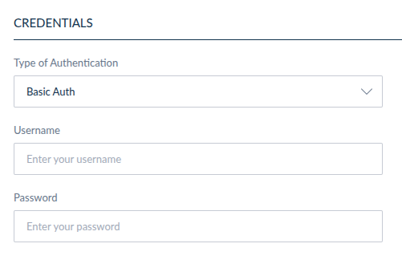

# Credentials
You have the ability to make authenticated calls via UI Extensions using credentials. Currently, credentials are available only for Action type UI Extensions, but they will be extended to other extension types in the future. These credentials will be used as headers in the POST requests generated when calling the specified URL.

### Currently Available Credential Methods

- Basic Authentication
- Bearer Token
- Custom Credentials

To add credentials, simply select your preferred authentication method and enter the required information.

Rest assured that all credentials will be encrypted before being stored, ensuring the security of your sensitive data. Additionally, the API calls are made server-side, meaning that the credentials are not accessible from the front end of the application, further enhancing security.

::: panel-link Filtering [Next](/extensions/filtering.html)
:::