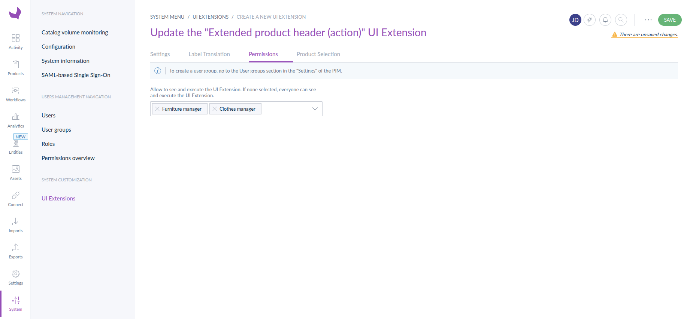
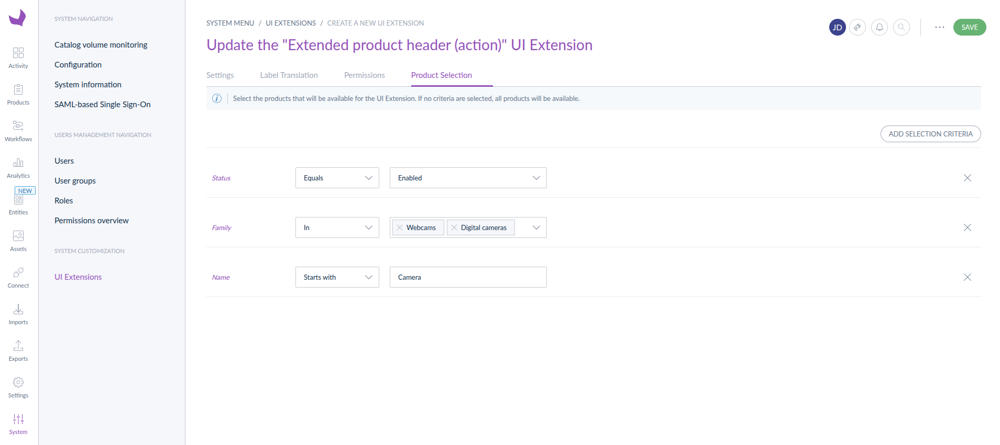
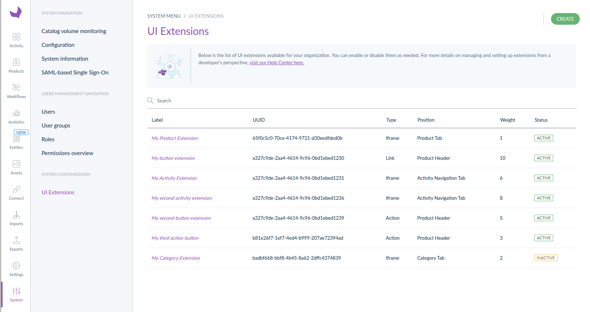

# Filter and display UI extensions

You may want to create UI extensions that are only available to certain user groups or for specific products. This can be achieved by filtering UI extensions based on user groups and product selection.

### Filter UI extension by user groups

You can filter the user groups allowed to see and execute an UI extension by using the permissions tab on the UI extensions creation/edition form.

### Filter UI extension by product selection
You can filter the products that can be selected by an UI extension by using the product selection tab on the UI extensions creation/edition form.

### Order UI extensions

In addition to the filtering capacity, you can order the UI extension in the UI using the `weight` field on the creation/update form. This will determine the order in which extensions are displayed in the **header** and **tab** positions.

::: panel-link FAQ [Next](/extensions/faq.html)
:::
