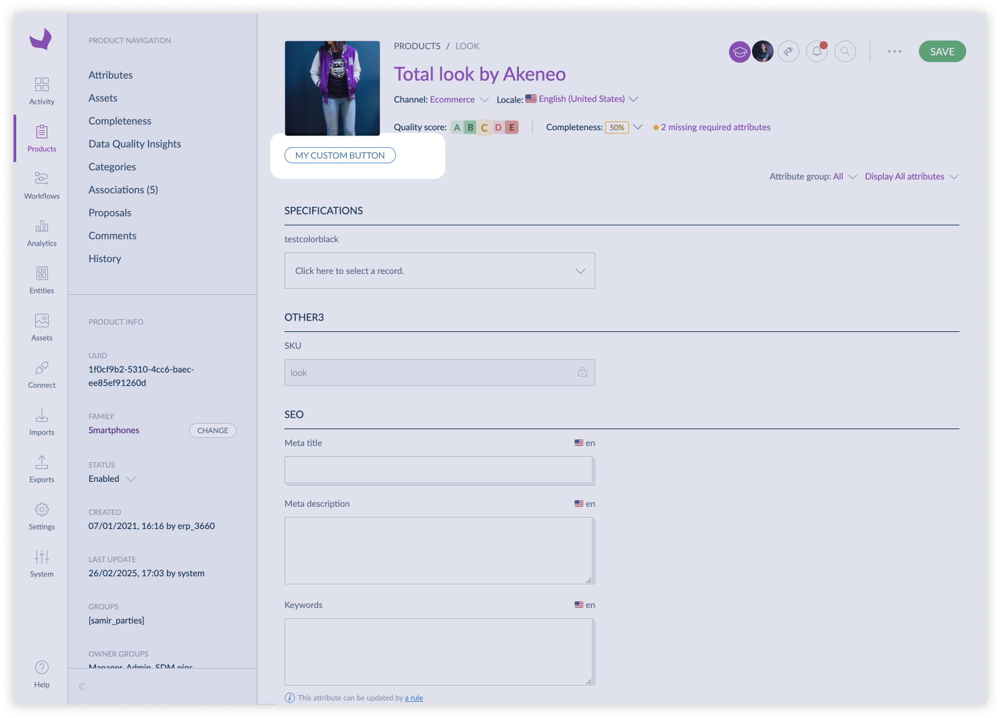
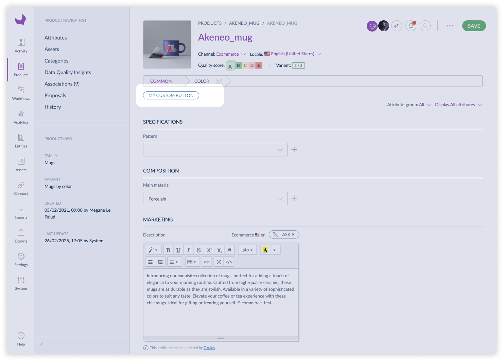
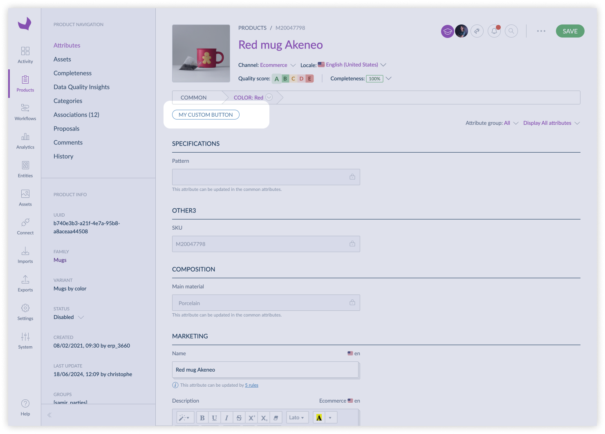
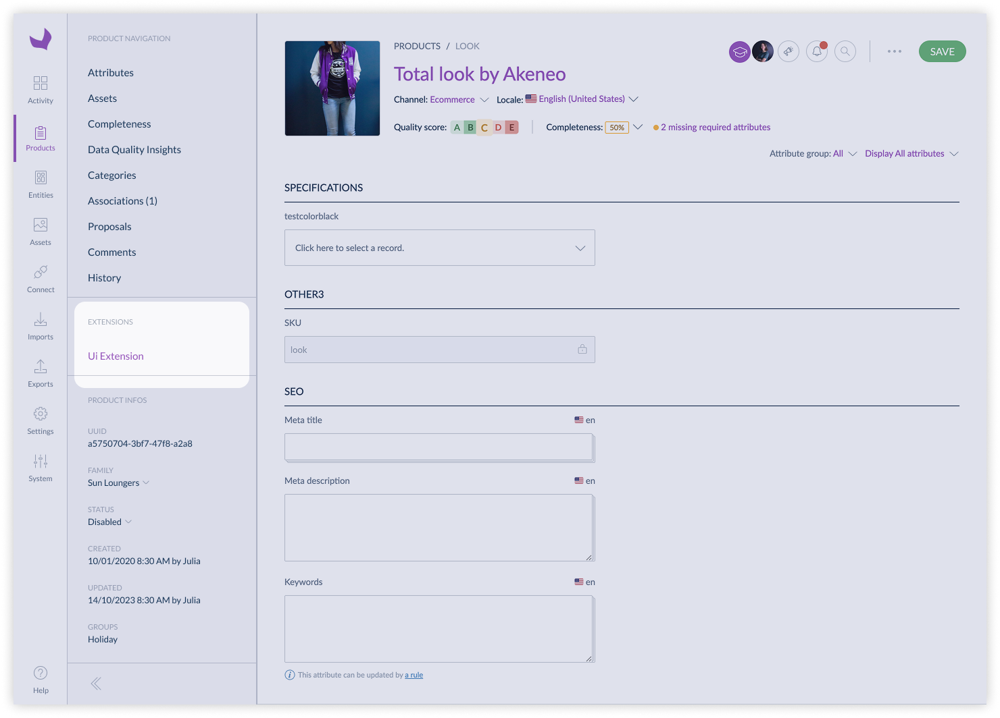
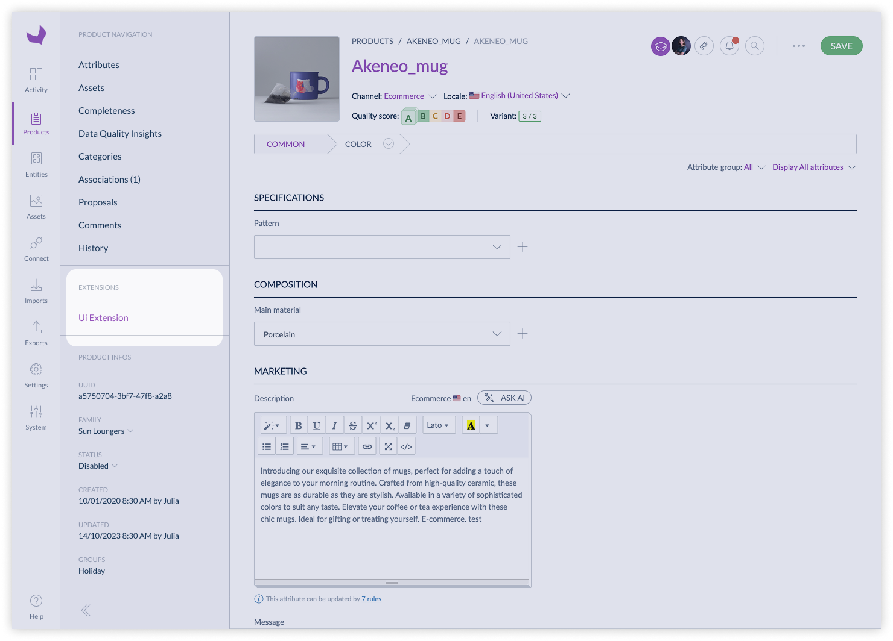
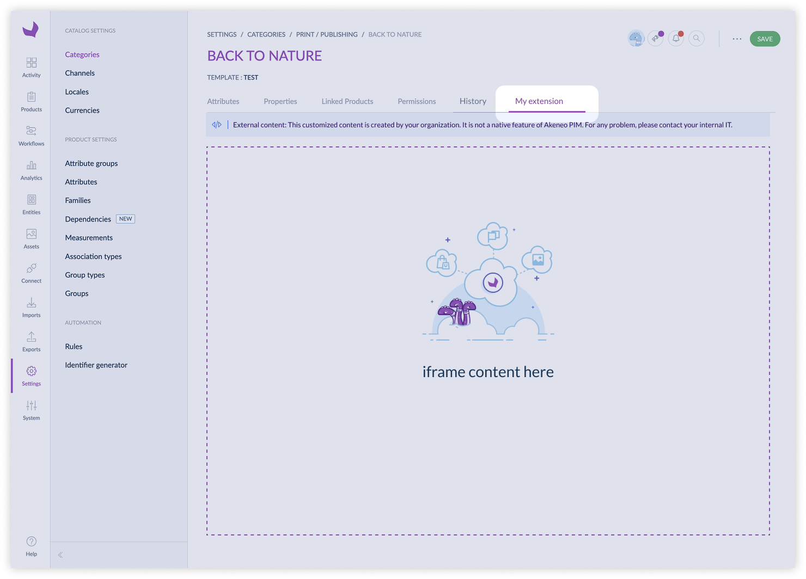
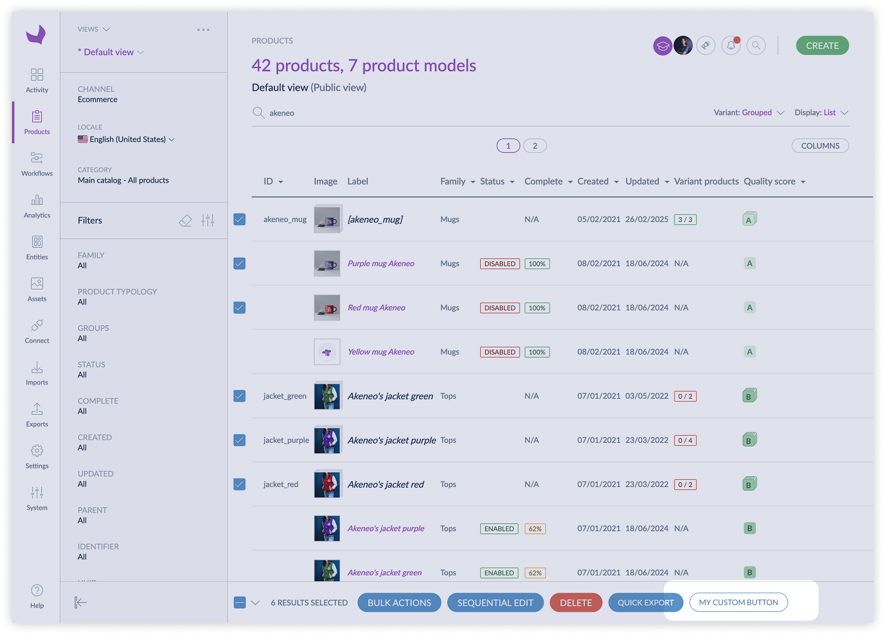
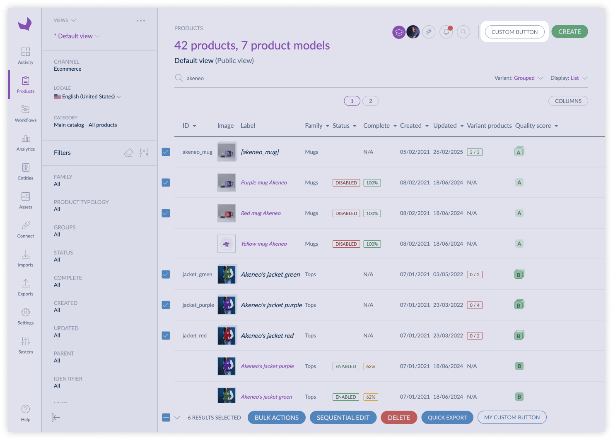
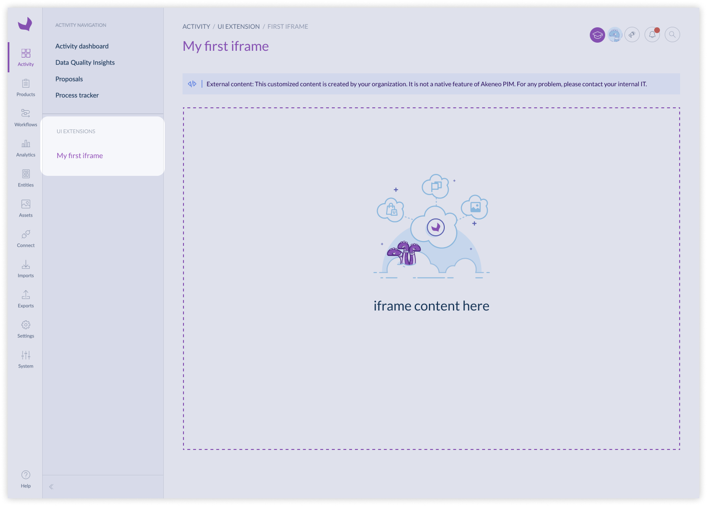

# Positions

Extension position determines where your extension appears within the Akeneo PIM interface. You can select from a variety of available positions, which vary depending on the specific extension type.

**Key Concepts:**

* **Position Options:** Each extension type offers a set of predefined positions. These positions control the location of your extension's interface elements.
* **Contextual Relevance:** Position options are designed to align with the functionality of each extension type, ensuring a seamless user experience.

**Best Practices:**

* Choose a position that aligns with the extension's intended functionality and user workflow.
* Review the available position options for each extension type to ensure optimal integration.
* Consider the impact of the position on the overall user experience within the PIM.

## Available positions for UI extensions

| Positions                    | Action | Iframe | Link  | Data Source   |
|------------------------------|--------|--------|-------|---------------|
| pim.product.header           | ✔️     | ❌     | ✔️    | ❌            |
| pim.product-model.header     | ✔️     | ❌     | ✔️    | ❌            |
| pim.sub-product-model.header | ✔️     | ❌     | ✔️    | ❌            |
| pim.product.tab              | ❌     | ✔️     | ❌    | ✔️            |
| pim.product-model.tab        | ❌     | ✔️     | ❌    | ❌            |
| pim.sub-product-model.tab    | ❌     | ✔️     | ❌    | ❌            |
| pim.category.tab             | ❌     | ✔️     | ❌    | ✔️            |
| pim.product-grid.action-bar  | ✔️     | ✔️     | ❌    | ❌            |
| pim.product.index            | ✔️     | ❌     | ❌    | ❌            |
| pim.activity.navigation.tab  | ❌     | ✔️     | ❌    | ❌            |
| pim.product.panel            | ❌     | ✔️     | ❌    | ✔️            |
| pim.product-model.panel      | ✔️     | ❌     | ✔️    | ✔️            |
| pim.sub-product-model.panel  | ✔️     | ❌     | ✔️    | ✔️            |

### Positions list

#### pim.product.header
This position refers to the header of a simple product or a variant edit page.

#### pim.product-model.header
This position refers to the header of a root model edit page.

#### pim.sub-product-model.header
This position refers to the header of a sub product model edit page.

#### pim.product.tab
This position refers to the tab of a simple product or a variant edit page.

#### pim.product-model.tab
This position refers to the tab of a root model edit page.

#### pim.sub-product-model.tab
This position refers to the tab of a sub product model edit page.

#### pim.category.tab
This position refers to the tab of a category edit page.

#### pim.product-grid.action-bar
This position refers to the action bar of the product grid. It is used to add actions that can be applied to multiple products at once.

::: warning
For the moment, you can't use UI extensions with more than **500** selected products & product models.
:::

#### pim.product.index
This position refers to the top left menu of the product list page.

#### pim.activity.navigation.tab
This position refers to the tab of the activity navigation. It is used to add custom tabs in the activity navigation of the PIM.

#### pim.product.panel
This position refers to the right panel of a simple product or a variant edit page.
// TODO change picture

#### pim.product-model.panel
This position refers to the right panel of a root model edit page.
// TODO change picture

#### pim.sub-product-model.panel
This position refers to the right panel of a sub product model edit page.
// TODO change picture

::: panel-link Credentials [Next](/extensions/credentials.html)
:::
