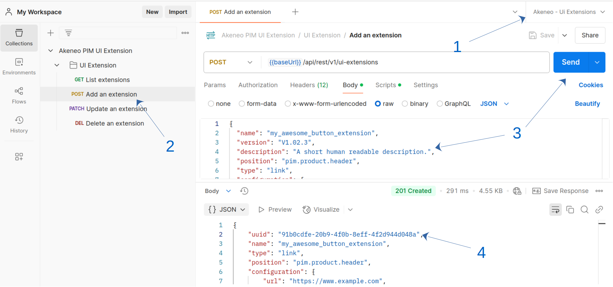
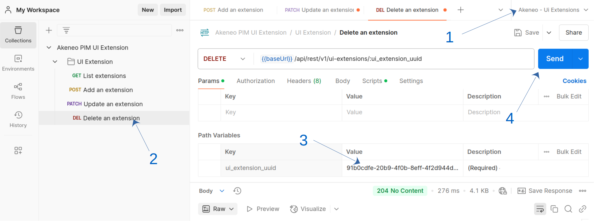

# UI Extensions
The UI Extension feature enables you to extend your PIM by integrating custom views and actions from external systems. This framework provides the flexibility to modify and adapt your PIM experience to meet specific business requirements.
By leveraging this functionality, you can integrate custom solutions while maintaining the reliability and ease of use of our SaaS platform, offering a balance between flexibility and stability.

The extension framework is designed to help you customize the standard behavior of your PIM system by integrating with externally hosted solutions. This documentation provides an overview of the framework's capabilities and the various customization options available, enabling you to extend and tailor your PIM to meet your specific business needs.

## Getting Started
This guide provides a step-by-step walkthrough for setting up and managing UI extensions.

### Prerequisites
Before proceeding, ensure that you have an active <a href="https://api.akeneo.com/apps/overview.html#whats-an-akeneo-app" target="_blank">App</a> (it can be a <a href="https://api.akeneo.com/apps/create-custom-app.html" target="_blank">Custom App</a> or an active <a href="https://api.akeneo.com/getting-started/connect-the-pim-4x/step-1.html#you-said-connection" target="_blank">connection</a>) to an Akeneo PIM.

To learn how to create a connection, see the <a href="https://api-dev.akeneo.com/documentation/authentication.html#client-idsecret-generation" target="_blank">Authentication Guide</a>. If you're setting up a custom App, follow the steps in <a href="https://api-dev.akeneo.com/tutorials/how-to-get-your-app-token.html" target="_blank">this tutorial</a> to obtain an App token.

### Authentication and authorization

#### Authentication
Having a valid Akeneo PIM API token provided by either a connection or an App to be authenticated to use the UI Extension API endpoints.

#### Authorization
To effectively manage your extension, it's essential to ensure that your connection or app has the necessary permissions.
1. For Connections: The user associated with the connection must have the permission **UI Extensions > Manage own Extensions** enabled.
2. For Apps: You need to request the scope **manage_extensions**.

::: info
ℹ️ A UI extension is owned by a user, meaning that a connection can only manage UI extensions created by itself or by connections associated with the same user. Similarly, an App can only manage its own UI extensions.
:::

Granting these permissions before setup helps prevent unnecessary errors.

### Using Postman
The quickest way to get started with UI Extensions is by using our Postman collection.

#### 1. Import the Postman Collection
1. Download our <a href="https://api.akeneo.com/files/Akeneo%20PIM%20API.postman_collection.json" target="_blank">Postman Collection</a>
2. Download our <a href="https://api.akeneo.com/files/akeneo-PIM-API-environment-4x.postman_environment.json" target="_blank">Postman environment variable template</a>
3. Import those files into Postman (follow <a href="https://learning.postman.com/docs/getting-started/importing-and-exporting/importing-data/" target="_blank">this guide</a> if you're not familiar with how Postman collections work)

#### 2. Fill the environment variables
The collection includes a pre-script for handling PIM Connection authentication.

Before making API requests, ensure your environment variables are configured with your Akeneo PIM connection credentials. A valid `pim_access_token` will be generated automatically on your first request, provided your credentials are valid. If you don't receive a token, or you don't see it within the environment variable list, double-check your credentials.


#### 3. Create a UI extension
1. Select the Postman environment you've just created
2. Click on the `Add an extension` POST request
3. Customize the data to send as you want before click on `Send`
4. Copy the newly created extension UUID. It will be asked to modify or delete the UI extension.



#### 4. Update a UI extension
1. Make sure that the right environment is selected
2. Click on the `Update an extension` POST request
3. Fill the `ui_extension_uuid` parameter with the UUID of the concerned UI extension
4. Customize the data to send as you want before click on `Send`


#### 5. Delete a UI extension
1. Make sure that the right environment is selected
2. Click on the `Delete an extension` POST request
3. Fill the `ui_extension_uuid` parameter with the UUID of the concerned UI extension
4. Click on `Send`



### Using Curl

#### 1. Retrieve your credentials from your targeted PIM

::: info
🛠 For every call to the API, you will need `X-PIM-TOKEN` & `X-PIM-CLIENT-ID`.

In this example, we will create a new `connection` in the PIM and use it to generate an `API token`.
:::

**1. Create a connection in Akeneo PIM:**
- Navigate to **Connect** > **Connection settings** > **Create**.
- Fill out the form to create the connection.
- Note the generated `Client ID`, `Secret`, `Username`, and `Password`.

**2. Set Your Environment Variables:**
- Define the Client ID, Secret, Username, Password, and Akeneo host URL as environment variables:

   ```bash [snippet:Shell]
        export CLIENT_ID="your-client-id"
    export CLIENT_SECRET="your-client-secret"
    export API_USERNAME="your-API-username"
    export API_PASSWORD="your-API-password"
    export TARGET_PIM_URL="https://your-pim.cloud.akeneo.com"
   ```
Replace the placeholders with your actual credentials and host URL.

**3. Encode Your Credentials:**
- Encode the Client ID and Secret in base64 format, separated by a colon `:`:
   ```bash [snippet:Shell]
        export BASE64_ENCODED_CLIENTID_AND_SECRET=$(echo -n "$CLIENT_ID:$CLIENT_SECRET" | base64 -w 0)
   // For Mac OS user remove the -w 0 option
   ```

**4.  Your API Token:**
- Make the API call to retrieve your `API token` using the environment variables:
   ```bash [snippet:Shell]
        curl --request POST "$TARGET_PIM_URL/api/oauth/v1/token" \
    --header "Content-Type: application/json" \
    --header "Authorization: Basic $BASE64_ENCODED_CLIENTID_AND_SECRET" \
    --data-raw '{
    "grant_type": "password",
    "username": "'"$API_USERNAME"'",
    "password": "'"$API_PASSWORD"'"
    }'
   ```
After retrieving the API token, store the `access_token` from the response in an environment variable:
   ```bash [snippet:Shell]
        export PIM_API_TOKEN="..."
    // Replace with the actual token from the response
   ```

::: info
ℹ️ Note that the token has a lifespan of one hour.
:::

::: info
🛠 Custom apps are also supported. To use one, add a variable `app_access_token` with your API Token.
:::

#### 2. Create a UI extension
You can create a UI extension once you have a valid PIM API token.

```bash [snippet:Shell]
    curl --request POST "$TARGET_PIM_URL/api/rest/v1/ui-extensions" \
--header "Authorization: Bearer $PIM_API_TOKEN" \
--header 'Content-Type: application/json' \
--data-raw '{
    "name": "my_awesome_extension",
    "version": "V1.02",
    "type": "link",
    "position": "pim.product.header",
    "configuration": {
        "url": "https://myapp.com/product",
        "default_label": "My awesome extension",
        "labels": {
          "en_US": "My awesome extension"
        }
    }
}'
```

#### 3. Update a UI extension
To update a UI extension, you must possess a valid PIM API token and the UUID of the extension you want to update.

```bash [snippet:Shell]
    curl --request PATCH "$TARGET_PIM_URL/api/rest/v1/ui-extensions/$EXTENSION_UUID" \
--header "Authorization: Bearer $PIM_API_TOKEN" \
--header 'Content-Type: application/json' \
--data-raw '{
    "version": "V1.03",
    "type": "iframe",
    "position": "pim.product.tab"
}'
```

#### 4. Delete a UI extension
To delete a UI extension, you must possess a valid PIM API token and the UUID of the extension you want to delete.

```bash [snippet:Shell]
    curl --request DELETE "$TARGET_PIM_URL/api/rest/v1/ui-extensions/$EXTENSION_UUID" \
--header "Authorization: Bearer $PIM_API_TOKEN"
```

## Concepts

### Type

UI extensions are categorized by type, which determines their capabilities. Select the type that best suits your requirements:
+ action
+ iframe
+ link

#### Link
A **link** UI extension is crafted to open your external content in a new tab.

#### Iframe
An **iframe** UI extension allows to open your external content inside the PIM thanks to an iframe.

An iframe (inline frame) is an HTML element that allows you to embed another HTML document within the current document. It is commonly used to display content from another source, such as a webpage, video, or interactive content, without leaving the current page.

For more detailed information, you can refer to the [Mozilla Developer Network (MDN) documentation on iframes](https://developer.mozilla.org/en-US/docs/Web/HTML/Element/iframe).

#### Action
An **action** UI extension is designed to perform external tasks in the background. Please note the following key points regarding its functionality:

+ **Single Execution**: An Action cannot be executed multiple times simultaneously. This ensures that tasks are processed in a controlled manner.
+ **Menu Deactivation**: During the execution of an Action, the associated menu will be deactivated to prevent further interactions until the task is complete.
+ **Notification on Completion**: A notification will appear once the external server responds to the request, keeping users informed of the task's status.

### Position

The available `position` values determine where your UI extension will appear in the Akeneo PIM

#### pim.product.header
This position refers to the header of a simple product or a variant edit page.

#### pim.product-model.header
This position refers to the header of a root model edit page.

#### pim.sub-product-model.header
This position refers to the header of a sub model edit page.

#### pim.product.tab
This position refers to the left panel of a simple product or a variant edit page.

#### pim.category.tab
This position refers to the horizontal list of tabs on a category edit page.

#### pim.product-grid.action-bar
This position refers to the list of commands availables after selecting some products on the product grid.

### Secret
A secret can be used for UI extensions of type `action`. If it is, this secret is used to sign the body of the POST request sent to the destination.
The protocol used to sign is <a href='https://fr.wikipedia.org/wiki/SHA-2'>SHA-512</a>.

## Available types by position
Each position supports a specific subset of available types. The table below outlines the compatible types for all positions.

| Positions                    | Action | Iframe | Link  |
|------------------------------|--------|--------|-------|
| pim.product.header           | ✔️     | ❌     | ✔️    |
| pim.product-model.header     | ✔️     | ❌     | ✔️    |
| pim.sub-product-model.header | ✔️     | ❌     | ✔️    |
| pim.product.tab              | ❌      | ✔️     | ❌    |
| pim.category.tab             | ❌      | ✔️     | ❌    |
| pim.product-grid.action-bar  | ✔️      | ✔️     | ❌    |

## Example use case(s)
TODO

## Administration of UI extensions
For a functional overview of the administration panel and permissions, see our [Help Center](https://help.akeneo.com/en_US/extensions/ui-extentions).

### Prerequisites

To be able to list all registered extensions, you must have a role with **UI Extensions > View all UI extensions via Administration panel** permission.

To be able to enable or disable extensions, you must have a role with **UI Extensions > Manage all UI extensions via Administration panel** permission.

### List all UI extensions

You can open the administration panel with the menu **System > System Customization > UI Extensions**.

On the new page, you can see all extensions registered in your PIM.

### Enable / Disable a UI extension

To manage one or more UI extensions from the list, you just have to select them thanks to the checkboxes present on the left of each line, and then use one of the two commands available at the bottom of the screen.

## API Reference
Several choices are offered to deep dive into our API, to discover all the endpoints, and their request/response schema:

- You can <a href="https://api.akeneo.com/api-reference-index.html#UIExtensions" target="_blank">consult this static documentation</a>
- Discover it thanks to <a href="https://api.akeneo.com/files/Akeneo%20PIM%20API.postman_collection.json" target="_blank">the postman collection</a> (see the [Postman section](https://api.akeneo.com/extensions/ui-extensions.html#using-postman))

## FAQ
### Who is responsible for UI Extensions?
Akeneo is responsible for the UI Extensions framework itself, including the APIs and administrative interface. We provide support for these components. Your organization or your integrator is responsible for any custom code, iframes, or other custom development built within the UI Extensions. Support for this custom code falls to your organization or integrator, not Akeneo. 

### How can I add a new UI Extension to my PIM?
Adding a new extension to your organization is easy! Just follow the steps in [this guide](https://api.akeneo.com/extensions/ui-extensions.html#getting-started).

### The UI Extensions entry isn't showing up in my PIM. Could you help me understand why? 
If you don't see the UI Extensions entry in your PIM, it's likely due to permission settings. [This guide](https://api.akeneo.com/extensions/ui-extensions.html#authorization) will help you check and activate the necessary permissions. 

### I'd like to see my extension in a position that isn't currently available. What can I do? 
Currently, UI Extension placements are limited to those defined by Akeneo. However, we highly value your feedback! Please contact your Customer Success Manager or our Support team to share your specific placement needs. This will help us understand your use case and consider it for future development.
