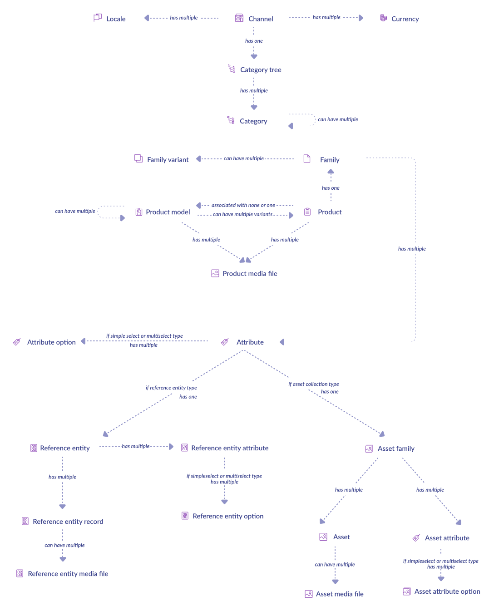

# Discover the PIM objects relationship schema

The PIM is a complex system with many objects, [concepts](https://help.akeneo.com/pim/serenity/themes-for-julia.html), and interactions between its components. The first time you consume an API resource, you may feel puzzled by your response payloads.
So, before beginning your synchronization process, make sure to understand these interactions: it's a little step during your journey, but a crucial one for your comprehension.

And because a picture is worth a thousand words, the following global relationship schema may help you.

This relation schema is the complete version of what you will discover, step by step, all along with this guide.
Every square represents a queryable resource of your PIM; narrows show interactions between them.

::: tips
Don't forget this page and come back to it whenever you need to see "the big picture".
:::

That's all! Let's now start serious matters...

::: panel-link [Next step: synchronize your PIM structure](/getting-started/synchronize-pim-products-6x/step-1.html)
:::
