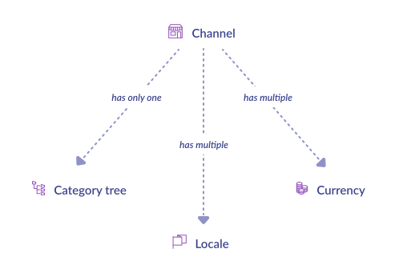

# Synchronize PIM structure

:::warning
This guide is being deprecated and will soon be unpublished. Please go to the newest guide [here](/tutorials/how-to-retrieve-pim-structure.html).
:::

## What do we synchronize?


## Synchronization steps


To begin with your synchronization, you should collect base information about your PIM structure. 

::: info
As it is the common rule for e-commerce, we assume that you want to synchronize only one channel with **your_channel_code** as channel code.
:::

The good news: everything is wrapped into the [channel endpoint API](https://api.akeneo.com/api-reference.html#get_channels__code_).

`GET /api/rest/v1/channels/your_channel_code`
```json
{
  "code": "ecommerce",
  "currencies": [
    "USD",
    "EUR"
  ],
  "locales": [
    "de_DE",
    "en_US",
    "fr_FR"
  ],
  "category_tree": "master",
  "conversion_units": {
    "weight": "KILOGRAM"
  },
  "labels": {
    "en_US": "Ecommerce",
    "de_DE": "Ecommerce",
    "fr_FR": "Ecommerce"
  }
}
```

Store **locales** and **category_tree**. If you need to know the currencies used by this channel, store **currencies**.

::: tips
We strongly advise you to **filter your locale list before stocking it**. Here is a good adage for now and for the rest of this synchronization guide: **early filter saves time later**.
:::

The first step is now finished :tada: Piece of cake, isn’t it? Don’t worry, it will be more challenging soon.

::: panel-link [Next step: synchronize your PIM catalog structure](/getting-started/synchronize-pim-products-6x/step-2.html)
:::
