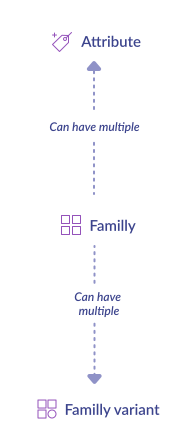

# Synchronize catalog structure: families and attributes

## What do we synchronize?


## Synchronization steps


The first step of the catalog structure synchronization can be summed up in **3 main steps**:

1. Collect [families](https://help.akeneo.com/pim/serenity/articles/what-is-a-family.html#mainContent) and attributes codes
2. Collect [family variants](https://help.akeneo.com/pim/serenity/articles/what-about-products-variants.html#what-is-a-family-variant)
3. Collect [attributes](https://help.akeneo.com/pim/serenity/articles/what-is-an-attribute.html#mainContent)

### 1 - Collect families and attribute codes

The natural way to retrieve your PIM families is to call the [API endpoint design for that](https://api.akeneo.com/api-reference.html#get_families)

`GET /api/rest/v1/families`

Store family codes in a **family_code_list** and attribute codes in a separate list (for example, **attribute_code_list**). We will deal [later](/getting-started/synchronize-pim-products-6x/step-4.html) with the attribute code list.

```json
{
  "items": [
    {
      "code": "tshirt",
      "attributes": [
        "sku",
        "name",
        "description",
        "price",
        "size",
        "color",
        "picture"
      ],
      "labels": {
        "en_US": "Tshirt",
        "fr_FR": "Tshirt"
      }
    }
  ]
}
```

And that’s it for the first step!

::: warning
Be careful! with this API call **GET api/rest/v1/families**, you will collect **all** the families into the database! Do you really need all of them? Please answer this question before continuing: now, it’s the perfect occasion to save time later, during products synchronization. We strongly advise you filter your families as much as you can before building **family_code_list** and **attribute_code_list**. One way to do this is [the family codes filter](https://api.akeneo.com/documentation/filter.html#by-family-codes).
:::

::: tips
Because attributes can be shared between families, you may have redundant attribute code in your **attribute_code_list**. We advise you to remove duplicates now. Again, you will save time later.
:::

::: info
A word about labels. During all the synchronization guides, you may encounter in the API response a **labels** section that contains translations for the asked resource. Here, for example, you can get the American English and French translation for the family code **T-shirt**. Do you have to store labels? It depends on your needs, but remember one thing: in the end, you have to display something for your final user. In the case of a family with the family code **dress**, what will be the best thing to display to a French user? the raw family code (_dress_), the German translation (_kleid_), or the French translation (_robe_)? You are the final judge.
:::

::: info 
Also, keep in mind that you can filter useless locales with the list of locales you built in [the previous section of the guide](/getting-started/synchronize-pim-products-6x/step-1.html).
:::

### 2 - Collect family variants

::: info
This step is mandatory if you want to synchronize product models later. If not, jump to the third step.
:::

In order to collect the family variants, we will use the **family_code_list** you built in the first step.

```code
function get_family_variant(family_code_list)
{
    for each family_code_list as family_code
	    get family variant
	    store family variant
}
```

`GET /api/rest/v1/families/family_code/variants`

```json
{
  "code": "shoesVariant",
  "variant_attribute_sets": [
    {
      "level": 1,
      "attributes": [
        "color",
        "material"
      ],
      "axes": [
        "color"
      ]
    },
    {
      "level": 2,
      "attributes": [
        "sku",
        "size"
      ],
      "axes": [
        "size"
      ]
    }
  ]
}
```

More details for this API endpoint are [here](https://api.akeneo.com/api-reference.html#get_families__family_code__variants).

Store at least code and variant_attribute_sets in **family_variant_list**.

### 3 - Collect attributes

Remember your **attribute_code_list**? It’s (already) time to use it for retrieving attribute information with the help of this [API endpoint](https://api.akeneo.com/api-reference.html#Attribute).

`GET /api/rest/v1/attributes?search={"code":[{"operator":"IN","value":attribute_code_list}]}`

Save results into **attribute_list**. The most important information, for each attribute, is :

- code
- type

```json
{
  "items": [
    {
      "code": "sku",
      "type": "pim_catalog_identifier"
    }
  ]
}
```

Why saving type? for saving your life later during [product synchronization](/getting-started/synchronize-pim-products-6x/step-4.html).

::: warning
💡 **attribute_code_list** may be significant, very big! If you get an [HTTP 414 error](https://www.w3.org/Protocols/rfc2616/rfc2616-sec10.html#sec10.4.15), you probably hit these boundaries. A workaround is to split your **attribute_code_list** into different parts and call them independently.
:::

Well done, your catalog structure is becoming a reality! Go to the next level.

::: panel-link [Next step: synchronize your PIM categories](/getting-started/synchronize-pim-products-6x/step-3.html)
:::
