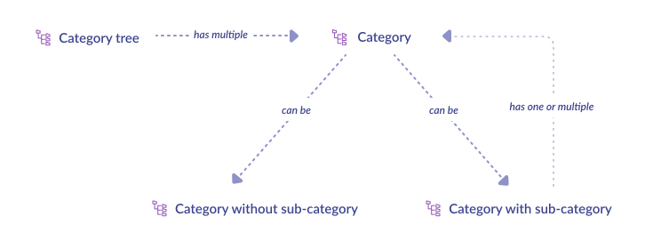
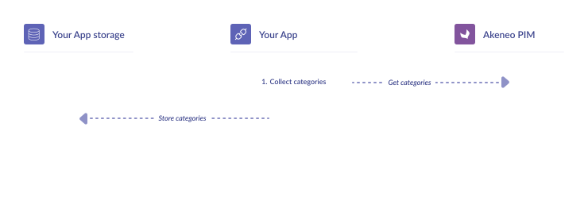

# Synchronize catalog structure: categories

## What do we synchronize?


## Synchronization steps


Collecting categories is a piece of cake: [query the PIM](https://api.akeneo.com/api-reference.html#get_categories), store the result.

`GET /api/rest/v1/categories`

```json
{
  "items": [
    {
      "code": "winter_collection",
      "parent": null,
      "updated": "2021-05-21T11:32:00+02:00",
      "labels": {
        "en_US": "Winter collection",
        "fr_FR": "Collection hiver",
        "de_DE": "Winter-Kollektion"
      }
    }
  ]
}
```

Store data you need into a **category_list**, like **code** and **labels**.

## Filtering categories

Filtering categories is another story.

Problem: with the previous call, you will collect all the categories of your PIM, even the ones you don’t use in the scope you are synchronizing! Maybe it’s not an issue — you don’t have so many categories after all. In this case, don’t go further in filtering.

If you need to filter your categories, you have two possibilities.

### Filter by category codes

If you know the category codes you want to collect, it’s your lucky day: [a filter for this purpose exists](https://api.akeneo.com/documentation/filter.html#by-category-codes).

`GET /api/rest/v1/categories?search={"code":[{"operator":"IN","value":["category_code1","category_code2"]}]}`

### Filter by category tree

Unfortunately, the most difficult filtering method is probably the one you need: because a scope has one and only one category tree, it’s natural to filter categories that belong to the category tree of the scope...and there is no API endpoint for that.

::: tips
Look closely at the first schema of this section...yes, a category tree is simply a graph where its nodes are categories!
:::

And who says “graph,” says “dept-first search”!

By combining [the filter on the parent category](https://api.akeneo.com/documentation/filter.html#by-parent-category) and this well-known graph algorithm, you can collect all the categories of a given category tree.

```code
function get_categories_of_a_category_tree(category_root)
{
    store category_root in category_list
	children = result of api call GET /api/rest/v1/categories?search={"parent":[{"operator":"=","value":"category_root"}]}
	foreach children as child
        get_categories_of_a_category_tree(child)
}
```

Categories have been synchronized! Now, let's deal with the main synchronization of this guide.

::: panel-link [Next step: synchronize your products and product models](/getting-started/synchronize-pim-products-6x/step-4.html)
:::
