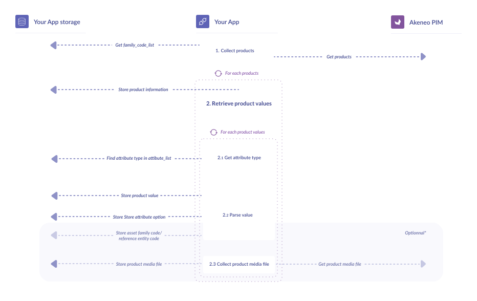

# Synchronize products and product models

## Products synchronization

### What do we synchronize?


### Synchronization steps


### 1 - Collect products

Remember our adage **early filter saves time later**? It has never been so true as in the collect product step; because a product catalog may be gigantic, it is primordial to filter as many as products you can **right now**.

We recommend to you the following product filters:
- by locale codes (you might have stored a list called **locales** in the [first step](/getting-started/synchronize-pim-products-6x/step-1.html));
- by channel code (stored also during [the first step](/getting-started/synchronize-pim-products-6x/step-1.html) with the name **your_channel_code**);
- by family codes (save to your storage in a **family_code_list** during [the second step](/getting-started/synchronize-pim-products-6x/step-2.html));
- by enabled products (you probably don’t use not enabled products, don’t you?)

Another very important point is the **with_attribute_options**. When this option is activated, labels of attributes options will be returned in the response — and saves you from many extra API calls. More information [here](https://api.akeneo.com/api-reference.html#get_products_uuid).

::: tips
Have a look at our [product filters](https://api.akeneo.com/documentation/filter.html#filter-on-product-properties): you may find other interesting ones.
:::

So, what does our API call on products look like?

`GET /api/rest/v1/products-uuid?locales=locales&scope=your_channel_code&with_attribute_options=true&search={"family":[{"operator":"IN","value":family_code_list}],"enabled"[{"operator":"=","value":true}]}`

Details of this call are [here](https://api.akeneo.com/api-reference.html#get_products_uuid).

What is important in the response payload?

```json
{
  "items": [
    {
      "identifier": "top",
      "family": "tshirt",
      "groups": [],
      "parent": null,
      "categories": [
        "summer_collection"
      ],
      "values": {
        "price": [
          {
            "locale": null,
            "scope": null,
            "data": [
              {
                "amount": "15.5",
                "currency": "EUR"
              },
              {
                "amount": "15",
                "currency": "USD"
              }
            ]
          }
        ],
        "collection": [
          {
            "locale": null,
            "scope": null,
            "data": [
              "winter_2016"
            ],
            "linked_data": {
              "winter_2016": {
                "attribute": "collection",
                "code": "winter_2016",
                "labels": {
                  "en_US": "Winter 2016",
                  "fr_FR": "Hiver 2016"
                }
              }
            }
          }
        ]
      },
      "associations": {
        "PACK": {
          "products": [
            "sunglasses"
          ],
          "product_models": [],
          "groups": []
        }
      },
      "quantified_associations": {
        "PRODUCT_SET": {
          "products": [
            {
              "identifier": "cap",
              "quantity": 2
            },
            {
              "identifier": "shoes",
              "quantity": 1
            }
          ],
          "product_models": [
            {
              "identifier": "model-biker-jacket-leather",
              "quantity": 2
            }
          ]
        }
      }
    }
  ]
}
```

For each product, retrieve the basic product information you want to store — for example, identifier, family, associations, ...everything you need, and in the next step, deal with its product values.

### 2 - Retrieve product values

Product values are the core of the product, and the most important data you have stored in your PIM (see our [help center](https://help.akeneo.com/pim/serenity/articles/what-is-a-product-value.html#mainContent)).

In the product response payload, all the product values are contained in the `values` property. Here, each entry is an associative array; the key is the **attribute code**, the value a **list of product values for the attribute code;** all the elements of this list contain a **value** for a given **channel** and **locale**. If the attribute is a select or multi option, there is an extra **linked_data** property that contains option labels.

In a nutshell

```json
{
  "values": {
    "attribute_code": [
      {
        "data": "an_attribute_value",
        "locale": "a_locale",
        "scope": "a_channel"
      },
      {
        "data": "another_attribute_value",
        "locale": "another_locale",
        "scope": "another_channel",
        "linked_data": {
          "attribute": "attribute_code",
          "code": "an_option_code",
          "labels": {
            "en_US": "option_code_label_for_locale_en_us",
            "fr_FR": "option_code_label_for_locale_fr_fr"
          }
        }
      }
    ]
  }
}
```

At first sight, you may think “ok, everything is in `data`, I just have, for each element of product value list, to parse this property. What is the format ?”

::: info
Unfortunately, data depends on its associated attribute type...
But if you have followed this guide since the beginning, there is a solution.
:::

### 2.1 - Get attribute type

Remember the [catalog structure synchronization when you collected families and attributes](/getting-started/synchronize-pim-products-6x/step-2.html)? We have stored an **attribute_list,** a list of tuples with **attribute_code** and **attribute type**. It’s time to use it.

Simply search your attribute into the **attribute_list**

```code
function get_attribute_type(attribute_code)
{
    return attribute type of your attribute_code
}
```

### 2.2 - Parse value

Ok, you have your attribute type. What’s next?

Parse `data` properties according to the attribute type.

For example, a text attribute looks like this:

```json
{
  "values": {
    "description": [
      {
        "data": "Tshirt long sleeves\nWinter special, 100% whool"
      }
    ]
  }
}
```

Whereas a metric attribute has the following format:

```json
{
  "values": {
    "power": [
      {
        "data": {
          "amount": 10,
          "unit": "KILOWATT"
        }
      }
    ]
  }
}
```

::: tips
You will find all the definitions in our API documentation, just [here](https://api.akeneo.com/concepts/products.html#the-data-format).
:::

Use the same algorithm - search the attribute type in **attribute_list** and parse according to product value data - and you will obtain all the product values of your product. Store it, and you’ve done with your product values.

Depending on the type of your attribute, you may have some extra action to perform. 

**_Simple select and multi-select attribute options_**

Does your attribute type **pim_catalog_simpleselect** or **pim_catalog_multiselect**? It’s a simple or multi select option, and because you add the **with_attribute_options** during your product call, you should have `linked_data` properties. Every data is there, help yourself and store your attribute option value in **attribute_option_list**.

**_References entities_**

Your attribute is type **akeneo_reference_entity** or **akeneo_reference_entity_collection**? It’s a reference entity record. Add it to your list **record_codes_by_reference_entity_code_list** with the following format:

```code
record_codes_by_reference_entity_code_list = [
	reference_entity_code_1 => [
		reference_entity_record_code_1,
		reference_entity_record_code_2,
		...
	],
	reference_entity_code_2 => [
		reference_entity_record_code_3,
		reference_entity_record_code_4,
		...
	],
	...
]
```

Add reference entity record data as follow:

```code
function add_reference_entity_record_code(reference_entity_record_code)
{
    reference_entity_code = reference_data_name field of your attribute
    reference_entity_record_code = parsed value of your attribute
    record_codes_by_reference_entity_code_list[reference_entity_code].add(**reference_entity_record_code)
}
```

::: info
Why such a format for reference entity records? You will understand in [reference entities synchronization](/getting-started/synchronize-pim-products-6x/step-5.html).
:::

**_Assets_**

You encountered a **pim_catalog_asset_collection** attribute type? It’s an asset family. Do the same as for reference entities in the list **asset_codes_by_asset_family_code_list**.

```code
asset_codes_by_asset_family_code_list = [
	asset_family_code_1 => [
		asset_code_1,
		asset_code_2,
		...
	],
	asset_family_code_2 => [
		asset_code_3,
		asset_code_4,
		...
	],
	...
]
```

```code
function add_asset_code(asset_code)
{
    asset_family_code = reference_data_name field of your attribute
    asset_code = parsed value of your attribute
    asset_codes_by_asset_family_code_list[asset_family_code].add(asset_code)    
}
```

Again, we will use it later, during [the asset synchronization](/getting-started/synchronize-pim-products-6x/step-6.html).

### 2.3 - Product media file

At last, a **pim_catalog_file** or **pim_catalog_image** attribute type means you are dealing with a media that could be downloaded.

::: tips
Keep in mind that synchronizing media files might be time and resource-consuming. Download media only if you need it, or do it in a dedicated and independent process.
:::

For downloading your resource, simply call the right [API endpoint](https://api.akeneo.com/api-reference-index.html#Productmediafile).

`GET /api/rest/v1/media-files/attribute_code/download`

## Product models synchronization

What about product models synchronization? Good news: it’s nearly the same thing. The unique difference is in product models collection: you have to use another API call.

`GET /api/rest/v1/product-models?locales=locales&scope=your_channel_code&with_attribute_options=true&search={"family":[{"operator":"IN","value":family_code_list}],"enabled"[{"operator":"=","value":true}]}`

Details of this call are [here](https://api.akeneo.com/api-reference.html#get_product_models).

::: warning
Be careful: filters for products and product models aren’t the same. Have a look at [product model filters](https://api.akeneo.com/documentation/filter.html#filter-on-product-model-properties).
:::

Otherwise, go through the same steps as products.

::: info
Need more information on product models, have a look to the documentation [here](https://help.akeneo.com/pim/serenity/articles/what-about-products-variants.html#what-is-a-product-model).
:::

If you didn’t plan to synchronize assets or reference entities, well done: your product synchronization is finished :tada:

Otherwise, go to the next part.

::: panel-link [Next step: synchronize your reference entities](/getting-started/synchronize-pim-products-6x/step-5.html)
:::
