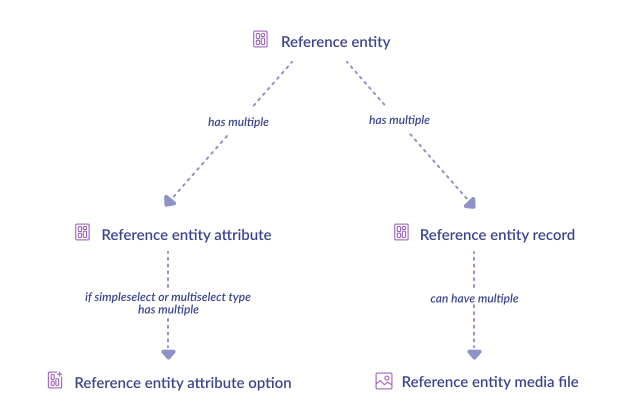
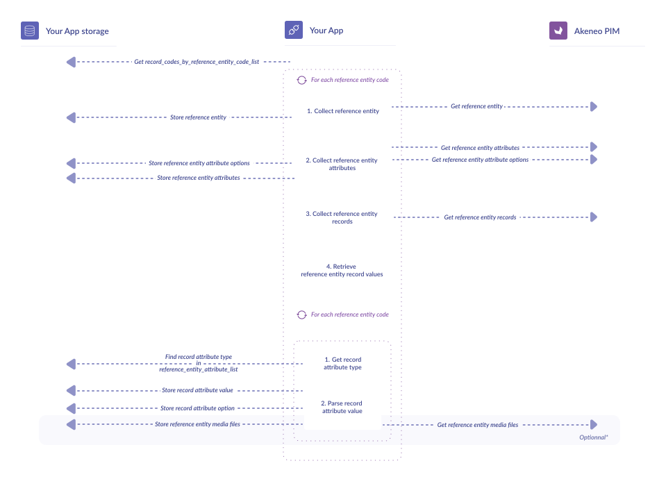

# Synchronize reference entities

::: warning
Reference entities is a feature of Enterprise Edition. If you have a Community Edition, you won't be able to collect this kind of object.
:::

## What do we synchronize?


## Synchronization steps


Your products are synchronized, but what about your complex fields shared by several products? 
So far, we haven’t dealt with reference entities, and it’s now time to fill his particular gap. This part of the guide is quite similar to the [product synchronization chapter](/getting-started/synchronize-pim-products-6x/step-5.html): you won’t be lost.

::: tips
Before going further and if references entities have still some secrets for you, feel free to read [our dear documentation about it](https://help.akeneo.com/pim/serenity/articles/what-about-reference-entities.html#introduction-to-reference-entities).
:::

::: warning
We assume in the next sections that you iterate through this **record_codes_by_reference_entity_code_list**. As a reminder, its format is:
:::

```code
 [
	reference_entity_code => [
		reference_entity_record_code_1,
		reference_entity_record_code_2,
		...
	],
	...
]
```

### 1 - Collect reference entity

Just call the proper [API endpoint](https://api.akeneo.com/api-reference.html#get_reference_entities__code_).

`GET /api/rest/v1/reference-entities/{reference_entity_code}`

```json
{
  "_links": {
    "image_download": {
      "href": "https://demo.akeneo.com/api/rest/v1/reference-entities-media-files/0/2/d/6/54d81dc888ba1501a8g765f3ab5797569f3bv756c_ref_img.png"
    }
  },
  "code": "brands",
  "labels": {
    "en_US": "Brands",
    "fr_FR": "Marques"
  },
  "image": "0/2/d/6/54d81dc888ba1501a8g765f3ab5797569f3bv756c_ref_img.png"
}
```

And store what you need to keep in **reference_entity_list**.

### 2 - Collect reference entity attributes

Here also, is as simple as calling the right [API endpoint](https://api.akeneo.com/api-reference.html#Referenceentityattribute).

`GET /api/rest/v1/reference-entities/{reference_entity_code}`

```json
[
  {
    "code": "description",
    "type": "text"
  },
  {
    "code": "creation_year",
    "type": "number"
  },
  {
    "code": "collection_overview",
    "type": "image"
  }
]
```

Store `code` and `type` in a dedicated list, and call it **reference_entity_attribute_list**.

::: info
As for products, some attributes may be simple select or multi select type (`pim_catalog_simpleselect` or `pim_catalog_multiselect`). In these cases, don’t forget to store the option in **reference_entity_attribute_option_list**.
:::

### 3 - Collect reference entity records

Again, an [API call](https://api.akeneo.com/api-reference.html#Referenceentityrecord) will save your life.

::: tips
Dont’t forget to add the options **locales** and **channel**. Remember: early filter saves time later...More filters [here](https://api.akeneo.com/documentation/filter.html#filter-reference-entity-records)
:::

`GET /api/rest/v1/reference-entities/{reference_entity_code}/records?locales=locales&channel=your_channel_code`

```json
{
  "items": [
    {
      "code": "kartell",
      "values": {
        "label": [
          {
            "locale": "en_US",
            "channel": null,
            "data": "Kartell"
          }
        ],
        "image": [
          {
            "locale": null,
            "channel": null,
            "data": "0/c/b/0/0cb0c0e115dedba676f8d1ad8343ec207ab54c7b_image.jpg"
          }
        ],
        "description": [
          {
            "data": "The contemporary Italian furniture brand",
            "locale": "en_US",
            "channel": null
          },
          {
            "data": "L'éditeur de meubles comtemporain italien",
            "locale": "fr_FR",
            "channel": null
          }
        ],
        "country": [
          {
            "locale": null,
            "channel": null,
            "data": "italy"
          }
        ]
      }
    }
  ]
}
```

Let’s deal now with the values property.

### 4 - Retrieve reference entity record values

This final step looks like the [collecting product values in the previous chapter](/getting-started/synchronize-pim-products-6x/step-4.html) and can be summarized with the following diagram:

You may notice that the reference entity record looks like the product values one: a reference entity record contains a `values` property that encapsulates all the attribute data of the record.

```json
{
  "record_code": "a_record_code",
  "values": {
    "attribute_code": [
      {
        "locale": "a_locale",
        "channel": "a_channel",
        "data": "data"
      }
    ],
    "another_attribute_code": [
      {
        "locale": "a_locale",
        "channel": "a_channel",
        "data": "data"
      },
      {
        "locale": "another_locale",
        "channel": "another_channel",
        "data": "another_data"
      }
    ]
  }
}
```

### 4.1 - Get record attribute type

In the step **Collect reference entity attributes** of this chapter, you built a **reference_entity_attribute_list** `(reference_entity_attribute_code,reference_entity_attribute_type)`

it’s time to use it!

Like for products, a simple function should do the job.

```code
function get_record_attribute_type(reference_entity_attribute_code)
    Search reference_entity_attribute_type 
	associated with reference_entity_attribute_code 
	in reference_entity_attribute_list
```

If your function returns `image`, it means your attribute is an image and it can be downloaded by calling the [following API endpoint](https://api.akeneo.com/api-reference.html#get_reference_entity_media_files__code).

`GET /api/rest/v1/reference-entities-media-files/{reference_entity_code}`

::: tips
Again, keep in mind that synchronizing media files might be time and resource-consuming. Use parsimoniously this API call!
:::

### 4.2 - Parse record attribute value

Parsing record values is much easier than parsing product values: data is homogenous and there is fewer types.

::: tips
You will find all the attribute types for reference entities [here](https://api.akeneo.com/concepts/reference-entities.html#the-data-format).
:::

Store your records and their attribute values into the list **reference_entity_record_list**,

Voilà! Your reference entities are synchronized!

Ready for the final step?

::: panel-link [Next step: synchronize your assets](/getting-started/synchronize-pim-products-6x/step-6.html)
:::
