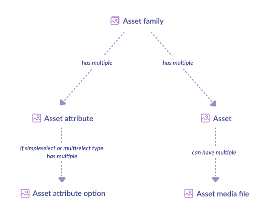

# Synchronize assets

::: warning
Assets is a feature of Enterprise Edition. If you have a Community Edition, you won't be able to collect this kind of object.
:::

# Overview

## What do we synchronize?


## Synchronization steps


Assets synchronization is really similar to reference entities synchronization because assets and reference entities have nearly the same structure. In this last part of this synchronization guide, we won’t reinvent the wheel and proceed the same way. For more explanations, please refer to the [reference entities’ synchronization](/getting-started/synchronize-pim-products-6x/step-5.html), and if you want to know more about assets, don’t hesitate to look at [this documentation](https://help.akeneo.com/pim/serenity/articles/what-about-assets.html#mainContent).

::: warning
We assume in the next sections that you iterate through this **asset_codes_by_asset_family_code_list**. As a reminder, its format is:
:::

```code
asset_codes_by_asset_family_code_list = [
	asset_family_code_1 => [
		asset_code_1,
		asset_code_2,
		...
	],
	asset_family_code_2 => [
		asset_code_3,
		asset_code_4,
		...
	],
	...
]
```

### 1 - Collect asset family

There is an [API endpoint](https://api.akeneo.com/api-reference.html#get_asset_family__code_) for collecting all the information about an asset family. Just call it...

`GET /api/rest/v1/asset-families/{asset_family_code}`

```json
{
  "code": "model_pictures",
  "labels": {
    "en_US": "Model pictures",
    "fr_FR": "Photographies en pied"
  },
  "attribute_as_main_media": "main_image",
  "naming_convention": {
    "source": {
      "property": "code",
      "channel": null,
      "locale": null
    },
    "pattern": "/(?P<product_ref>.*)-.*/",
    "abort_asset_creation_on_error": true
  },
  "product_link_rules": [
    {
      "product_selections": [
        {
          "field": "sku",
          "operator": "EQUALS",
          "value": "{{product_ref}}"
        }
      ],
      "assign_assets_to": [
        {
          "attribute": "model_pictures",
          "mode": "replace"
        }
      ]
    }
  ],
  "transformations": [
    {
      "label": "Thumbnail plus black and white transformation",
      "filename_suffix": "_thumbnailBW",
      "source": {
        "attribute": "main_image",
        "channel": null,
        "locale": null
      },
      "target": {
        "attribute": "thumbnail",
        "channel": null,
        "locale": null
      },
      "operations": [
        {
          "type": "thumbnail",
          "parameters": {
            "width": 150,
            "height": 150
          }
        },
        {
          "type": "colorspace",
          "parameters": {
            "colorspace": "grey"
          }
        }
      ]
    }
  ]
}
```

...And store what you need in **asset_family_list**.

### 2 - Collect asset family attributes

Again, an [API endpoint](https://api.akeneo.com/api-reference.html#Assetattribute) will do the job for you.

`GET /api/rest/v1/asset-families/{asset_family_code}/attributes`

```json
[
  {
    "code": "model_is_wearing_size",
    "type": "single_option"
  },
  {
    "code": "media_link",
    "type": "media_link"
  }
]
```

Store `code` and `type` in a **asset_attribute_list**.

::: info
As for reference entities, some asset family attributes may be simple select or multi select type (`pim_catalog_simpleselect` or `pim_catalog_multiselect`). In these cases, don’t forget to store the option in **asset_attribute_option_list**.
:::

### 3 - Collect assets

Simply call [the following API endpoint](https://api.akeneo.com/api-reference.html#Asset).

::: tips
Please add the options **locales** and **channel**. Remember: early filter saves time later... More filters [here](https://api.akeneo.com/documentation/filter.html#filter-assets)
:::

`GET /api/rest/v1/asset-families/{asset_family_code}/assets?locales=locales&channel=your_channel_code`

```json
{
  "code": "allie_jean_model_picture",
  "values": {
    "media_link": [
      {
        "locale": null,
        "channel": null,
        "data": "allie_jean_model_picture.png"
      }
    ],
    "warning_mention": [
      {
        "data": "Photo not retouched",
        "locale": "en_US",
        "channel": null
      },
      {
        "data": "Photo non retouchée",
        "locale": "fr_FR",
        "channel": null
      }
    ]
  }
}
```

...and without surprise, extract assets values like for the reference entities.

### 4 - Retrieve asset values

It’s exactly the same as for reference entities! We won’t repeat ourselves so, here the algorithm:

for each attribute_value in values:
 - type = search in asset_attribute_list the asset attribute type of attribute_code
 - parsed_data = parse attribute_value according to type

::: info
Have a look at [this page](https://api.akeneo.com/concepts/asset-manager.html#the-global-format) for the available asset attribute type.
:::

Store your assets and their attribute values into the list **asset_list**,

Well done, your assets are synchronized...and all your PIM too! Time for celebration! :tada:
