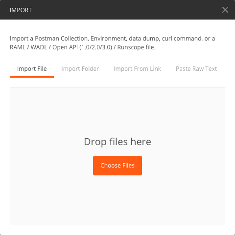
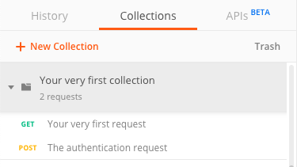
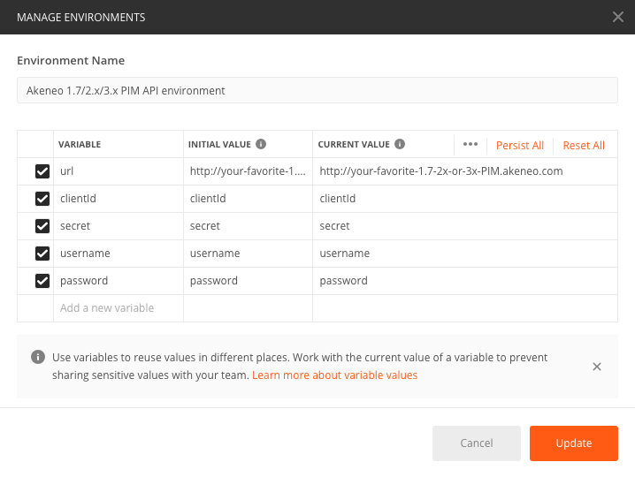
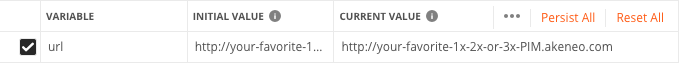
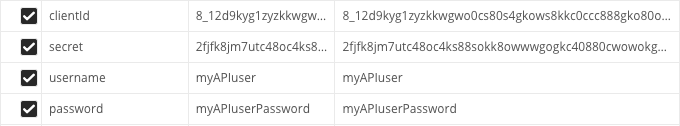

# Set up Postman

In this step, you are going to configure Postman, a tool that will allow us to easily make your very first API request. :rocket:

## But first, what is Postman?
Postman is a free client application that allows making calls to any API very easily. What's great is that you don't need any code skills to use this tool.  
We use it internally at Akeneo. It helps us develop and test our API. If you want more details, do not hesitate to browse their [website](https://www.getpostman.com/).

With Postman, you can share pre-configured API requests in **collections** with whoever you want.  
We crafted for you a very simple collection, that contains only two pre-configured requests:
- `Your very first request`: The Graal! That's the whole goal of this tutorial: being able to launch this request and receive an answer from the PIM. More concretely, this request will in fact asks the PIM for its first 100 products.
- `The authentication request`: Very useful, this request will allow you to authenticate yourself. Indeed, the API is protected and is only accessible to people that have app credentials. To avoid anyone to mess with your precious PIM data. :wink: 

::: tips
If you have trouble using Postman, do not hesitate to browse their really complete [documentation](https://learning.getpostman.com/docs).
:::

## Step by step

To set up Postman, follow these steps:
1. Download the Postman application (which is free by the way) from their [official website](https://www.getpostman.com/downloads/).
2. Download those two files:  
    - [The Postman collection containing your first request](../../files/your-very-first-collection.postman_collection.json)  
    - [A pre-configured Postman environment](../../files/akeneo-PIM-API-environment-old.postman_environment.json)
3. Import in Postman those files. To do so, click the `Import` button and drop the two files you just downloaded in the pop-in that should look like this.

As a result, you will see a new collection in the Collection tab, on the left side of your screen, like this.

A new environment should also have been created in the dropdown in the top right corner.

6. Click on the gear wheel in the top right corner, and then select `Manage environments`.
7. In the pop-in that just opened, select the environment called `Akeneo 4.x PIM API environment`.

8. In the `Initial value` field and in the `Current value` field of the `url`, enter the url where your 4.x PIM is hosted.

9. In the `clientId`, `secret`, `username` and `password` fields, enter the credentials you grabbed during [step 1](/getting-started/my-first-tutorial-old/step-1.html).

That's it for this step!

::: panel-link And now, let's make this request for real [The final step](/getting-started/my-first-tutorial-old/step-3.html)
:::

