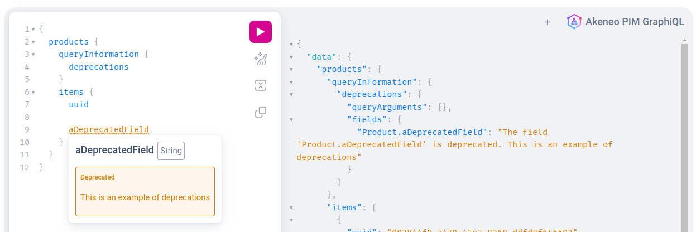

## Query only what you need
Design queries to request only the data required, avoiding over-fetching and under-fetching scenarios. 
Use field-level granularity to specify precisely which fields are needed for each request.
By asking only for essential data, you minimize network traffic, reduce server load, and optimize overall API performance.

```graphql [snippet:GraphQL]

{
    products {
        items {
            uuid
            enabled
            created
            updated
            # If you don't need the family detail for your use case
            # It's a best practice to don't include it
            family {
                code
                labels
                attributeRequirements {
                    channelCode
                    attributesRequirements
                }
            }
        }
    }
}
```

## Load only required product attributes
Product and ProductModel queries have a special argument called `attributesToLoad` that allow you to fetch only the specified attributes.
This argument is not mandatory but will greatly improve the response time. 
More details are available in the [Rest API documentation](https://api.akeneo.com/documentation/filter.html#filter-product-values).

```graphql [snippet:Query]

{
    products(attributesToLoad: ["condition", "name"]) {
        items {
            uuid
            attributes {
                code
                values
            }
        }
    }
}
```
```json[snippet:Response]

{
  "data": {
    "products": {
      "items": [
        {
          "uuid": "0187ed82-17cc-4dec-b287-75ca581bad46",
          "attributes": [
            {
              "code": "name",
              "values": [
                {
                  "locale": "en_US",
                  "data": "Dickies Men's Size 40 Black Industrial Strength Metal Logo Tab Belt",
                  "channel": null
                }
              ]
            },
            {
              "code": "condition",
              "values": [
                {
                  "locale": null,
                  "data": "new",
                  "channel": null
                }
              ]
            }
          ]
        }
      ]
    }
  }
}
```

## Gzip compression
We support **request compression**. 
Feel free to utilize it by including the following code in your request header: 
`Accept-Encoding: gzip, deflate, br, zstd`

## Variables usages
**Arguments** don't need to be written **inside the query string**. 
You can instead use static query with variables.

The following example show how to use a `$limit` variable.

```graphql [snippet:GraphQL]

query MyQuery($limit: Int) {
  products(limit:$limit ) {
    items {
      uuid
    }
  }
}
```
You can also run this query using cURL or your favorite development language.
``` bash [snippet:Bash]

curl -X POST https://graphql.sdk.akeneo.cloud \
-H 'Content-Type: application/json' \
-H 'X-PIM-URL: https://xxxxxxx.demo.cloud.akeneo.com' \
-H 'X-PIM-CLIENT-ID: xxxxxx' \
-H 'X-PIM-TOKEN: xxxxxxxxxxxxxxxxxxxxxxxxxxxxxxxx' \
-d '{
    "query": "query myProductQuery($limit: Int) {products(limit: $limit) {items {uuid}}}",
    "variables": {
        "limit": 10
    }
}'
```

## Deprecations
While deprecated fields and arguments are highly visible using the graphic interface, it is less obvious using a client library.  
On the GraphiQL ui deprecated fields will appear in orange with an underline and a deprecation message.

On queries, you have several ways to get this information.
- The `queryInformation` field holds a `deprecations` field that contains all the deprecated arguments and fields for this particular query.
- **GraphiQL** show deprecations in `orange` with more informations in hover
- A response header `x-deprecations-count` is also added

In **GraphiQL** the `deprecations` will be displayed as following:



The deprecations count can also be found as a header in the response
```bash

HTTP/1.1 200 OK
content-type: application/json; charset=utf-8
content-length: 773
x-request-complexity: 70
x-transaction-id: cef6aadc-eedb-49f5-8199-dbfbe3689fa3
# This is the header
x-deprecations-count: 1
```

::: panel-link And now, check the existing [limitations](/graphql/limitations.html)
:::
