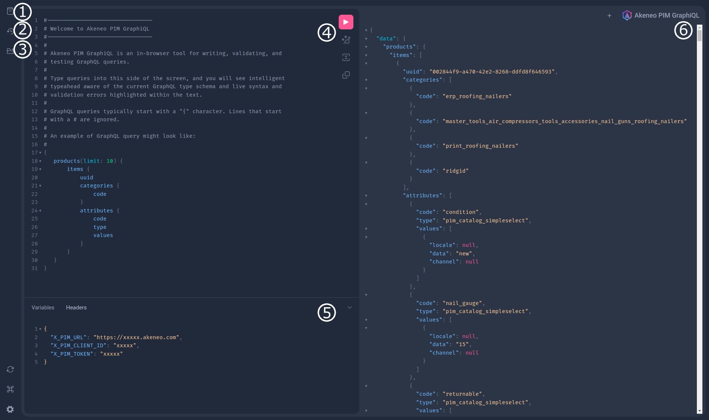

# How to browse the GraphQL capabilities

To browse the Akeneo GraphQL capabilities, you can use the in-browser IDE GraphiQL.
**GraphiQL** will also help you execute your first queries.

## What is GraphiQL?

GraphiQL is **an interactive, in-browser IDE specifically designed for working with GraphQL API**.
It streamlines the process of querying, exploring, and testing **GraphQL API**, making development faster and more efficient.

## How to access it?

The GraphiQL user interface is directly accessible from your browser by accessing the GraphQL URL: [https://graphql.sdk.akeneo.cloud](https://graphql.sdk.akeneo.cloud/)

## How to use it?

You will probably spend most of the time writing queries in the **GraphiQL Query Builder (4)**, but this tool also provides several interesting functionalities.

Here’s a screenshot of the GraphiQL IDE, please refer to the corresponding numbered section to know more about the interface:

### Section 1: Link to the **Documentation Explorer.**

The documentation explorer is **a tree-like structure displaying documentation about the GraphQL schema, including types and queries**.
:::info
Clicking on a type allows you to reveal additional details.
The documentation explorer also includes a search bar that enables users to quickly locate types, fields, or any other relevant information within the schema documentation.
:::

### Section 2: Link to **Show History.**

Displays a list of all the previous queries you ran.

### Section 3: Link to the **Query Explorer**.

The explorer tree is **a tree-like structure representing the GraphQL schema**.
It displays types, fields, and their relationships in a hierarchical manner.

:::info
You can expand or collapse tree nodes to navigate the schema. Clicking on a type or field expands it to reveal its children.
:::

:::info
Clicking on a field adds it to the query in the center panel.
If a field has subfields, you can click on them to add them to the query.
As you add fields, the Explorer automatically structures them in a nested manner, reflecting the hierarchy of your query.
When you click on a field, the Explorer shows any available arguments or directives.
:::

### Section 4: The **Query Panel.**

The query panel is **a text editor where you can input your GraphQL queries**.
It supports syntax highlighting and error highlighting (such as syntax errors or invalid field names).

You can either compose your queries by clicking in the Explorer or by typing directly into the text editor.

:::info
Auto-completion is available using the `ctrl+space` shortcut.
:::

:::info
At the top of the panel, you can create new queries. GraphiQL keeps them in local storage to allow access and reuse previously executed queries.
:::

:::info
Clicking on the **▶️** (or using `ctrl+enter`) will send the query for execution.
:::

### Section 5: Headers & Variables.

Some headers are required to do API calls :
- **`X-PIM-URL`** is your PIM URL (for example, `https://my-awesome-pim.sandbox.cloud.akeneo.com/`)
- **`X-PIM-CLIENT-ID`** is your client_id
- **`X-PIM-TOKEN`** is your authentication token

### Section 6: Query result panel.

You will see the **GraphQL response** here, displayed in JSON format (you can collapse & expand the items).

Errors are also displayed in this section.

::: panel-link You can now browse the GraphQL common notions [Next](/graphql/common-notions.html)
:::
