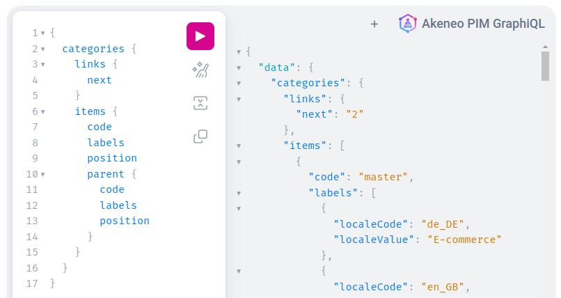
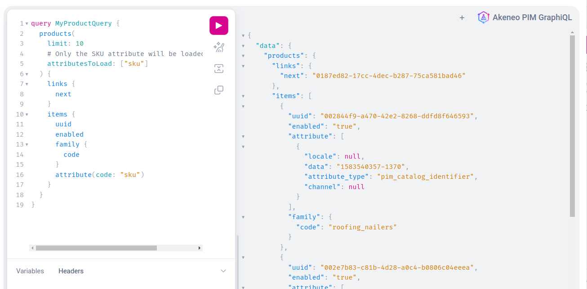
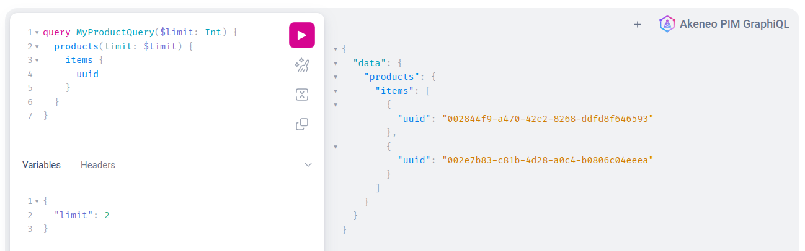

# Common notions

## Common arguments for all queries

A few things are common to all queries (or a significant number of them).

List of common arguments:

- `limit` is used to ask for a specific number of results, `default:10` `maximum:100`. ex: `limit: 50`
- `links` contains `first` `next` `self`. It is used for retrieving page links.
- `page` is used to ask for a specific page. You can find the next page when requesting the links.
  ex: `page: "<<links.next>>"`
  

- `locales` is used to get data results for specified locales (one or many at once).
  ex :`locales: ["en_US”]`, ex for multiple : `locales: ["fr_FR","en_US"]`
- `search` is used for more detailed search parameters in your query, the syntax to use can be found [here](https://api.akeneo.com/documentation/filter.html#filters).
  You can use any example that exists in the documentation, the value must be escaped. You can use **any online JSON Escaper** for this.

Here’s an example:


:::info
`Product` and `ProductModel` queries have a special argument called `attributesToLoad`.

This argument is not mandatory but will greatly improve the response time. If you request a specific attribute in your query (such as `sku` in this example) you should pass it to `attributeToLoad`.

More details are available in the [Best practices](/graphql/best-practices.html#restrict-loaded-attributes).
:::


:::info
[Try-it or copy the query](https://graphql.sdk.akeneo.cloud/?query=query+MyProductQuery+%7B%0A++products%28%0A++++limit%3A+10%0A++++%23+Only+the+SKU+attribute+will+be+loaded+from+the+PIM%0A++++attributesToLoad%3A+%5B%22sku%22%5D%0A++%29+%7B%0A++++links+%7B%0A++++++next%0A++++%7D%0A++++items+%7B%0A++++++uuid%0A++++++enabled%0A++++++family+%7B%0A++++++++code%0A++++++%7D%0A++++++attribute%28code%3A+%22sku%22%29%0A++++%7D%0A++%7D%0A%7D)
:::

## Using variables in GraphiQL or cURL
**Variables in GraphQL** will allow you to make your query dynamic and avoid string concatenation or extrapolation.
For example variables can be usefull in:
* **The pagination**: to allow you to pass each time the next page
* **The locales**: to be able to add easily more locales in the result
* ...

On **GraphiQL** (the in-browser IDE) you need to put your variables in the **bottom left tab** ```Variables```



:::info
If you build your query with variables but omit the value for variable or put a null value, the variables are ignored.
The result will be the same as omitting variables
:::

:::info
[Try-it or copy the query](https://graphql.sdk.akeneo.cloud?query=query+MyProductQuery%28%24limit%3A+Int%29+%7B%0A++products%28limit%3A+%24limit%29+%7B%0A++++items+%7B%0A++++++uuid%0A++++%7D%0A++%7D%0A%7D)
**(Please note that you must add the variable by yourself)**
:::

You can also run this query using cURL or your favourite development language.

```bash [snippet:Bash]

curl -X POST https://graphql.sdk.akeneo.cloud \
-H 'Content-Type: application/json' \
-H 'X-PIM-URL: https://xxxxxxx.demo.cloud.akeneo.com' \
-H 'X-PIM-CLIENT-ID: xxxxxx' \
-H 'X-PIM-TOKEN: xxxxxxxxxxxxxxxxxxxxxxxxxxxxxxxx' \
-d '{
    "query": "query myProductQuery($limit: Int) {products(limit: $limit) {items {uuid}}}",
    "variables": {
        "limit": 10
    }
}'
```

## Working with pagination

In our **GraphQL API**, we implement pagination in most queries to manage large datasets efficiently.

Pagination breaks down query results into smaller, manageable chunks, improving performance and user experience.

Pagination is facilitated by the `limit` argument when available, allowing users to specify the maximum number of results per page.

The `limit` argument accepts values between **1** and **100**, determining the maximum number of results returned on a single page.


This is a simple example:

```graphql [snippet:Query]

{
  products(limit: 5) {
    items {
      uuid
      created
    }
  }
}
```
```json [snippet:Result]

{
  "data": {
    "products": {
      "items": [
        {
          "uuid": "002844f9-a470-42e2-8268-ddfd8f646593",
          "created": "2023-10-10T07:08:57+00:00"
        },
        {
          "uuid": "002e7b83-c81b-4d28-a0c4-b0806c04eeea",
          "created": "2023-10-10T07:07:42+00:00"
        },
        {
          "uuid": "00859783-a85a-4825-b0a9-93ffce57b1f2",
          "created": "2023-10-10T07:06:32+00:00"
        },
        {
          "uuid": "00df7dde-c745-4590-8c17-01a6ae36d172",
          "created": "2023-10-10T07:06:27+00:00"
        },
        {
          "uuid": "00fd49f2-c417-4a40-8a7b-439a6e51923b",
          "created": "2023-10-10T07:09:00+00:00"
        }
      ]
    }
  }
}
```

To request the next page of data in GraphQL, you need to include the `links` object with at least the `next` attribute, like this:

```graphql [snippet:Query]

{
  products(limit: 5) {
    links {
      next
    }
    items {
      uuid
      created
    }
  }
}
```
```json [snippet:Result]

{
  "data": {
    "products": {
      "links": {
        "next": "00fd49f2-c417-4a40-8a7b-439a6e51923b"
      },
      "items": [
        {
          "uuid": "002844f9-a470-42e2-8268-ddfd8f646593",
          "created": "2023-10-10T07:08:57+00:00"
        },
        {
          "uuid": "002e7b83-c81b-4d28-a0c4-b0806c04eeea",
          "created": "2023-10-10T07:07:42+00:00"
        },
        {
          "uuid": "00859783-a85a-4825-b0a9-93ffce57b1f2",
          "created": "2023-10-10T07:06:32+00:00"
        },
        {
          "uuid": "00df7dde-c745-4590-8c17-01a6ae36d172",
          "created": "2023-10-10T07:06:27+00:00"
        },
        {
          "uuid": "00fd49f2-c417-4a40-8a7b-439a6e51923b",
          "created": "2023-10-10T07:09:00+00:00"
        }
      ]
    }
  }
}

```

The value of the `next` attribute obtained from the `links` object should be inserted into the `page` argument of the subsequent request.

This `next` value serves as a pointer or reference to the next page of data in the dataset.

By passing this value to the `page` argument in the next query, the result of the next page will be returned :

```graphql [snippet:GraphQL]

{
  products(limit: 5, page: "00fd49f2-c417-4a40-8a7b-439a6e51923b") {
    links {
      next
    }
    items {
      uuid
      created
    }
  }
}
```

The result should show a max of 5 new results with potentially a new value for the `next` attribute.
When no more pages are available, the `next` value is set to `null`.

## Aliasing fields in response

Aliases in GraphQL provide a way to:
* Rename a field in the response to get object as needed
* Duplicate a field with two different names

To alias a field you only need to prefix the field with `your-desired-alias: `, example:

```graphql [snippet:GraphQL]

{
  products (limit: 2) {
    items {
      identifier: uuid
      createdAt: created
      updatedAt: updated
      active: enabled
      associations: simpleAssociations {
        type
        products {
          uuid
        }
      }
    }
  }
}
```
```json [snippet:Result]
{
  "data": {
    "products": {
      "items": [
        {
          "identifier": "002844f9-a470-42e2-8268-ddfd8f646593",
          "createdAt": "2023-10-10T07:08:57+00:00",
          "updatedAt": "2024-04-11T14:30:04+00:00",
          "active": "true",
          "associations": [
            {
              "type": "UPSELL",
              "products": [
                {
                  "uuid": "acf44c18-213f-44b3-aade-52e8d27fa58b"
                },
                {
                  "uuid": "c9940072-30a2-4886-af73-3285b1c9e17e"
                }
              ]
            }
          ]
        },
        {
          "identifier": "002e7b83-c81b-4d28-a0c4-b0806c04eeea",
          "createdAt": "2023-10-10T07:07:42+00:00",
          "updatedAt": "2023-10-10T07:23:30+00:00",
          "active": "true",
          "associations": []
        }
      ]
    }
  }
}
```

::: panel-link And now, let's discover how to resolve some use cases with GraphQL [Next](/graphql/use-cases.html)
:::
