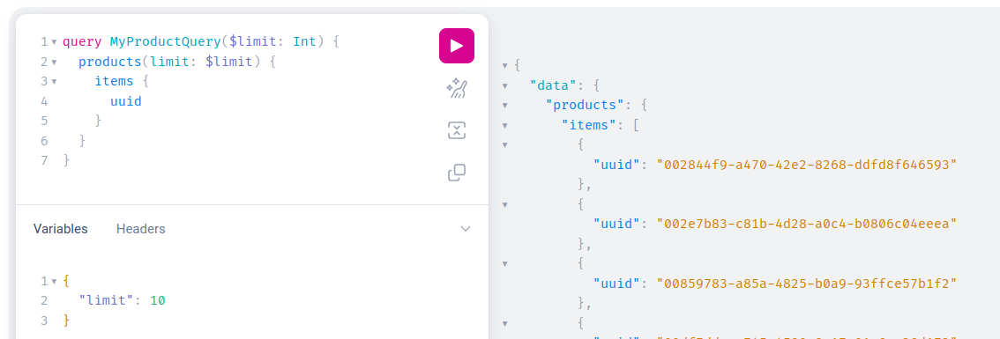

## Common arguments for all queries

A few things are common to all queries (or a significant number of them).

List of common arguments:

- `limit` is used to ask for a specific number of results, default and maximum is 100.
  ex: `limit: 50`
- `page` is used to ask for a specific page.
  ex: `page:"0187ed82-17cc-4dec-b287-75ca581bad46"`
  The products after this uuid will be returned. You can use what `next` returned instead of inputting manually an uuid, please check below.
- `links` contains `first` `next` `self`. It is used for retrieving page links.
- `locales` is used to ask for the results for specified locales (one or many at once).
  ex :`locales: "en_US”`, ex for multiple : `locales: ["fr_FR","en_US"]`
- `search` is used for more detailed search parameters in your query, the syntax to use can be found [here](https://api.akeneo.com/documentation/filter.html#filters).
  You can use any example that exists in the documentation, you have to escape the quotes on the string.

Here’s an example:

```graphql [snippet:GraphQL]

# This query fetches 10 products, after the first 10, with their UUID, enabled, family code and sku attribute information by using pagination.
query MyProductQueryWithPagination {
  products(
    limit: 10
    locales: "en_US"
    page: "with_count=false&pagination_type=search_after&limit=10&search_after=0187ed82-17cc-4dec-b287-75ca581bad46"
    attributesToLoad: "sku"
  ) {
    links {
      next
    }
    items {
      uuid
      enabled
      family {
        code
      }
      attribute(code: "sku")
    }
  }
}
```

:::info
`Product` and `ProductModel` queries have a special argument called `attributesToLoad`.
This argument is not mandatory but will greatly improve the response time. If you request a specific attribute in your query (such as `sku` in this example) you should pass it to `attributeToLoad`.
More details are available in the [Rest API documentation](https://api.akeneo.com/documentation/filter.html#filter-product-values).
:::

:::info
[GraphiQL live example](https://graphql.sdk.akeneo.cloud?query=query+MyQuery+%7B%0A++products%28%0A++++limit%3A+10%0A++++locales%3A+%22en_US%22%0A++++page%3A+%220187ed82-17cc-4dec-b287-75ca581bad46%22%0A++++attributesToLoad%3A+%22sku%22%0A++%29+%7B%0A++++links+%7B%0A++++++next%0A++++%7D%0A++++items+%7B%0A++++++uuid%0A++++++enabled%0A++++++family+%7B%0A++++++++code%0A++++++%7D%0A++++++attribute%28code%3A+%22sku%22%29%0A++++%7D%0A++%7D%0A%7D)
:::

## Query using variables in GraphiQL or cURL

:::info
[GraphiQL live example](https://graphql.sdk.akeneo.cloud?query=query+MyProductQuery%28%24limit%3A+Int%29+%7B%0A++products%28limit%3A+%24limit%29+%7B%0A++++items+%7B%0A++++++uuid%0A++++%7D%0A++%7D%0A%7D) (Please note that you must add the variable yourself, just like the screenshot below.)
:::

The request does not need to be dynamically generated, you can also use static request with parameters like in the example below, we use the $limit variable defined.



You can also run this query using cURL or your favourite development language.

```bash [snippet:Bash]

curl -X POST https://graphql.sdk.akeneo.cloud \
-H 'Content-Type: application/json' \
-H 'X-PIM-URL: https://xxxxxxx.demo.cloud.akeneo.com' \
-H 'X-PIM-CLIENT-ID: xxxxxx' \
-H 'X-PIM-TOKEN: xxxxxxxxxxxxxxxxxxxxxxxxxxxxxxxx' \
-d '{
    "query": "query myProductQuery($limit: Int) {products(limit: $limit) {items {uuid}}}",
    "variables": {
        "limit": 10
    }
}'
```

## Working with pagination

In our GraphQL API, we implement pagination in most queries to manage large datasets efficiently. Pagination breaks down query results into smaller, manageable chunks, improving performance and user experience. In the majority of our queries, there are by default 10 results per page, ensuring a balance between fetching sufficient data and maintaining optimal performance.
Pagination is facilitated by the `limit` argument when available, allowing users to specify the maximum number of results per page. The `limit` argument accepts values between 1 and 100, determining the maximum number of results returned on a single page.
This is a simple example:

```graphql [snippet:GraphQL]
{
  products(limit: 5) {
    items {
      name: attribute(code: "name")
    }
  }
}
```

The result should be similar to the next one:

```json [result:JSON]
{
  "data": {
    "products": {
      "items": [
        {
          "name": [
            {
              "locale": "en_US",
              "data": "Striped Cotton Button-Up Shirt",
              "attribute_type": "pim_catalog_text",
              "channel": null
            }
          ]
        },
        {
          "name": [
            {
              "locale": "en_US",
              "data": "Slim Fit Denim Jeans",
              "attribute_type": "pim_catalog_text",
              "channel": null
            }
          ]
        },
        {
          "name": [
            {
              "locale": "en_US",
              "data": "Knit Cardigan Sweater with Pockets",
              "attribute_type": "pim_catalog_text",
              "channel": null
            }
          ]
        },
        {
          "name": [
            {
              "locale": "en_US",
              "data": "Tailored Wool Blend Blazer",
              "attribute_type": "pim_catalog_text",
              "channel": null
            }
          ]
        },
        {
          "name": [
            {
              "locale": "en_US",
              "data": "Printed Floral Maxi Dress",
              "attribute_type": "pim_catalog_text",
              "channel": null
            }
          ]
        }
      ]
    }
  }
}
```

To request multiple pages of data one by one in GraphQL, additional information needs to be requested from GraphQL. At the top level inside the query, it's essential to include the `links` object with at least the `next` attribute, like this:

```graphql [snippet:GraphQL]
{
  products(limit: 5) {
    links {
      next
    }
    items {
      name: attribute(code: "name")
    }
  }
}
```

The result should be similar to the next one:

```json [result:JSON]
{
  "data": {
    "products": {
      "links": {
        "next": "d64e70f0-3b14-4e70-bce9-2711d8a3b7c1"
      },
      "items": [
        {
          "name": [
            {
              "locale": "en_US",
              "data": "Striped Cotton Button-Up Shirt",
              "attribute_type": "pim_catalog_text",
              "channel": null
            }
          ]
        },
        {
          "name": [
            {
              "locale": "en_US",
              "data": "Slim Fit Denim Jeans",
              "attribute_type": "pim_catalog_text",
              "channel": null
            }
          ]
        },
        {
          "name": [
            {
              "locale": "en_US",
              "data": "Knit Cardigan Sweater with Pockets",
              "attribute_type": "pim_catalog_text",
              "channel": null
            }
          ]
        },
        {
          "name": [
            {
              "locale": "en_US",
              "data": "Tailored Wool Blend Blazer",
              "attribute_type": "pim_catalog_text",
              "channel": null
            }
          ]
        },
        {
          "name": [
            {
              "locale": "en_US",
              "data": "Printed Floral Maxi Dress",
              "attribute_type": "pim_catalog_text",
              "channel": null
            }
          ]
        }
      ]
    }
  }
}

```

The value of the `next` attribute obtained from the `links` object should be inserted into the `page` argument of the subsequent request. This `next` value serves as a pointer or reference to the next page of data in the dataset. By passing this value to the `page` argument in the next query, the GraphQL server understands which portion of the dataset the client is requesting.
The next request should be something like:

```graphql [snippet:GraphQL]
{
  products(limit: 5, page: "d64e70f0-3b14-4e70-bce9-2711d8a3b7c1") {
    links {
      next
    }
    items {
      name: attribute(code: "name")
    }
  }
}
```

The result should show a max of 5 new results with potentially a new value for the `next` attribute.
When no more pages are available, the `next` value is set to `null`.

# Customize output field name with aliases

Aliases in GraphQL provide a way to request multiple fields with different names from the same root field, including the possibility to rename a field without necessarily fetching it multiple times.
This allows clients to customize the structure of the response without changing the structure of the query.
By assigning unique aliases to each field, clients can disambiguate between identically named fields and simplify data processing on the client side.
The syntax is really simple. You just need to prefix the field or function name with the alias followed by a colon.

For example, you might want to call the same function (`attribute` here) multiple times:

```graphql [snippet:GraphQL]
{
  products (limit: 2) {
    items {
      sku: attribute(code: "sku")
      erpName: attribute(code: "erp_name")
    }
  }
}
```

The result should be similar to the next one:

```json [snippet:JSON]
{
  "data": {
    "products": {
      "items": [
        {
          "sku": [
            {
              "locale": null,
              "data": "ABC12345",
              "channel": null
            }
          ],
          "erpName": [
            {
              "locale": "en_US",
              "data": "Plaid shirt",
              "channel": null
            },
            {
              "locale": "fr_FR",
              "data": "Chemise à carreaux",
              "channel": null
            }
          ]
        },
        {
          "sku": [
            {
              "locale": null,
              "data": "XYZ98765",
              "channel": null
            }
          ],
          "erpName": [
            {
              "locale": "en_US",
              "data": "Denim jeans",
              "channel": null
            },
            {
              "locale": "fr_FR",
              "data": "Pantalon en jean",
              "channel": null
            }
          ]
        }
      ]
    }
  }
}
```
