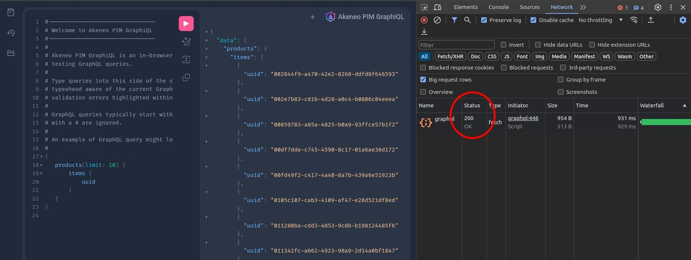
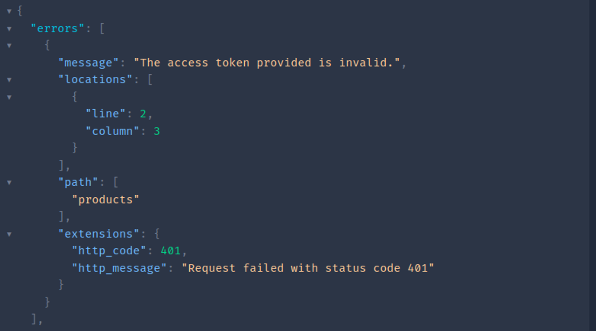

# Status and error codes

All queries performed through GraphQL return HTTP status codes containing more information about the response.


You can check the response code of a query in your favorite browser’s developer tools

## `200 OK`

*Most of the time, this response code will be sent. It means that the request was successful.*

:::warning
Nice, you get a “200 OK” code… But under the hood, it is possible that something did not work as expected, so pay attention to the response you received.
If you did not receive a nicely formatted json “products” (or any other attribute you requested) response, please check the “errors” key to know more.
For example, you’ll get a “200” code if the PIM URL or the headers you sent are invalid:



*An error raised by the “final” API.
We can see in “extensions” that a "401" code was sent from this API, but we get a “200” from GraphQL.*

According to the error message, it can also mean that there’s an error on the API that GraphQL tried to reach: it could be an edge case that was not handled yet on GraphQL side (bug).
:::

## `400 (4xx)`

A query syntax error likely causes this code.
In this situation, the query did not even reach the underlying service, and GraphQL triggered this error code.
For example, it can happen if you perform such a query:

```graphql [snippet:GraphQL]
{
   products() {
       i_do_not_exist {
           uuid
       }
   }
}
```

If you encounter a “400”, please check the `message` string in the `errors` key that will be displayed. It should be self-explanatory and will help you find the solution:

```graphql [snippet:GraphQL]
"message": "Cannot query field \"i_do_not_exist\" on type \"ProductCollection\"."
```

## `500 (5xx)`

This error code can be caused by an application error or an infrastructure problem and is usually more severe.
Please try again later or check the status page of GraphQL: https://status.akeneo.com/.
