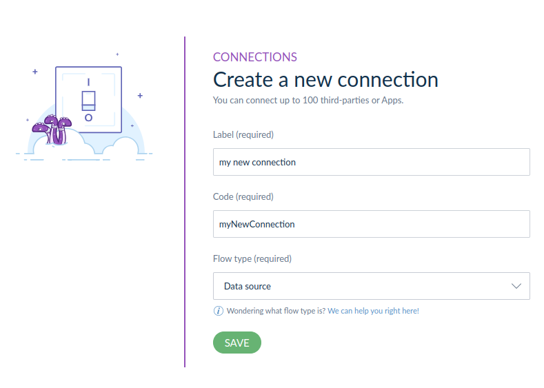
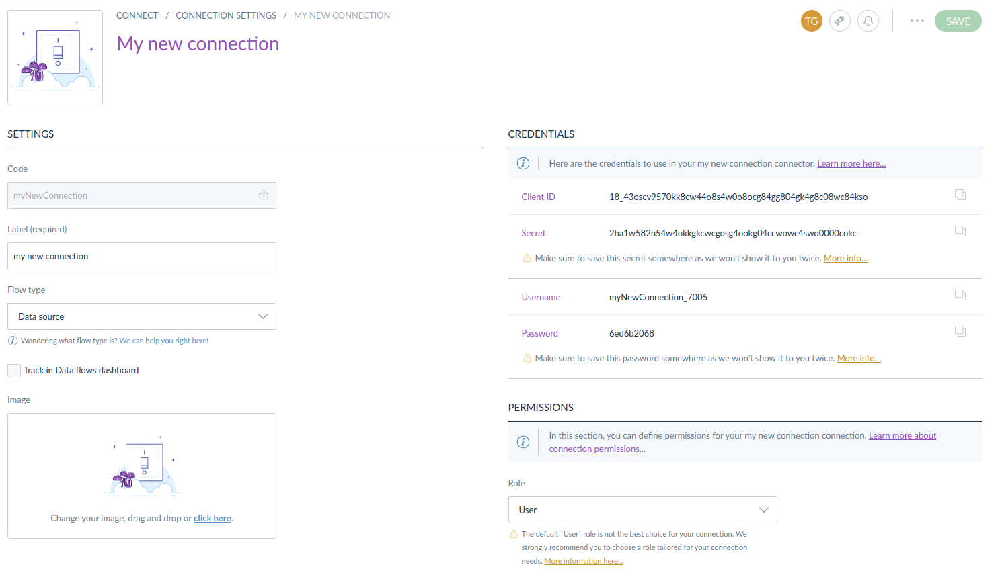

# Getting started

To use the **GraphQL API**, you need a PIM token that will allow the API to connect with a PIM of your choice. 
Follow the steps below to obtain it.

# Step 1: Create a connection

- Log in to your PIM, go to Connect > Connection settings, and click “Create” to create a new connection.
- Enter a label for your connection and let “Data source” for your Flow type.



- Your new connection has been successfully created! You should see a screen similar to the one shown below.



:::warning
Don’t close this page without putting it in a secure place the password. You will not be able to recover it later. In case it happens, you can always regenerate it.
:::

:::warning
Set the role and group correctly before closing, or you may not have access to particular data.
:::

# Step 2: Ask for an access token

We have created a GraphQL query that retrieves one-hour validation access tokens.

To execute this query:

- Go to [https://graphql.sdk.akeneo.cloud](https://graphql.sdk.akeneo.cloud/).
- Replace `my-username`, `my-password`, `my-client-id`, and `my-client-secret` found on the connection page in the following query.

```graphql [snippet:GraphQL]

{
  token(
    username: "my-username"
    password: "my-password"
    clientId: "my-client-id"
    clientSecret: "my-client-secret"
  ) {
    data {
      accessToken
    }
  }
}
```

- Add header information.

```json [snippet:JSON]

{
  "X-PIM-URL": "your-pim-url",
  "X-PIM-CLIENT-ID": "your-client-id",
}
```

- Execute. Check the output: you should receive a result similar to the one below.

```json [snippet:JSON]

{
  "data": {
    "token": {
      "data": {
        "accessToken": "xxxxxxxxxxxxxxxxxxMzQyYWNhYjc5NjcyOGU3ZGRiMTkwNWM3Mzg0NjEwY2Y2NWJjZGFiNWM2Ng"
      }
    }
  }
}
```

Congratulations! You now have an access token! You’re ready to query your PIM using GraphQL.

:::info
We have multiple ways to obtain access tokens without using GraphQL. Please refer to our documentation on [Apps](https://api.akeneo.com/apps/homepage.html) or [connectors](https://api.akeneo.com/getting-started/your-first-tutorial-4x/welcome.html).
:::
