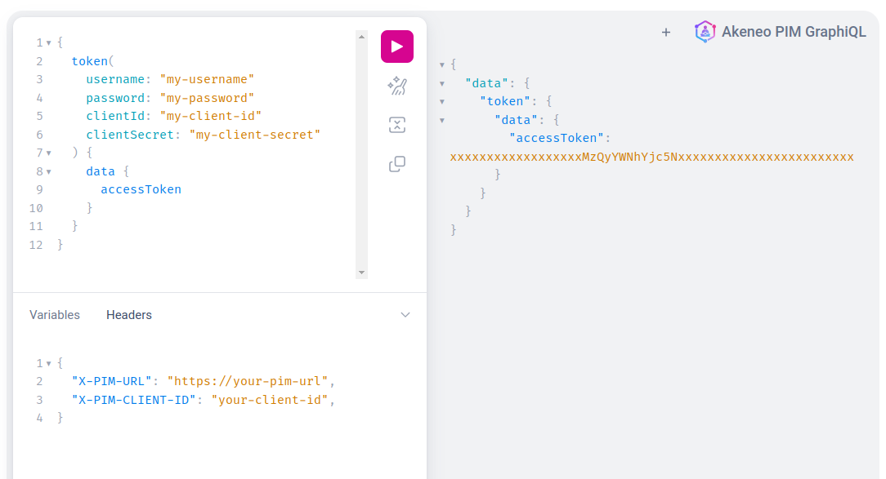

# Getting started

As GraphQL aggregates the GET Rest API calls, a Rest API Token is required to use GraphQL.

## Step 1: Get your token
### Using a connection
To generate a token from a connection you will need:

* A **clientId/clientSecret** in addition of a **username/password**, you can find all the detail [here](https://api.akeneo.com/getting-started/your-first-tutorial-4x/step-1.html#step-1-create-a-connection)

You can now ask for a token using a dedicated GraphQL query, to execute it:

- Go to [https://graphql.sdk.akeneo.cloud](https://graphql.sdk.akeneo.cloud/), a GraphQL in browser will be displayed and allow you to execute queries.
- Replace `my-username`, `my-password`, `my-client-id`, and `my-client-secret` found on the connection page in the following query.

```graphql [snippet:GraphQL]
{
  token(
    username: "my-username"
    password: "my-password"
    clientId: "my-client-id"
    clientSecret: "my-client-secret"
  ) {
    data {
      accessToken
    }
  }
}
```
- Enter the previous query on the left panel

- Add header information on the bottom left panel

```json [snippet:JSON]
{
  "X-PIM-URL": "https://your-pim-url",
  "X-PIM-CLIENT-ID": "your-client-id",
}
```

- You can now click on the **play** button, you should receive the following response:

```json [snippet:JSON]
{
  "data": {
    "token": {
      "data": {
        "accessToken": "xxxxxxxxxxxxxxxxxxMzQyYWNhYjc5Nxxxxxxxxxxxxxxxxxxxxxxxx"
      }
    }
  }
}
```

- Here is a screenshot that correspond to the previous steps



**Congratulations!** You now have an access token! You’re ready to query your PIM using GraphQL.

:::info
A token generated using a connection will have a **1hour lifetime**
:::

### Using an app token
When we connect a PIM with an APP using the oauth flow, a permanent token is created.

All the required steps are documented [here](https://api.akeneo.com/tutorials/how-to-get-your-app-token.html#)

:::info
A token generated when connecting an APP will be **permanent without any expiration**
:::


## Step 2: Make your first query

In the previous step you got the following configuration:
* A pim URL
* A client id 
* A token (previously generated)

You can now execute your first query to get a list of product with their categories code & labels

- Go to [https://graphql.sdk.akeneo.cloud](https://graphql.sdk.akeneo.cloud/), a GraphQL in browser will be displayed and allow you to execute queries.
- Enter the following query on the left panel

```graphql [snippet:GraphQL]
{
  products {
    items {
      uuid
      categories {
        code
        labels
      }
    }
  }
}
```

- Add header information on the bottom left panel

```json [snippet:JSON]
{
  "X-PIM-URL": "https://your-pim-url",
  "X-PIM-CLIENT-ID": "your-client-id",
  "X-PIM-TOKEN": "your-token"
}
```

- You can now click on the **play** button
- Here is a screenshot that correspond to the previous steps


::: panel-link And now, let's discover all the GraphQL capabilities using the in browser [GraphiQL](/graphql/setup/browse-graphql-capabilities.html)
:::
