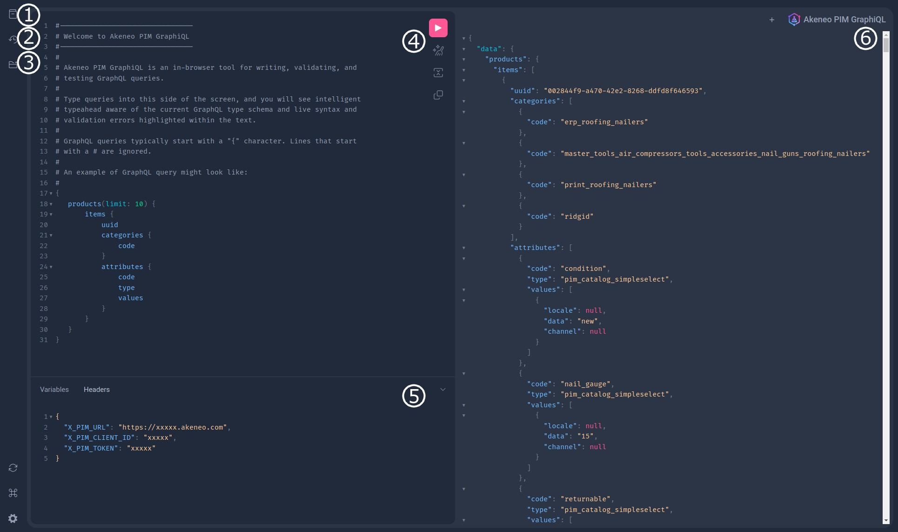

# How to use GraphiQL (the GraphQL IDE)

The Akeneo GraphQL API helps you retrieve data from an Akeneo PIM in a more business-oriented approach.
This documentation will help you running your first queries through the GraphQL integrated web IDE, “GraphiQL”.

## What is GraphiQL?

GraphiQL is **an interactive, in-browser IDE specifically designed for working with GraphQL APIs**.
It streamlines the process of querying, exploring, and testing GraphQL APIs, making development faster and more efficient.
More information in the official Github project: https://github.com/graphql/graphiql

## How to access it?

The GraphiQL user interface is directly accessible from your browser by accessing the GraphQL URL: [https://graphql.sdk.akeneo.cloud](https://graphql.sdk.akeneo.cloud/)

## How to use it?

You will probably spend most of the time writing queries in the GraphiQL Query Builder (4), but this tool also provides several interesting functionalities.
Here’s a screenshot of the GraphiQL IDE, please refer to the corresponding numbered section to know more about the interface:


*The GraphiQL interface*

### Section 1: Link to the **Documentation Explorer.**

The documentation explorer is **a tree-like structure displaying documentation about the GraphQL schema, including types and queries**.
:::info
Clicking on a type allows you to reveal additional details.
The documentation explorer also includes a search bar that enables users to quickly locate types, fields, or any other relevant information within the schema documentation.
:::

### Section 2: Link to **Show History.**

Displays a list of all the previous queries you ran.

### Section 3: Link to the **Query Explorer**.

The explorer tree is **a tree-like structure representing the GraphQL schema**.
It displays types, fields, and their relationships in a hierarchical manner.

:::info
You can expand or collapse tree nodes to navigate the schema. Clicking on a type or field expands it to reveal its children.
:::

:::info 
Clicking on a field adds it to the query in the centre panel.
If a field has subfields, you can click on them to add them to the query.**
As you add fields, the Explorer automatically structures them in a nested manner, reflecting the hierarchy of your query.
When you click on a field, the Explorer shows any available arguments or directives.
:::

### Section 4: The **Query Panel.**

The query panel is **a text editor where you can input your GraphQL queries**.
It supports syntax highlighting and error highlighting (such as syntax errors or invalid field names).

You can either compose your queries by clicking in the Explorer or by typing directly into the text editor.

:::info
Auto-completion is available using the `ctrl+space` shortcut.
:::

:::info
At the top of the panel, you can create new queries. GraphiQL keeps them in local storage to allow access and reuse previously executed queries.
:::

:::info 
Clicking on the **▶️** (or using `ctrl+enter`) will send the query for execution.
:::

### Section 5: Headers & Variables.

   Some headers are required to do API calls :
    - **`X-PIM-URL`** is the PIM URL you want to call.
      `https://my-awesome-pim.sandbox.cloud.akeneo.com/`
    - **`X-PIM-CLIENT-ID`** is your client_id
    - **`X-PIM-TOKEN`** Please check th[is section](https://www.notion.so/How-to-use-GraphiQL-the-GraphQL-IDE-e8d5d9a19dca418494a74ffd5b39fa5b?pvs=21) to know more about it.

### Section 6: Query result panel.

   You will see the GraphQL response here, displayed in JSON format (you can collapse & expand the items).
   If your query failed for a reason, this section will display an error message.

## Queries examples

:::info
We support request compression. 
Feel free to utilize it by including the following code in your request header: `Accept-Encoding: gzip, deflate, br, zstd`. 
Our tests have shown noticeable improvements, so don't hesitate to take advantage of them!
:::

### Common arguments for all queries

A few things are common to all queries (or a significant number of them).

List of common arguments:

- `limit` is used to ask for a specific number of results, default and maximum is 100.
  ex: `limit: 50`
- `page` is used to ask for a specific page.
  ex: `page:"0187ed82-17cc-4dec-b287-75ca581bad46"`
  The products after this uuid will be returned. You can use what `next` returned instead of inputting manually an uuid, please check below.
- `links` contains `first` `next` `self`. It is used for retrieving page links.
- `locales` is used to ask for the results for specified locales (one or many at once).
  ex :`locales: "en_US”`, ex for multiple : `locales: ["fr_FR","en_US"]`
- `search` is used for more detailed search parameters in your query, the syntax to use can be found [here](https://api.akeneo.com/documentation/filter.html#filters).
  You can use any example that exists in the documentation, you have to escape the quotes on the string.

Here’s an example:

```graphql [snippet:GraphQL]

# This query fetches 10 products, after the first 10, with their UUID, enabled, family code and sku attribute information by using pagination.
query MyProductQueryWithPagination {
  products(
    limit: 10
    locales: "en_US"
    page: "with_count=false&pagination_type=search_after&limit=10&search_after=0187ed82-17cc-4dec-b287-75ca581bad46"
    attributesToLoad: "sku"
  ) {
    links {
      next
    }
    items {
      uuid
      enabled
      family {
        code
      }
      attribute(code: "sku")
    }
  }
}
```

:::info
`Product` and `ProductModel` queries have a special argument called `attributesToLoad`.
This argument is not mandatory but will greatly improve the response time. If you request a specific attribute in your query (such as `sku` in this example) you should pass it to `attributeToLoad`.
More details are available in the [Rest API documentation](https://api.akeneo.com/documentation/filter.html#filter-product-values).
:::

:::info
[GraphiQL live example](https://graphql.sdk.akeneo.cloud?query=query+MyQuery+%7B%0A++products%28%0A++++limit%3A+10%0A++++locales%3A+%22en_US%22%0A++++page%3A+%220187ed82-17cc-4dec-b287-75ca581bad46%22%0A++++attributesToLoad%3A+%22sku%22%0A++%29+%7B%0A++++links+%7B%0A++++++next%0A++++%7D%0A++++items+%7B%0A++++++uuid%0A++++++enabled%0A++++++family+%7B%0A++++++++code%0A++++++%7D%0A++++++attribute%28code%3A+%22sku%22%29%0A++++%7D%0A++%7D%0A%7D)
:::

### Query using variables in GraphiQL or cURL

:::info
[GraphiQL live example](https://graphql.sdk.akeneo.cloud?query=query+MyProductQuery%28%24limit%3A+Int%29+%7B%0A++products%28limit%3A+%24limit%29+%7B%0A++++items+%7B%0A++++++uuid%0A++++%7D%0A++%7D%0A%7D) (Please note that you must add the variable yourself, just like the screenshot below.)
:::

The request does not need to be dynamically generated, you can also use static request with parameters like in the example below, we use the $limit variable defined.


You can also run this query using cURL or your favourite development language.

```bash [snippet:Bash]

curl -X POST https://graphql.sdk.akeneo.cloud \
-H 'Content-Type: application/json' \
-H 'X-PIM-URL: https://xxxxxxx.demo.cloud.akeneo.com' \
-H 'X-PIM-CLIENT-ID: xxxxxx' \
-H 'X-PIM-TOKEN: xxxxxxxxxxxxxxxxxxxxxxxxxxxxxxxx' \
-d '{
    "query": "query myProductQuery($limit: Int) {products(limit: $limit) {items {uuid}}}",
    "variables": {
        "limit": 10
    }
}'
```

### Products updated in last 4 days using search

:::info
[GraphiQL live example](https://graphql.sdk.akeneo.cloud?query=%7B%0A++products%28search%3A+%22%7B%5C%22updated%5C%22%3A%5B%7B%5C%22operator%5C%22%3A%5C%22SINCE+LAST+N+DAYS%5C%22%2C%5C%22value%5C%22%3A4%7D%5D%7D%22%29+%7B%0A++++links+%7B%0A++++++next%0A++++%7D%0A++++items+%7B%0A++++++uuid%0A++++%7D%0A++%7D%0A%7D)
:::

When we follow the documentation on the filters https://api.akeneo.com/documentation/filter.html we can see some examples of searches :

- `{"updated":[{"operator":"SINCE LAST N DAYS","value":4}]}`
- `{"created":[{"operator":"=","value":"2016-07-04 10:00:00"}]}`

We need to escape the quotes if we want to use these searches. You can use an online escaper for help. The result will be:

- `{\"created\":[{\"operator\":\"=\",\"value\":\"2016-07-04 10:00:00\"}]}`
- `{\"updated\":[{\"operator\":\"SINCE LAST N DAYS\",\"value\":4}]}`

### Product model and their variation axis + family information

:::info
[GraphiQL live example](https://graphql.sdk.akeneo.cloud?query=query+ProductModelWithVariationAxisAndFamily+%7B%0A++productModels%28limit%3A+10%29+%7B%0A++++links+%7B%0A++++++next%0A++++%7D%0A++++items+%7B%0A++++++variationAxes%0A++++++code%0A++++++family+%7B%0A++++++++code%0A++++++++familyVariant+%7B%0A++++++++++code%0A++++++++%7D%0A++++++%7D%0A++++++attribute%28code%3A+%22brand%22%29%0A++++%7D%0A++%7D%0A%7D)
:::

### All the variations of a product model with variation values & specific attribute values

:::info
[GraphiQL live example](https://graphql.sdk.akeneo.cloud?query=query+VariationOfAModelWithVariationValueAndAttributeValue+%7B%0A++products%28%0A++++limit%3A+10%0A++++parent%3A+%22Acme+Classic+Mens+Black+PVC+Work+Boots%22%0A++++locales%3A+%22en_US%22%2C%0A++++attributesToLoad%3A+%5B%22name%22%2C%22sku%22%2C%22brand%22%2C%22shoe_size%22%2C%22erp_name%22%5D%0A++%29+%7B%0A++++links+%7B%0A++++++next%0A++++%7D%0A++++items+%7B%0A++++++uuid%0A++++++enabled%0A++++++variationValues%0A++++++name%3A+attribute%28code%3A+%22name%22%29%0A++++++sku%3A+attribute%28code%3A+%22sku%22%29%0A++++++brand%3A+attribute%28code%3A+%22brand%22%29%0A++++++formatedErpName%3A+attribute%28code%3A+%22erp_name%22%29%0A++++%7D%0A++%7D%0A%7D)
:::

If you want to get all attributes, you can include `attributes` in your query with the necessary fields.

When retrieving attribute values with the `attribute` keyword, we use aliases to ensure that every retrieved data document has the desired format in the response.


### Enabled locales

:::info
[GraphiQL live example](https://graphql.sdk.akeneo.cloud?query=query+EnabledLocales+%7B%0A++locales%28enabled%3A+true%29+%7B%0A++++items+%7B%0A++++++code%0A++++%7D%0A++%7D%0A%7D)
:::

### Enabled currencies

:::info
[GraphiQL live example](https://graphql.sdk.akeneo.cloud?query=query+EnabledCurrencies+%7B%0A++currencies%28enabled%3A+true%29+%7B%0A++++items+%7B%0A++++++code%0A++++%7D%0A++%7D%0A%7D)
:::

### Families and their belonging attributes code & type

:::info
[GraphiQL live example](https://graphql.sdk.akeneo.cloud?query=query+FamiliesWithAttributeCodeAndType+%7B%0A++families+%7B%0A++++links+%7B%0A++++++next%0A++++%7D%0A++++items+%7B%0A++++++code%0A++++++attributes+%7B%0A++++++++code%0A++++++++type%0A++++++%7D%0A++++%7D%0A++%7D%0A%7D)
:::

### Product with attributes, family, group & categories with all labels

:::info
[GraphiQL live example](https://graphql.sdk.akeneo.cloud?query=query+ProductWithAttributesFamilyCategoriesAndLabels+%7B%0A++products%28limit%3A+1%2C+locales%3A+%22en_US%22%29+%7B%0A++++items+%7B%0A++++++attributes+%7B%0A++++++++code%0A++++++++labels%0A++++++++sortOrder%0A++++++++type%0A++++++++group+%7B%0A++++++++++code%0A++++++++++labels%0A++++++++++sortOrder%0A++++++++%7D%0A++++++%7D%0A++++++family+%7B%0A++++++++code%0A++++++++labels%0A++++++%7D%0A++++++categories+%7B%0A++++++++code%0A++++++++labels%0A++++++%7D%0A++++++uuid%0A++++++variationValues%0A++++%7D%0A++%7D%0A%7D)
:::

### Product with assets and reference entity attributes

:::info
[GraphiQL live example](https://graphql.sdk.akeneo.cloud?query=query+ProductWithAssetsAndReferenceEntityAttributes+%7B%0A++products%28attributesToLoad%3A+%5B%22packshot%22%5D%29+%7B%0A++++items+%7B%0A++++++attributes+%7B%0A++++++++code%0A++++++++relatedObject+%7B%0A++++++++++code%0A++++++++++labels%0A++++++++%7D%0A++++++++values%28withRelatedObjectValues%3A+true%29%0A++++++%7D++++%7D%0A++%7D%0A%7D)
:::

To load assets and reference entity records on product queries there are two ways:

- Using Attributes fields with the withRelatedObjectValues argument on values
- Using Assets and ReferenceEntities fields using the attribute argument

The first solution will get you all the attributes from the product (or the one listed in the parameter `attributesToLoad`).
The parameter `withRelatedObjectValues` is here to allow users to load linked attributes assets and reference entity records.
Please keep in mind that it can impact the performance.

The second solution provides the same result as the first but allows the requested asset or reference entity attribute to filter more precisely.
