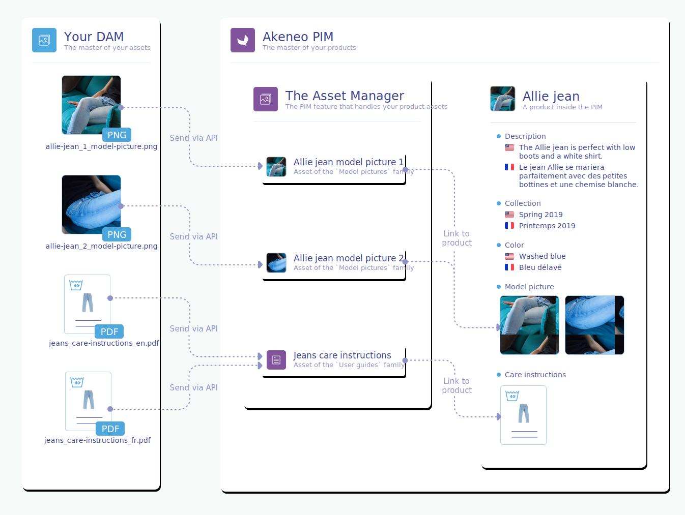

# Introduction

> Do you want to connect your DAM to the PIM?  
> Do you want to send the product assets already stored in your DAM to your PIM?  

You landed in the right place!

## Goal of this guide

In the following guide, we are going to explain how to properly connect a DAM to our PIM, thanks to our wonderful REST API.

::: warning
The connection described in this guide is based on our brand new way to manage assets: the **Asset Manager**. This feature was introduced in the 3.2 version.  
If you want to know more about the Asset Manager, don't hesitate to take a look at all its concepts, right [here](/concepts/asset-manager.html).
:::

### Macro overview

As an image is worth a thousand words, here's a small diagram to help you get the point of this guide.

In this guide, we consider the DAM as the master of the product assets. It means that assets are sent from the DAM to the PIM, and not the other way around.  
First, photographers or marketers upload their new product assets into the DAM. Then, thanks to the Apps we're going to build in this guide, these assets are sent via the REST API to the Asset Manager of our PIM.  

Once the assets are in the Asset Manager, there are two ways to link them to the right product:
- _Manually_: marketers manually assign the imported assets to the right products,
- _Automatically_: a product link rule is automatically run after the asset creation in the Asset Manager and assigns them to the right products.

::: info
Want to dig deeper into the Asset Manager? Take a dive into its concepts right [here](/concepts/asset-manager.html).
:::

### The use case in details

Now, let's take a closer look.

You already have a DAM installed and a lot of your assets are already stored in it. Some of those assets are product assets: product user guides, product images, product video shootings,...  
You are also using an Akeneo PIM. And your goal is quite simple. You want the product assets located in your DAM to be sent to your PIM, so that you can have all the visuals, documentation and product shootings of your product along with your product information in one single product sheet.

Let me show you how!

## Follow the steps!

To properly connect your DAM to your PIM, as illustrated above, here are the steps you need to carefully follow.
1. First, you're going to need to understand how the Asset Manager works. Carefully read about all its concepts, right [here](/concepts/asset-manager.html), and you'll become an Asset Manager master! On a more serious note, those concepts are key to creating a great App that will perfectly fit with our PIM. 😉
2. Then, we strongly encourage you to read the [glossary](glossary.html). It will help you grasp the basic notions we are going to use throughout this guide. It's worth the read - you'll see it's pretty short.
3. Before beginning to write any code, you'll need to carefully study your DAM and its asset modelization. It's a crucial step, don't miss it. You'll find more about how to successfully initialize your Asset Manager families that will match the assets you're going to receive from the DAM, in the [Structure your DAM and PIM](pre-requisites.html) section.
4. For this step, you are going to choose your App's architecture and technical stack. Check out this [section](technical-stack.html) to find out more. You'll see it also provides pro tips regarding scalability, error management and so on...
5. Now, hands on your keyboard, this is the part where you start coding. Build the DAM-PIM App by following the steps described in the [Synchronize assets](synchronize-assets.html) section.

And... that's it! :tada: You now have a functional DAM-PIM App.

::: info
Don't forget that this guide isn't meant to be exhaustive. You'll find a million ways to improve this first DAM-PIM App version. Don't hesitate to iterate to support new use cases, it's the key to great Apps!
:::

## The skeleton

To ease even more the creation of your App, we bootstrapped a skeleton that will give you some code examples and guide you to your own App creation. Do not hesitate to explore it in order to get an even better overview of what we are trying to build here.  
It is written in our favorite language, aka PHP.

You'll find it [here](https://github.com/akeneo/dam-connector). Enjoy!

::: warning
This skeleton is provided as-is. It is only supported in **best effort** mode, whether you are an Enterprise or a Community user.
:::

::: warning
This skeleton is **far from being production-ready**. We don't recommend you to use it as is. Its sole purpose is for training and learning.
:::

If you ever find a bug, do not hesitate to directly open an issue on the [Github](https://github.com/akeneo/dam-connector/issues) repository.

Don't forget that we also love it when you contribute and help us make better tools. So do not hesitate! Every feedback/pull request is very welcome!
