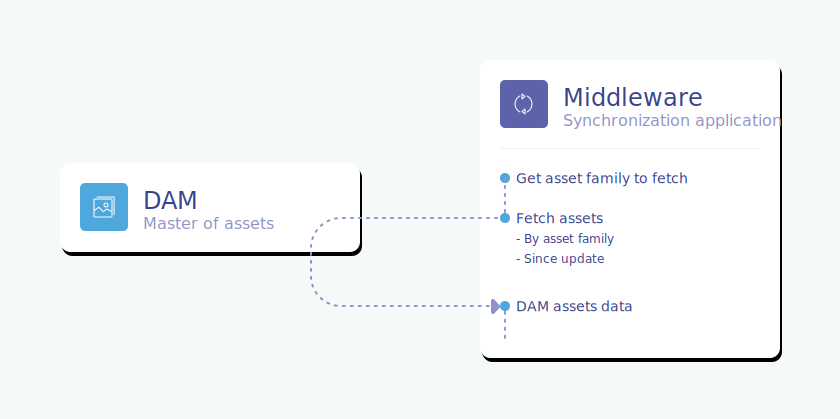
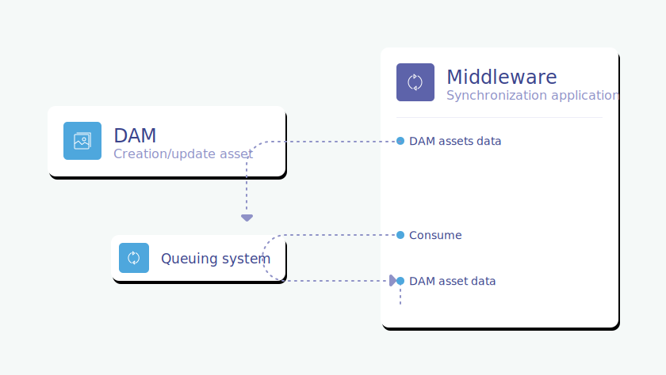
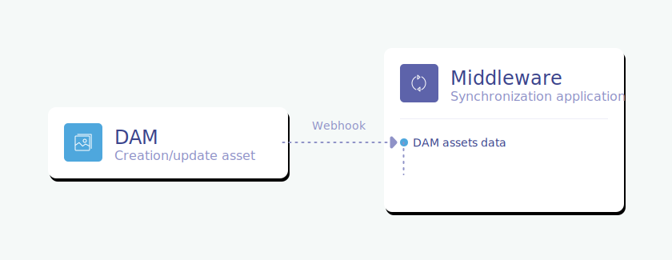

# Define the technical stack of your connector

Now that your PIM and your DAM are [well prepared](pre-requisites.html) for their connection, it's time to dig a bit into the technical stack you are going to choose for your connector.

## On the PIM side

That's the easy part. At Akeneo, we recommend using our API, whenever you want to connect your PIM to whatever third-party. So here you go! Use the API! :rocket: :wink:

_But why?_  
We will never repeat it enough: the API is the **most stable** way to connect to the PIM. You won't suffer from migrations from a PIM version to another, as we guarantee we won't introduce any BC breaks in our API.  
Also, and it is quite important to keep it in mind, the API is the **fastest way** to push and pull data from the PIM.

::: tips
Not familiar with the Akeneo PIM API? We have a [getting started guide](/getting-started.html) to help you right here!
:::

Also, if you are a PHP developer, we provide a [PHP Client](https://github.com/akeneo/api-php-client-ee) for this API. So don't hesitate to use it if need be!

## On the DAM side

All DAMs are different. So you'll to need to get information on your DAM capabilities in terms of connectivity:
- Does it provide an API? Webhooks? A queuing system?
- How does the API authentication work?
- What are the API endpoints to pull assets from the DAM?

Your DAM may provide an API client too.

There are two main ways to connect a DAM and a PIM:
- Asynchronously using API or queuing systems,
- Synchronously with webhooks.

Both have their advantages and drawbacks.

For those who are not comfortable with these different ways to connect, below is a bit of literature to learn more about them.  
For the other ones, you can skip this part. :wink:

### API (REST/GraphQL)
It is the most common way to connect with an external application.

APIs are great for initialization purposes. But their main drawback lays in the fact you'll need a polling mechanism in order to monitor if something changed in the application.    
In other words, you'll need to regularly ask which were the last updated DAM assets, in order to synchronize them with the PIM.

### Queuing systems
Queuing systems offer the possibility to get closer to real-time and are run asynchronously, protecting your connector from too many simultaneous requests.

The updated DAM assets are *published* as messages in the queuing system.  
Then the connector will consume these messages.

### Webhooks

With webhooks, the DAM will send freshly created assets and updated assets values to your connector.
It allows you to have some kind of "real-time" asset synchronization between your DAM and your PIM.

The biggest drawback is to ensure that your connector and your PIM won't suffer from too many HTTP requests.  
It could lead to a crash of one of these applications (or they could just ignore your messages) and sometimes could create latency on the DAM side (if it is waiting from a webhook response).  
So **be careful** with that!

::: info
If a problem occurs when transforming the DAM asset or sending it to the PIM, the message is lost.  
You can get around this problem using a queuing system that will register webhook requests and consume them.
:::

::: warning
Firewalls can block webhooks so you may need a specific configuration of your firewall or find another strategy.
:::

## To keep in mind!
### Automation

As mentioned [above](technical-stack.html#on-the-dam-side), automation can be implemented in many ways. It totally depends on your DAM capabilities.

When you use an asynchronous method to connect, you will need to [synchronize your assets](synchronize-assets.html) between your DAM and your PIM on a **regular basis**. Depending on your DAM and PIM users' needs, this synchronization may be needed every 5 minutes, every hour or every week. Choose this frequency very carefully as it is crucial. It is a compromise between:
- a frequent synchronisation so that your DAM and PIM users can work efficiently,
- but not too frequent as it can have an impact on performances of your overall system.

### Volumetry

You should avoid having too many calls to the PIM API and process only the data you need. This is why the [DAM attribute selection](/pre-requisites.html#define-the-attributes-of-your-asset-families) is really important.

For queuing systems and webhooks, you need to send all messages related to assets. Then, in the connector, filter them to keep only DAM assets that are related to products that you want in the PIM (see [Pre-requisites](pre-requisites.html#which-dam-assets-are-products-related)).  

If you are using an API in the DAM, please make sure to only query the modified assets since the last successful synchronization, in order to avoid synchronizing twice the exact same asset.

Also, some APIs have a rate limit so feel free to check what is the best for you.

### Scalability

Scaling is probably the most complicated part to check.

You should process DAM assets one by one or by groups but never fetch all of the DAM assets and then process them at once.

Test and monitor your system for potential memory leaks on long-running processes.  
If the memory is not stable (meaning it returns to a base after each batch call), it will alter performances and could lead to crashes.

### Performance

One of the best ways to enhance your connector performance is to limit the number of I/O calls to your infrastructure (HTTP requests to the API, database queries, etc...).

For example, it is better to patch assets using bulk requests than using multiple single patches. It will limit the number of API calls.  
You can also implement a cache system for the PIM asset structure (asset family and asset attribute) to avoid using an API call each time you need it.

Keep in mind that one of the most efficient ways to enhance your connector performance is to be able to scale (see above).

### Error handling

You should handle errors on DAM and PIM sides (unavailable server, authentication error, ...).  

Here are the [client errors](/documentation/responses.html#client-errors) that you can have on the PIM side, with our PHP client.

::: info
If you are [creating/updating multiple assets at once](/php-client/exception.html), the API will return a list of errors for each attribute that couldn't be created or updated successfully.  
You'll need to find a way to run the calls again for the assets that have not been synchronized.
:::

### Our skeleton

As already stated in the [introduction](introduction.html#our-skeleton), we provide a skeleton to inspire you when writing your own connector.   
It is fueled with coding best practices, so do not hesitate to have a look at it.  
As a reminder, this skeleton is only supported in **best effort**.  
