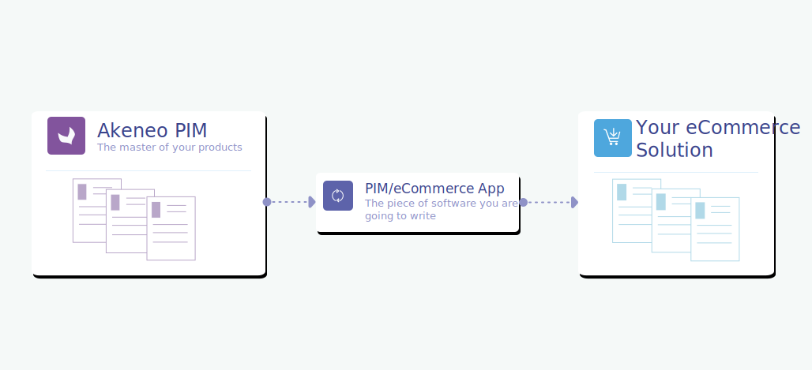

# Who does what?

## Macro overview

Akeneo PIM provides a single place to collect, manage, and enrich product information, create a product catalog, and distribute it to the eCommerce solution.

In the context of a "PIM/eCommerce" architecture, the **PIM becomes the Reference of marketing product information**.

It means that when Akeneo PIM interacts with an eCommerce solution, marketing product information is **no longer directly inserted into the eCommerce solution via it’s UI** but is now sourced from Akeneo PIM.

**At this stage, the creation and modification of products, directly in  your eCommerce platform, is no longer recommended. Changes may be erased by future updates coming from the PIM**.

It also means that in order to guarantee the cohesion of product information, the flow of data information only goes **from Akeneo PIM to the eCommerce platform**.

:::info
**Key points**
* PIM is the reference of marketing product information.
* No more manual product information update directly in your eCommerce platform.
* Marketing product information flow goes from Akeneo PIM to eCommerce solution only.
:::

## Akeneo PIM and ERP solution...

As seen previously, Akeneo PIM is therefore the source for product information... but what data are we talking about?

### Does Akeneo PIM have all product information needed for eCommerce solution?

The answer is NO because Akeneo PIM only manages **"cold" product information**. It means that Akeneo PIM only owns marketing product information that needs to be checked, organized, enriched. And “cold” product information means that this information does not change every day.

Concerning **“hot product information”** (i.e. product information that changes frequently: prices or stock), this information should be directly transmitted to the eCommerce solution without passing through Akeneo PIM. **“Hot product information”** flow should go directly from the ERP to the eCommerce solution (It’s the ERP's responsibility to deliver this information. Again: a PIM only manages “cold” Marketing product information).

For example, **up-to-date price and stock information** of a product should never be stored in Akeneo PIM and should be transmitted directly from the ERP into the eCommerce solution.

For price information, Akeneo PIM has the capability of storing product price information, but only for a **“reference”** price and not an **“up-to-date”** price. This **“reference” price** is for information purposes only for the teams managing Akeneo PIM (Julia) and should never be mapped to the eCommerce solution price displayed in your store.

:::info
**Key points**
* The **PIM** only owns **“cold”** product information.
* **ERPs** own **“hot”** product information (like prices and stocks).
:::

## Akeneo PIM and DAM

Akeneo PIM can manage product-related media.

As of version 4.0, Akeneo PIM also facilitates the connection with a DAM software thanks to its [new asset management system](/concepts/asset-manager.html).

:::tips
If you want to know how a DAM connection works, don't hesitate to read our [dedicated documentation](../dam-connection/introduction.html).
:::

There are different 2 ways to manage media with the PIM:

* **Akeneo PIM without a DAM**

Akeneo PIM manages product media internally (with some specific media attributes or its asset manager). Media binaries are then stored directly into the PIM.

* **Akeneo PIM with a DAM**

The DAM solution transfers its data to the PIM (media asset URL and its metadata) and the PIM is then responsible for linking products to media assets.

Instead of binaries stored in the PIM method, the use of media URLs (and therefore the use of a DAM/CDN in addition to a PIM is undoubtedly the best solution to manage product images and allow them to be transferred into the eCommerce solution in a smooth and optimized way as URL information.

::: warning
In that case, make sure that your eCommerce solution allows the use of external URLs to manage media too.
:::

::: info
**Key points**  
2 possible configurations to manage media:
* Akeneo PIM alone: PIM manage media **as binaries**
* Akeneo PIM associated to a DAM/CDN: PIM manage media **as URLs** (Recommended)
:::

## Conclusions

In conclusion, in relation to what has been said above, it is, therefore, necessary to consider the following possible architectures which may lead to completely different PIM catalog models.

### Architecture ERP / PIM / eCommerce

### Architecture ERP / DAM / PIM / eCommerce

Of course these are only basic PIM architectures: some clients may have multiple data sources or destinations making the data workflow managed by your connector more complex… However, we suggest that you focus on these 2 typical architectures that we believe are the most used by our clients.

::: warning
An eCommerce connector never works alone: an eCommerce solution needs a **PIM connector** and probably an **ERP connector** in order to have all the product information enabling products to be activated and therefore visible to end-users... and sometimes a DAM/CDN to manage product media.
:::   
