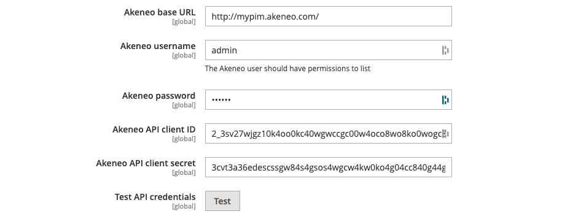
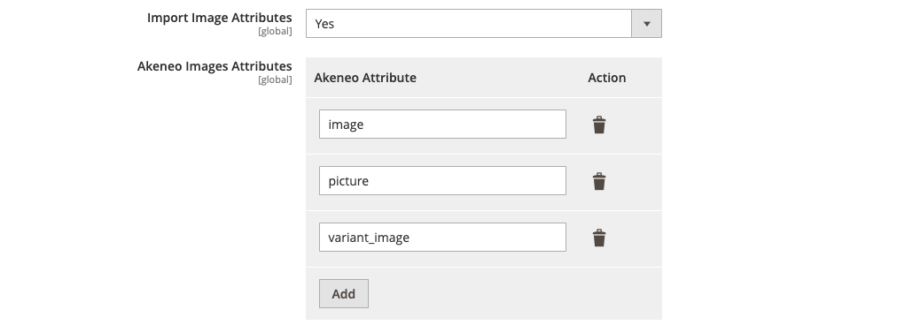

# Reconcile PIM data with eCommerce data

## Main goal

Congratulations! Now, you have a good overview of Akeneo PIM data, you need to reconcile the PIM data and your eCommerce solution data.

Next step, for each piece of PIM data, you need to ask yourself the following questions:

1. What does your eCommerce solution need from the PIM?
2. Is this PIM data strictly identical to the eCommerce one? (same type, same structure, same limits)
3. Should I implement a data conversion or a specific mapping if necessary?
4. Should I implement some configuration in my connector to allow some mapping flexibility?
5. Documentation: What do I need to document? (Data processing, mapping or feature limits, possible settings...)   

In order to help you implement the features of your connector, you will find below a list of features implemented as part of our premium eCommerce connectors:

## API connection

**What is it?**

In order for your connector to communicate with Akeneo PIM, it must connect with its API. So you need to provide a setting to invite the user to enter PIM API credentials.

**What do you need to implement?**

* A UI or a “configuration file” to copy and paste Akeneo PIM API credentials (client id, secret, connection username and password).
* If you create a UI, add a “Test” button to test this connection (in order to check that everything is well configured on this side and maybe to start retrieving some interesting information about the Akeneo PIM that has just been connected)
* Bonus: Akeneo API allows you to change the “limit” parameter. It could be useful to have this setting in your connector configuration to optimize the connection between Akeneo PIM and the eCommerce solution.

## Attribute management

### Attribute type mapping

**What is it?**

Akeneo PIM manages different attribute types. Some eCommerce solutions may have limitations in terms of attribute types and the mapping between Akeneo PIM attribute types and eCommerce attribute types can sometimes be quite complex. Sometimes, you will have to make some difficult choices in terms of mapping.

For some attribute types, the choice can be multiple...
 (e.g. Measurement Attribute: keep only the value in the number attribute type or the value plus the unit in a text attribute?).

For price attribute type, again, warning, the PIM manages only a “reference” price not an “up-to-date” price.

**What do you need to implement?**

In order to bring flexibility to your connector configuration you can introduce a manual choice of the attribute type mapping.

For example, you can suggest a configuration to convert a PIM attribute type to a different eCommerce attribute type (e.g. transform a PIM “select” attribute to an eCommerce “text” attribute).

This type of configuration can be very useful when you want to optimize your attribute mapping or when a new attribute type appears in the PIM and you need to define the corresponding mapping (e.g. Table Attribute bundle).

### Attribute mapping

**What is it?**

By default your connector will create a new attribute in the eCommerce solution for each PIM attribute it will find.

This is a feature that allows you to select, in the settings, which PIM attribute can be mapped to an already existing attribute (default or custom) from your in eCommerce platform.

This is especially useful for mapping essential attributes such as product name, SKU, description...

**What do you need to implement?**

* A Connector configuration to map existing PIM attributes to eCommerce ones.

* If you develop a UI, if possible, retrieve automatically all PIM and eCommerce attributes so that your user has only to make a defined choice through an already filled list.

### "Localizable" attribute

**What is it?**

With Akeneo PIM, it is possible to define localizable attributes (attribute content that is different depending on the locale).  

**What do you need to implement?**

Some eCommerce solutions offer the same capabilities as Akeneo PIM for localizable attributes management. Depending on the eCommerce solution, the mapping is sometimes straightforward and automatic but sometimes it requires implementing a connector configuration to map locales manually.

Don't forget that you can have localizable attributes on PIM products, assets and reference entities data.

**Default locale**

Some eCommerce solutions may have a notion of **"default locale"**.
This default locale makes it possible, for example, to define the product translation to be displayed when a product translation for a specific locale does not exist.

This notion does not exist in the PIM and it is, therefore, necessary to define this default locale at the connector configuration level.

### “Scopable” attribute

**What is it?**

With Akeneo PIM, it is possible to define scopable attributes (attribute content differs, depending on the channel).

Compared to e-commerce features, one channel can be used:

* To define the eCommerce solution itself (this means that all attributes have the same value for the eCommerce solution... even if it has several eCommerce sites). For example, if a customer has products for a mobile application, for a paper catalog and for an eCommerce solution, he will define a "Mobile" channel, a "Print" channel and an "eCommerce" channel.

* To define each eCommerce website (this means that attributes can have different content related to each eCommerce website).
Please read “Manage multiple eCommerce website” below for more information.

**What do you need to implement?**

You could develop a specific configuration in your connector to specify which channel you will take into account when retrieving data from Akeneo PIM.

Don't forget that you can have scopable attributes on PIM products, assets and reference entities data.

### What about attribute groups feature?

**What is it?**

Some eCommerce solutions have the capability to group attributes and you might, of course, be tempted to associate this notion of attribute group with PIM attribute group. Same name, same notion… but that could be a mistake! ;-)

In the PIM, attribute groups are used **only for internal purposes** to:
* Gather attributes together to give more visibility when users fill in values
* Organize the work of the different product contributors in the Enterprise Edition, as attribute groups hold specific permissions.

In the eCommerce solution, these attribute groups most of the time, do have a very specific SEO goal.

**What do you need to implement?**

As Akeneo PIM and eCommerce attribute groups have absolutely different purposes, we advise you to map attributes into a single eCommerce group called "Akeneo PIM".

The eCommerce managers will then be able, to manually redistribute these attributes into strategic eCommerce attribute groups to optimize the SEO of their eCommerce store.

At the level of your connector you must, therefore, take into account that the attributes already synchronized may have been changed manually in the eCommerce solution. Your connector should therefore not change attributes that already exist in your eCommerce solution and have been moved into eCommerce attribute groups.

### Family mapping feature

**What is it?**

A family is a set of attributes that is shared by products belonging to the same family. In other words, a family can be considered as a product template.

**What do you need to implement?**

Like Akeneo PIM, most eCommerce solutions have this capability to define a set of attributes per product type.

You can, therefore, map Akeneo PIM families to the attribute sets of your eCommerce solution.

At the connector settings level, you can give the possibility to manually define which family you want to import. This feature is particularly useful for an initial import and allows you to import PIM products family by family (step by step) when you are dealing with a very large catalog.

## Media management

### Manage image mapping

**What is it?**

A PIM can manage product images in many different ways:
* Images can be managed as binaries or external DAM/CDN URLs.
* Images can be stored in an “image” attribute (one image per attribute) or as assets that are linked to products, managed as an “asset collection” attribute (multiple images per attribute).
* Image attributes can be localizable (different images for each locale) and/or scopable (different assets for each channel).
* Image can have metadata (assets with a corresponding set of text attributes)
These image metadata can be scopable and/or localizable too.
* Asset Images can be ordered at the product level

**What do you need to implement?**

Apart from taking into consideration all these PIM modeling capabilities (compared to your eCommerce solution). You also need to take into account some eCommerce solution specific features such as:

* Define product attributes that represent images
* Define image transformation (Thumbnail, Small, full size...)
* Define the “main” image of the product
* Define the SEO strategy (Image metadata mapping)

::: warning
The number of images that a catalog can contain can be quite large and the time to import the image binaries is difficult to optimize.
Make sure you have all the mechanisms in your connector to optimize the performance to import of image binaries.
:::

::: warning
For “media file” attribute, PIM API exposes a URL. As Akeneo PIM is not a CDN, this URL is **NOT a public URL** and can’t be used directly by your eCommerce solution.
:::

### Manage Video/File mapping

**What is it?**

As per images, you would want to enable your users to attach videos or files to your eCommerce products via Akeneo PIM.

* For videos: most of the time, it’s not a media file in the PIM (too heavy). Your connector will rather have to manage videos as “media links” attribute with a URL from Youtube, Vimeo or from other video providers.

Of course, don’t forget that a video can have some metadata for SEO purposes.

* For files: some customers will store their files in the PIM (as media files), while others will host them on a CDN and the PIM will then only contain a URL (media link).

**What do you need to implement?**

* For videos, if your eCommerce solution includes natively a video manager feature, you should allow URL mapping for videos.

If your eCommerce solution does not have this feature, you will probably need to expose this URL at product level (in a product text attribute for example).

Please create a configuration at your connector level to enable the mapping of PIM asset attributes with eCommerce ALT or description fields to ensure SEO goals.

* For files, following the capabilities of your eCommerce platform to host files, you will have to either retrieve the binary of the file or its URL if it is hosted on a CDN server

::: warning
For “media file” attributes, PIM API exposes a URL. As Akeneo PIM is not a CDN, this URL is not a public URL and can’t be used directly by your eCommerce solution.
:::

## Product management

### Manage products

**What is it?**
You need to import products from the PIM into your eCommerce solution...
But what products? All PIM products?

Products are prepared in Akeneo PIM but not all of them are intended to be exported to your eCommerce platform.

Depending on client projects, a product can be considered "exportable" in your eCommerce solution according to different criteria:

* Channel: a PIM product can be exported in eCommerce solution only if it has been associated with a specific channel.
* Completeness: a PIM product can be exported if it is complete in terms of its data contents, its translation (localizable attribute) and information specific to the channels you are going to use (scopable attribute).
* Enabled/Disabled status: each PIM product has an enable/disable status. A PIM product can be exported if it has an enable status only.

And sometimes, your customers will also need to import a PIM product into the eCommerce solution compared to:

* Published product: some PIM customers can use this feature to work on different versions of the product. In the PIM, you can manage two different versions of a very same product: one “published” version that can be exported (using a published product export profile) and another version that is used to prepare the next collection or season of products, for instance. This is handled by the Akeneo PIM “Publication” feature.

* The value specific attribute: This attribute can be:
  * A localizable enable/disable attribute to manage an enable/disable status compared to each channel.
  * A multi-select attribute that represents the destination website of the product
  …
* A category tree or a subcategory tree…
...

**Conclusion:** each customer project has its own needs and it is important to implement enough flexibility in your connector settings to allow each customer to import in his eCommerce solution only product information he needs according to his criteria.

**What do you need to implement?**

In the features of your connector configuration, you can add a “simple” and an “advanced” filter system with the capability to switch from one to the other according to the needs of your customers.

The “simple” filter will include filters most used by your customers and the “advanced” filter will allow more complex configurations (based on our [PIM API filter capabilities](/documentation/filter.html)).

Bonus: to have the most advanced system, you can implement a specific configuration for each website of your eCommerce solution.  
This method can bring some benefits:
* Ability to have a large flexibility in term of configuration for each website.
* Ability of your connector to manage websites independently.
* Ability to manage multiple PIM for the same eCommerce solution.

### Product with variants

**What is it?**

Products with variants are products that have similarities, they are based on the same model but differ in some aspects from one another.

Please consult [our documentation](https://help.akeneo.com/pim/v3/articles/what-about-products-variants.html), to know everything about PIM product with variants:

::: info
* PIM can manage up to 3 levels of enrichment (1 or 2 variant levels)
  * 1 or 2 levels of “product model”
  * 1 level of variant “product”
* PIM can have up to 5 attributes as variant axes for each level
* PIM variant axes can be:
  * Simple select
  * Reference entity single link (EE only)
  * Measurement
  * Boolean (Yes/No)
:::

**What do you need to implement?**

Compared to your eCommerce solution, you would need to create a mapping
between the PIM structure and eCommerce structure to manage product variants.

Sometimes this mapping can be complex: not the same level of variation between the PIM and eCommerce solution, not the same number of axes per level...etc... you will then have to make choices or concatenate certain levels of variation to take into account all this information.

### Enable/disable status

**What is it?**

A product is rarely removed. It is more often “disabled” to keep its history (In Akeneo PIM but in eCommerce solution too).

**What do you need to implement?**

Please consider relying only on the enable/disable status of the PIM product to know if a product can be activated or deactivated in your eCommerce solution.

Consider also that, sometimes, a PIM doesn't work alone (e.g. if an ERP imports its data directly into the eCommerce solution).  
In that case, you need to consider a configuration to set if the product needs to be activated (because your connector is the last one to import product data) or stay deactivated (because the ERP connector is the last one to import product data).

### Manage product associations

**What is it?**
In an eCommerce solution, you can have different features related to product association as:
* Cross-sell
* Up-sell
* Substitutions
* Pack

Some of your customers may want to manage these associations manually in Akeneo PIM. Others will prefer to set up complex rules directly in eCommerce solution to manage these associations automatically according to dynamic criteria.

For the first use case (association manual management), Akeneo PIM allows you to create product association types and then manually associate products and/or product models with these association types.

It is, therefore, possible to create these typical product associations:
* Cross-sell
* Up-sell
* Substitutions
* Pack

But also "custom" product association types for other needs.

**What do you need to implement?**

Well, again, it depends on your customers needs.

If your customers don't manage associations directly in the eCommerce solution and want to manage it manually in the PIM, you can create a specific configuration in your connector to identify which PIM association type is a “Cross-sell”, “Up-sell”, “Substitution” or “Pack” association type to be able to map these associations in your eCommerce solution.

Also, don't forget our new Serenity feature that adds [quantities on PIM associations](https://help.akeneo.com/pim/serenity/updates/2020-07.html#new-association-type-with-quantities).

### What about PIM product groups feature?

**What is it?**
Groups are used to bring products together.
In Akeneo PIM, you can group all the products on a selection of products to create a theme, for example a collection of products on the same Christmas theme.
But most of the time, this feature is for internal purpose and product group don’t have to be exported in the eCommerce solution.

**What do you need to implement?**
As product groups can be used for so many different use-cases and for internal purposes most of the time, our recommendation is to not develop a mapping for this.

## Category management

**What is it?**

In an eCommerce solution, categories can be used for several features such as:
* Categorization of products to define their type and trigger particular actions.
* Define the navigation of a site.
* Define anchors for navigation within a page.

At PIM level, the same catalog can have several navigation trees. Some category trees are only used for PIM purposes and are not intended to be exported. Other category trees can be directly exported to your eCommerce solution.

The main difference between your eCommerce solution and PIM categories is, most of the time, that PIM categories are less complex than the eCommerce solution categories.

Indeed, in Akeneo PIM, there is no attribute set attached to a category, only a localizable label.

Another point to take into consideration is that your eCommerce solution may need different trees depending on the destination eCommerce sites: the same eCommerce solution can manage several organizations that may have themselves several eCommerce sites... in different languages.

**What do you need to implement?**

Well, it depends on your eCommerce solution.  
Some eCommerces can manage automatically categories on products.  
In that specific case, you don't have to map PIM categories with eCommerce ones.

If, on the other hand, you think it's interesting to map PIM categories to eCommerce categories, you need to give some flexibility to your users to choose which category trees are going to do what in the eCommerce solution.

You can then define in the configuration of your connector:
* Which category trees or sub-trees do you want to import into the eCommerce plate-form
* A mapping to define which organizations, eCommerce websites and features (menu, anchor…) will use this category tree or sub-tree.

## Multiple organization/stores

**What is it?**

Your eCommerce solution probably has the capacity to manage multiple organizations and multiple websites.

It is important to understand that the needs here can be many and diverse:
For example, a client might need a single organization and a single website translated into different languages.
Another client might need a single organization but several websites, one for each locale. Each site might have different product needs (some products would appear in some sites and not in others).
Another client might need several organizations, several websites with different constraints.

Akeneo PIM doesn’t have the notion of “organization” and “website”, so depending on the needs, this modeling can be done in different ways:

* **Use of categories:**
In order to define whether a product belongs to an organization or a website, this can be modeled with categories in the PIM with multiple category trees (or sub-trees).

* **Use of channels:**
If websites have different needs in terms of product attribute contents, a customer will create a channel in the PIM for each website.

* **Use a specific multi-select attribute:**
Some customers create a specific multi-select product attribute that contains the list of their eCommerce websites in it.
When he wants to define that a product must appear in a particular website, he uses this attribute to do so.

* **Use of locales:**
If websites are dedicated to a specific locale, a customer will create some localizable product attributes in the PIM to define a specific localized product content for each website.  

**What do you need to implement?**

Your connector will probably have to manage this notion Multi-organisation / Multi-sites in the eCommerce solution and choose the right PIM data to import to achieve this.

Compared to your eCommerce features, you should, therefore, implement a flexible connector configuration to define:

* Which products are going to be associated to which website (compared to categories and/or a specific multi-select attribute)

* Which attribute contents are going to be associated to which website (compared to its locale or its channel)

## Reference Entities management

**What is it?**

Please consult the introduction of [our documentation about Reference Entities](https://help.akeneo.com/pim/v3/articles/what-about-reference-entities.html) to understand how it can be used for eCommerce purposes:

As you can see, Reference Entities can be used to enrich product information or to create dedicated CMS pages with product relationships.

The main problem that usually occurs is that, most of the time, this notion of "Reference Entities" does not exist in the eCommerce solutions. Some solutions have CMS capabilities to manually create rich-text articles, others allow the enrichment of product information with some additional modules but most of the time there is nothing natively comparable to PIM Reference Entities.

**What do you need to implement?**

Well, two choices are available:

1. **Don’t manage PIM Reference Entities in your connector:**
As the concept of Reference Entities does not exist most of the time in your eCommerce solution, you can then decide:

* To import Reference Entities records data in your connector but not to manage it (no mapping).

* To indicate to your customers in your documentation that this requires a customization of your connector and the eCommerce solution to take into account these Reference Entities (customization that you can decide to develop).

2. **Expose Reference Entities at Product information level:**
As there is no equivalent structure in your eCommerce solution, one strategy could be to transfer the data from the PIM "Reference Entities record" into eCommerce product attributes. This is not an ideal solution because for each product linked to a Reference Entity record, you will have to duplicate these data in each eCommerce product as new product attributes.

## Manage PIM data updates

### Manage creations: Initial import

The first use-case your connector will encounter is the initial import of your user's PIM catalog.

Indeed, your client will probably have been preparing everything in Akeneo PIM for several weeks and is ready to make a first test with your connector...

This is an important use-case because it will probably be the first contact between your connector and your customer.

The performance of your connector is not necessarily an issue here because this initial import will normally only be done once in the context of this use-case.

But this first step is one of the most challenging for the scalability of your connector.
(Scalability is the ability of your connector to manage any type of data volume, any data complexity without issue.)

If your customer's Akeneo PIM catalog contains a large amount of data (not only in terms of the number of products but also in terms of the number of attributes, options, categories, images...) and your connector is not scalable (i.e. your connector must, in theory, be able to import any volume of data from Akeneo PIM), you risk breaking the user experience from the start…

::: warning
Don't forget that the scalability of your connector work is also constrained by :
* The scalability limits of the PIM
* The scalability limits of your eCommerce solution
:::

::: info
**Think scalable from the start!**

A connector must be **"scalable"**, i.e. it must be able to import any type of volume that Akeneo PIM gives it and this regardless of the import time (here we are talking about scalability and not performance).
:::

To test the scalability limits of your connector, Akeneo can give you access to a specific Akeneo PIM platform containing a "Reference" catalog.

**What is the Akeneo “Reference” catalog?**

The **Akeneo Reference catalog** is the catalog that best represents our current customer base in terms of catalog volume.
It's evolving as our customer base do, we are targeting new types of customers, who may have different catalog structures.

That's why, each year we publish a new reference catalog, based on the volume of the customer catalogs of the year before.

::: info
Please contact us if you need to have access to our **Scalability PIM** for your tests.
:::

### Manage modifications: Differential import feature

Your connector will not need to process all Akeneo PIM data at each synchronization. This would not be efficient in terms of performance.

Your connector will therefore need to try to synchronize the product data differential between Akeneo PIM and your eCommerce solution.

Your users will push you to have immediate synchronisation between Akeneo PIM and your eCommerce solution but this can be dangerous and complex to build…

**Why?**
* Because product data must be fully prepared (notion of completeness) before being synchronized with your eCommerce solution.
* Because Akeneo PIM API does not yet have a push event system to determine whether data has been modified or deleted.

Please, consider a regular synchronisation solution (the recurrence will be configured by your customers according to their needs) which will only retrieve data that has changed since the last synchronisation of your connector.

Here, it is more the capacity of your connector in terms of performance that will be judged more than its scalability capabilities.

Akeneo PIM offers data modification API filters based on a specific date that allow you to import only data that has been modified since a certain date.

Thanks to this mechanism you will be able to:

* [Retrieve the last modified products](https://api.akeneo.com/documentation/filter.html#on-their-creation-or-update-date)
* [Retrieve the last modified product models](https://api.akeneo.com/documentation/filter.html#on-creation-or-update-date)
* [Retrieve the last modified assets](https://api.akeneo.com/documentation/filter.html#by-update-date-2)
* [Retrieve the last modified reference entity records](https://api.akeneo.com/documentation/filter.html#by-update-date)

:::warning
Through these mechanisms, you need to understand that updating an asset or reference entity will not automatically update the product/product model date.
:::

You will need:
* To determine which assets and/or reference entities have been modified.
* For each modified asset/reference entity, to retrieve the associated products/product models to update them.

**What about “options” and “categories”?**
As Akeneo PIM API does not have a date filtering system on this data, your connector will need to fully import all options and all categories.

::: info
**Think “performance” from the start!**

* Your connector must be as high-performance as possible to synchronize with the PIM.

* Your connector only needs to import the latest Akeneo PIM data modified since the previous synchronization (delta only).  You don't have to synchronize all Akeneo PIM data each time but only data that cannot be filtered by update date.
:::
