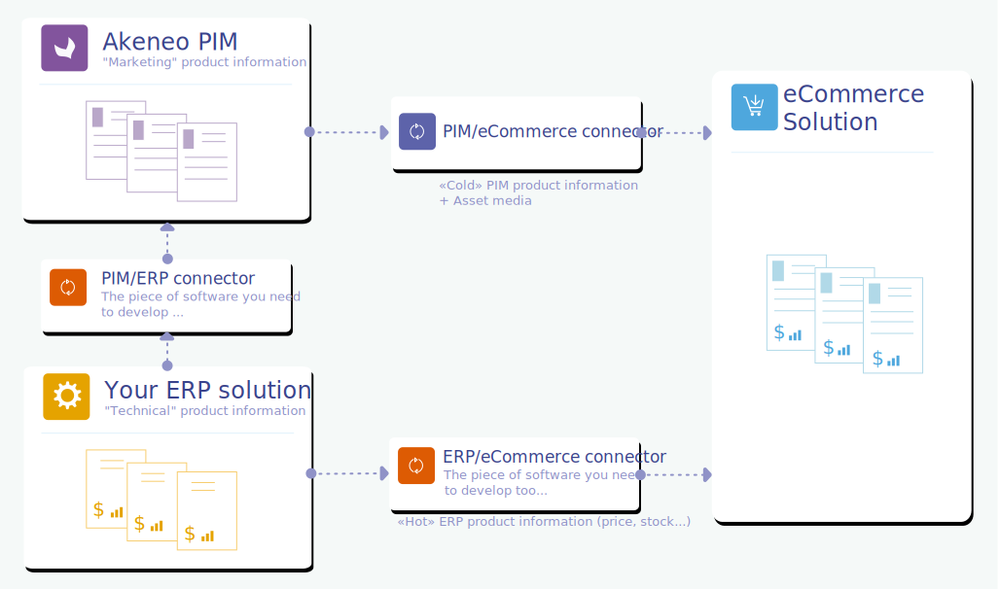

# Who is your App for?

Because we want to give our PIM users the best experience to connect Akeneo PIM with third-parties by providing them easy-to-connect, configurable & interactive Apps on our App Store, you need to understand who is Julia and her needs.

## Understand Julia

Julia is the persona we use to help you guide your decisions about product features, interactions, and even visual design of your App.

Julia, PIM user, is also the end-user of your App, she has no technical skills, she wants to spend more time building versus operating her business. She is looking for a faster, more effective way to manage her marketing projects.

## Product workflow overview

The organization of Julia's work on products can be done in 2 different ways when using an ERP and Akeneo PIM.

### The product is initially created in the ERP

With this organization, the product is initially created by ERP teams, so it contains mainly technical information.

As an image is worth a thousand words, here's an example of a product workflow with the ERP, Akeneo PIM and an eCommerce solution:

Julia's needs will be to:
1. Retrieve product information from the ERP
2. Organize, enrich, translate product information in her PIM
3. Export these PIM data to different channels such as an e-commerce website, a print solution, a mobile application...

### The product is initially created in the PIM

In this organization variation, the product workflow is slightly different: this time, the product is initially created by Julia (and no longer by the ERP teams):

Julia's needs will be to:
1. Create the product in her PIM with a SKU and some basic marketing information (such as the product name, short description)
2. Export this product information from her PIM to the ERP solution to allow the ERP teams to add technical product information (such as price, stock information, automatic categorization...)
3. Import again part of the ERP product information (ERP data that need to be enriched or used by Julia)
4. Finalize the product marketing information in her PIM
5. Export these PIM data to different channels such as an e-commerce website, a print solution, a mobile application...

:::info
In the PIM, product information that comes from the ERP is usually stored in dedicated **read-only** attributes and in a specific **attribute group**.
This allows Julia to have the information at her fingertips without the risk of mixing it with her own PIM product information.
:::

## Julia's needs

Now, let's be focus on Julia's needs about your App.

**If the product is initially created in the ERP:**

Julia needs an easy way import product information from the ERP solution to her PIM.

So she needs:

* A **smooth process** to import automatically ERP product data into her PIM.

* An **easy to follow strategy** to define the periodicity of this automatic import process.

* Perhaps also a **friendly App UI** to trigger and to log manually all processes (import/export) if needed (full or partial imports). She also needs a notification system to be alerted when something goes wrong.

**If the product is initially created in the PIM**

Julia needs an easy way to create the product in her PIM, and exchange product information with the ERP solution.

So she needs:

* An **easy process** to create dynamically a SKU for the product

* An **easy way** to tag her new product so that your ERP App can automatically export the corresponding product data from her PIM to the ERP solution

* A **smooth process** to retrieve ERP product information she needs in return

* A **strategy** to define the periodicity of these automatic import/export processes

* Perhaps also a **friendly App UI** to trigger and to log manually all processes (import/export) if needed (full or partial imports). She also needs a notification system to be alerted when something goes wrong.

And of course, she also needs:

* An **easy to follow configuration process** to configure the App.

* A **complete and easy-to-read online documentation** to understand all the features of your App and how to use it.

* A **support contract** to ask for assistance and get quick support from you.
