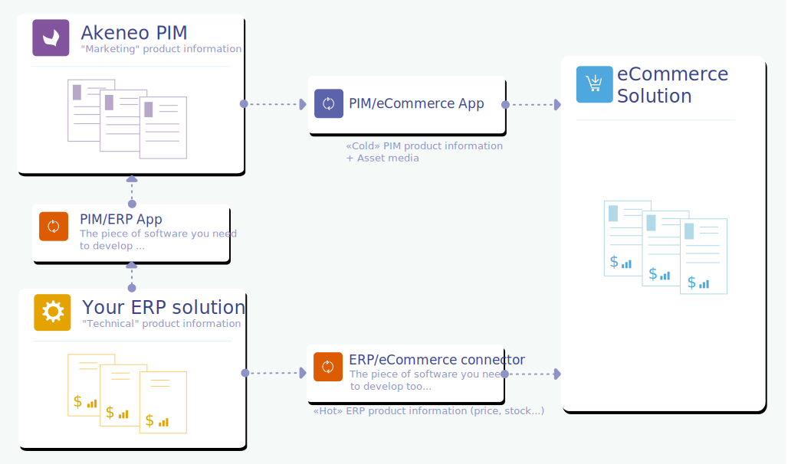

# Who is your connector for?

## Personas

Below, you will find the user archetypes we use to help you guide your decisions about product features, interactions, and even the visual design of your connector. Designing for the archetype — whose goals and behavior patterns are well understood — allows you to satisfy the broader group of people represented by that archetype.

## Product workflow overview

The organization of Julia's work on products can be done in 2 different ways when using an ERP and Akeneo PIM.

### The product is initially created in the ERP

With this organization, the product is initially created by ERP teams, so it contains mainly technical information.

As an image is worth a thousand words, here's an example of a product workflow with the ERP, Akeneo PIM and an eCommerce solution:

Julia's needs will be to first retrieve product information from the ERP and then enrich it before transmitting it to different final solutions such as an e-commerce website, a print solution or others...

### The product is initially created in the PIM

In this organization variation, the product workflow is slightly different: this time, the product is initially created by Julia (and no longer by the ERP teams).

First, the product is created by the PIM with initial marketing information (such as the product name, description...).

:::warning
This initial PIM action requires Julia to automatically generate a SKU of this new product directly in the PIM.
:::

Then this PIM product information is transmitted to the ERP to empower ERP teams to add technical product information (such as price, stock information, automatic categorization...).

Then, some ERP product information (ERP data that need to be enriched or used by Julia) is re-imported in the PIM to allow Julia's teams to finalize the product information according to the different final channels (end-solutions).

:::info
In the PIM, product information that comes from the ERP are usually stored in dedicated **read only** attributes and in a specific **attribute group**.
This allows Julia to have the information at her fingertips without the risk of mixing it with her own PIM product information.
:::

## Personas' needs

Below, you will find the main needs, associated with each user profile, in terms of process, documentation, actions related to your future online translation connector.

### Julia's needs

**If the product is initially created in the PIM**
Julia needs an easy way to create the product in her PIM, and exchanges product information with the ERP solution.

So she needs:

* An **easy process** to create dynamically a SKU for the product

* An **easy way** to tag her new product so that your ERP connector can automatically export the corresponding product data from her PIM to the ERP solution

* A **friendly other process** to retrieve ERP product information she needs in return

* A **strategy** to define the periodicity of these automatic import/export processes

* Perhaps also a **friendly Connector UI** to trigger manually all processes (import/export) if needed (full or partial imports)

* A **friendly UI** to log all processes and a notification system to be alerted when something goes wrong.

**If the product is initially created in the ERP, she needs:**
Julia needs an easy way import product information from the ERP solution to her PIM.

So she needs:

* An **easy to follow process** to import automatically ERP product data into her PIM.

* An **easy to follow strategy** to define the periodicity of this automatic import process.

* Perhaps also a **friendly Connector UI** to trigger manually the import process if needed (full or partial imports)

* A **friendly UI** to log all automatic and manual import processes and a notification system to be alerted when something goes wrong.

### Peter and/or Filips' needs

Peter and/or Filips needs a easy way to install, configure and maintain your connector.

So they need:

* An **easy to follow download/installation process:** to retrieve and install your connector.
It depends on your business model. If you require your client to install the connector themself, make sure you provide appropriate documentation.

* A **full documentation** about **the limits of the connector** in terms of **scalability** and **performance**.

* An **easy to follow configuration process** to set up the connection between the ERP Solution and Akeneo PIM as well as parameters to configure the connector. It requires documentation to explain the methodology on how to configure your connector compared to your business needs.

* A **friendly import process** to perform the first import of product data: due to the volume of data usually imported, this may require special support from your end.

* A **connector UI or a configuration file to set up the connector** (PIM/ERP connection, mapping settings, filtering capabilities, …)

* An access to the **connector logs** to have all detailed technical information to investigate errors.
