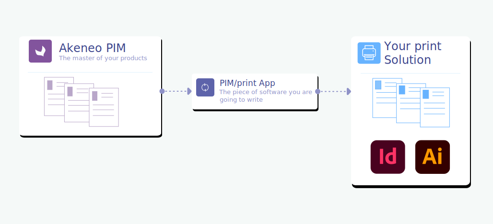

# Who does what?

## Macro overview

Akeneo PIM provides a single place to collect, manage, and enrich product information, create a product catalog, and distribute it to your print solution.

In the context of a "PIM/print" architecture, the **PIM becomes the Reference of marketing product information**.

## Akeneo PIM and DAM

Akeneo PIM manages product-related media.

As of PIM version 4.0, Akeneo also facilitates the connection with a DAM software thanks to its [new asset management system](/concepts/asset-manager.html).

:::tips
If you want to know how a DAM/PIM connection works, don't hesitate to read our [dedicated documentation](../dam-connection/introduction.html).
:::

There are 2 different ways to manage media with the PIM:

* **Akeneo PIM without a DAM**

Akeneo PIM manages product media internally (with some specific media attributes or its asset manager). Media binaries are then stored directly into the PIM.

* **Akeneo PIM with a DAM**

The DAM solution transfers its data to the PIM (media asset URL and its metadata) and the PIM is then responsible for linking products to media assets.

Instead of binaries stored in the PIM method, the use of media URLs (and therefore the use of a DAM/CDN in addition to a PIM is undoubtedly the best solution to manage product images and allow them to be transferred into the print solution in a smooth and optimized way as URL information.

::: info  
2 possible configurations to manage media with the PIM:
* Akeneo PIM alone: the PIM manages media **as binaries**,
* Akeneo PIM associated to a DAM/CDN: the PIM manages media **as URLs** (this is the recommended method for performance reasons).
:::
